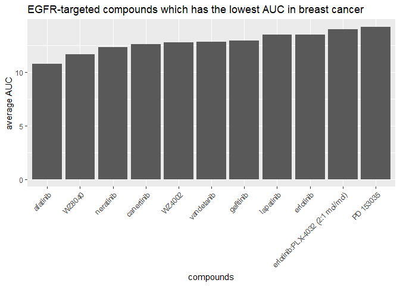

CTRP\_joined
================
Yujia Liu
8/10/2020

# Joining CTRP dataset

## Introduction by Robert

CTRP is a dataset I use in my research. CTRP screens cancer cells with
various compounds and determines the Area Under the Dose Response Curve
(AUC, a metric for how sensitive a cell line is to that compound).
However, when you download the data, it comes in parts that requires a
lot of id matching to be able to use reasonably easily. For example, the
file that contains the AUC data doesn’t tell you the cell line name or
the type of cancer it is, it just gives an experiment ID number. If you
wanted to know which cell line was which, you’d have to reference the
experiment\_info.csv file which gives you a cell line ID for each
experiment, and then reference the the cancer\_cell\_line\_file.csv to
figure out what the name of that cell line actually is.

``` r
library(tidyverse)
library(magrittr)
library(knitr)
```

## Join separated tables

First, load all 5 tables:

``` r
auc_1 <- read.csv("CTRP_files/AUC_1.csv")
kable(head(auc_1))
```

| experiment\_id | area\_under\_curve | master\_cpd\_id |
| -------------: | -----------------: | --------------: |
|              1 |             14.782 |            1788 |
|              1 |             13.327 |            3588 |
|              1 |             16.082 |           12877 |
|              1 |             13.743 |           19153 |
|              1 |             13.390 |           23256 |
|              1 |             14.385 |           25036 |

``` r
auc_2 <- read.csv("CTRP_files/AUC_2.csv")
kable(head(auc_2))
```

| experiment\_id | area\_under\_curve | master\_cpd\_id |
| -------------: | -----------------: | --------------: |
|            461 |             13.489 |          606586 |
|            461 |             14.792 |          606670 |
|            461 |             14.724 |          607696 |
|            461 |             13.881 |          608062 |
|            461 |             14.701 |          608999 |
|            461 |             14.626 |          609058 |

``` r
cancer_cell_line <- read.csv("CTRP_files/cancer_cell_line_info.csv")
kable(head(cancer_cell_line))
```

| master\_ccl\_id | ccl\_name | cancer\_type                          |
| --------------: | :-------- | :------------------------------------ |
|               1 | 697       | haematopoietic\_and\_lymphoid\_tissue |
|               3 | 5637      | urinary\_tract                        |
|               4 | 2313287   | stomach                               |
|               5 | 1321N1    | central\_nervous\_system              |
|               6 | 143B      | bone                                  |
|               7 | 22RV1     | prostate                              |

``` r
compound <- read.csv("CTRP_files/compound_info.csv")
kable(head(compound))
```

| master\_cpd\_id | cpd\_name           | gene\_symbol\_of\_protein\_target |
| --------------: | :------------------ | :-------------------------------- |
|            1788 | CIL55               | NA                                |
|            3588 | BRD4132             | NA                                |
|           12877 | BRD6340             | NA                                |
|           17712 | ML006               | S1PR3                             |
|           18311 | Bax channel blocker | BAX                               |
|           19153 | BRD9876             | NA                                |

``` r
experiment <- read.csv("CTRP_files/Experiment_info.csv")
kable(head(experiment))
```

| expt\_id | master\_ccl\_id | experiment\_date | cells\_per\_well |
| -------: | --------------: | ---------------: | ---------------: |
|        1 |             130 |         20120501 |              500 |
|        2 |             569 |         20120501 |              500 |
|        3 |             682 |         20120501 |              500 |
|        4 |               9 |         20120504 |              500 |
|        5 |              61 |         20120504 |              500 |
|        6 |              62 |         20120504 |              500 |

## Join the tables

``` r
ctrp_joined <- experiment %>%
  # I didn't know more than 2 tables can be joined!
  left_join(auc_1, auc_2, by = c("expt_id" = "experiment_id")) %>%
  left_join(cancer_cell_line, by = "master_ccl_id") %>%
  left_join(compound, by = "master_cpd_id") %>%
  glimpse()
```

    ## Rows: 235,381
    ## Columns: 10
    ## $ expt_id                       <int> 1, 1, 1, 1, 1, 1, 1, 1, 1, 1, 1, 1, 1...
    ## $ master_ccl_id                 <int> 130, 130, 130, 130, 130, 130, 130, 13...
    ## $ experiment_date               <int> 20120501, 20120501, 20120501, 2012050...
    ## $ cells_per_well                <int> 500, 500, 500, 500, 500, 500, 500, 50...
    ## $ area_under_curve              <dbl> 14.782, 13.327, 16.082, 13.743, 13.39...
    ## $ master_cpd_id                 <int> 1788, 3588, 12877, 19153, 23256, 2503...
    ## $ ccl_name                      <chr> "CAS1", "CAS1", "CAS1", "CAS1", "CAS1...
    ## $ cancer_type                   <chr> "central_nervous_system", "central_ne...
    ## $ cpd_name                      <chr> "CIL55", "BRD4132", "BRD6340", "BRD98...
    ## $ gene_symbol_of_protein_target <chr> NA, NA, NA, NA, NA, "BCL2;BCL2L1;LDHA...

## Answer the following questions

### Which cancer type has the lowest AUC values to the compound “vorinostat”?

``` r
ctrp_joined %>%
  filter(cpd_name == "vorinostat") %>%
  group_by(cancer_type) %>%
  # We use the median, in the case of multiple observations per cancer
  summarize(med_auc = median(area_under_curve)) %>%
  top_n(10, desc(med_auc)) %>%    # keep top 10
  ggplot(aes(x = reorder(cancer_type, med_auc), y = med_auc)) +
    geom_col() +
    labs(x = "cancer cell line names", y = "median AUC", 
         title = "Cancer types with the lowest AUC to vorinostat") +
    theme(axis.text.x = element_text(angle = 45, hjust = 1, vjust = 1))
```

    ## `summarise()` ungrouping output (override with `.groups` argument)

<!-- -->

As is shown above, the cancer type *autonomic ganglia cancer* has the
lowest AUC values to the compound “vorinostat”.

## Which compound is the prostate cancer cell line 22RV1 most sensitive to? (For 22RV1, which compound has the lowest AUC value?)

``` r
ctrp_joined %>%
  filter(ccl_name == "22RV1") %>%
  group_by(cpd_name) %>%
  summarize(med_auc = median(area_under_curve)) %>%
  top_n(10, desc(med_auc)) %>%    # select top 10
  ggplot(aes(x = reorder(cpd_name, med_auc), y = med_auc)) +
    geom_col() +
    labs(x = "compounds", y = "median AUC", 
         title = "Compounds that 22RV1 most sensitive to") +
    theme(axis.text.x = element_text(angle = 45, hjust = 1, vjust = 1))
```

    ## `summarise()` ungrouping output (override with `.groups` argument)

<!-- -->

The above figure suggests that *leptomydin B* is the drug which 22RV1
most sensitive to.

## For the 10 compounds that target EGFR, which of them has (on average) the lowest AUC values in the breast cancer cell lines?

``` r
ctrp_joined %>%
  filter(cancer_type == "breast") %>%
  filter(grepl("^EGFR;|;EGFR;|;EGFR$|^EGFR$", gene_symbol_of_protein_target)) %>%
  group_by(cpd_name) %>%
  summarize(mean_auc = mean(area_under_curve)) %>%
  ggplot(aes(x = reorder(cpd_name, mean_auc), y = mean_auc)) +
    geom_col() +
    labs(x = "compounds", y = "average AUC",
         title = "EGFR-targeted compounds which has the lowest AUC in breast cancer") +
    theme(axis.text.x = element_text(angle = 45, hjust = 1, vjust = 1))
```

    ## `summarise()` ungrouping output (override with `.groups` argument)

<!-- -->

Actually, *11* drugs were detected which are breast cancer cell line are
sensitive to and target EGFR, but one of them seems to be a “cocktail”
(erlotinib & PLX-4032). Among them *afatinib* is the one with the lowest
AUC.
