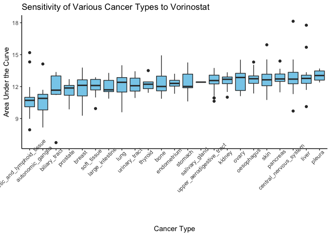
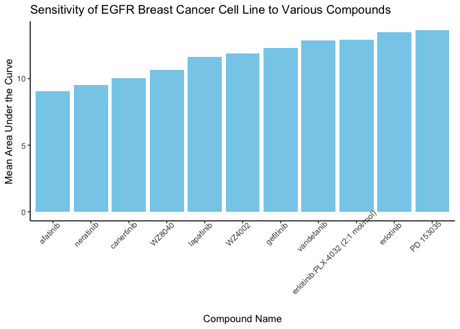

HW05 Part 2
================
Olivia Pura
8/3/2020

## HW05 Part 2

As in Part 1, we need to load the tidyverse package in order to
manipulate and wrangle the CTRP files.

``` r
library(tidyverse)
```

    ## Warning: package 'purrr' was built under R version 3.6.2

``` r
library(knitr)
```

### Reading in all CTRP files

### Manipulating the dataset

To begin, we can use bind\_rows() to “stack” AUC\_1 and AUC\_2 on top of
each other. Those .csv files have an “experiment\_id” column, which can
be joined with the “expt\_id” column in experiment\_info.csv. Next,
cancer\_cell\_line\_info.csv can be added by joining the dataframe by
the “master\_ccl\_id” column. Finally, compound\_info.csv can be joined
in by the “master\_cpd\_id” column.

### Answering the dataset questions

1.  Which cancer type has the lowest AUC values to the compound
    “vorinostat”?

<!-- -->

**The cancer with the lowest AUC values to vorinostat is Haematopoietic
and Lymphoid Tissue cancer.**

2.  Which compound is the prostate cancer cell line 22RV1 most sensitive
    to? (For 22RV1, which compound has the lowest AUC
    value?)

<!-- end list -->

    ## [1] "The DU145 prostate cancer cell line is most sensitive to the compound oligomycin A ."

**My dataframe did not contain any cell lines called 22RV1. Instead,
I’ll be using the DU145 prostate cancer cell line.**

3.For the 10 compounds that target EGFR, which of them has (on average)
the lowest AUC values in the breast cancer cell lines?

<!-- -->

**The EGFR cancer cell line is least sensitive to afatinib.**
