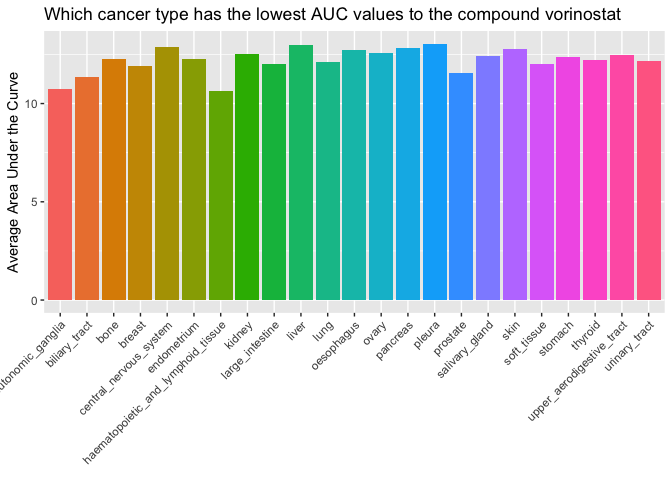
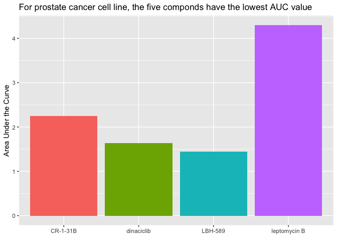
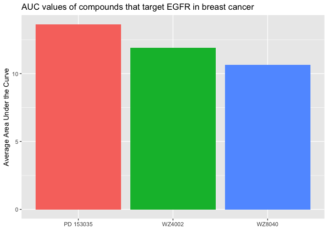

HW05
================
Bei Wang

## 1\. Tidying the dad\_mom file

    Each variable must have its own column.
    Each observation must have its own row.
    Each value must have its own cell.

``` r
#read dataset
dad_mom<- read.table("dad_mom.txt", header=TRUE) 

#reshape
tidy_dad_mom<- dad_mom %>%
  unite("dad", name_dad, income_dad) %>%
  unite("mom", name_mom, income_mom) %>%
  pivot_longer(c(dad, mom), names_to="parent", values_to="income") %>%
  separate(income, c("name", "income"))

#print
tidy_dad_mom
```

    ## # A tibble: 6 x 4
    ##   fam_id parent name  income
    ##    <int> <chr>  <chr> <chr> 
    ## 1      1 dad    Bill  30000 
    ## 2      1 mom    Bess  15000 
    ## 3      2 dad    Art   22000 
    ## 4      2 mom    Amy   22000 
    ## 5      3 dad    Paul  25000 
    ## 6      3 mom    Pat   50000

## 2\. Joining together CTRP data

``` r
#read files
AUC_1 <- read_csv("CTRP_files/AUC_1.csv")
```

    ## Parsed with column specification:
    ## cols(
    ##   experiment_id = col_double(),
    ##   area_under_curve = col_double(),
    ##   master_cpd_id = col_double()
    ## )

``` r
AUC_2 <- read_csv("CTRP_files/AUC_2.csv")
```

    ## Parsed with column specification:
    ## cols(
    ##   experiment_id = col_double(),
    ##   area_under_curve = col_double(),
    ##   master_cpd_id = col_double()
    ## )

``` r
cancer_cell_line_info <- read_csv("CTRP_files/cancer_cell_line_info.csv")
```

    ## Parsed with column specification:
    ## cols(
    ##   master_ccl_id = col_double(),
    ##   ccl_name = col_character(),
    ##   cancer_type = col_character()
    ## )

``` r
compound_info <- read_csv("CTRP_files/compound_info.csv")
```

    ## Parsed with column specification:
    ## cols(
    ##   master_cpd_id = col_double(),
    ##   cpd_name = col_character(),
    ##   gene_symbol_of_protein_target = col_character()
    ## )

``` r
Experiment_info <- read_csv("CTRP_files/Experiment_info.csv")
```

    ## Parsed with column specification:
    ## cols(
    ##   expt_id = col_double(),
    ##   master_ccl_id = col_double(),
    ##   experiment_date = col_double(),
    ##   cells_per_well = col_double()
    ## )

``` r
#glimpse
glimpse(AUC_1)
```

    ## Rows: 20,000
    ## Columns: 3
    ## $ experiment_id    <dbl> 1, 1, 1, 1, 1, 1, 1, 1, 1, 1, 1, 1, 1, 1, 1, 1, 1, 1…
    ## $ area_under_curve <dbl> 14.782, 13.327, 16.082, 13.743, 13.390, 14.385, 13.0…
    ## $ master_cpd_id    <dbl> 1788, 3588, 12877, 19153, 23256, 25036, 25334, 25344…

``` r
glimpse(AUC_2)
```

    ## Rows: 195,263
    ## Columns: 3
    ## $ experiment_id    <dbl> 461, 461, 461, 461, 461, 461, 461, 461, 461, 461, 46…
    ## $ area_under_curve <dbl> 13.4890, 14.7920, 14.7240, 13.8810, 14.7010, 14.6260…
    ## $ master_cpd_id    <dbl> 606586, 606670, 607696, 608062, 608999, 609058, 6090…

``` r
glimpse(cancer_cell_line_info)
```

    ## Rows: 1,107
    ## Columns: 3
    ## $ master_ccl_id <dbl> 1, 3, 4, 5, 6, 7, 8, 9, 10, 13, 14, 15, 16, 19, 20, 21,…
    ## $ ccl_name      <chr> "697", "5637", "2313287", "1321N1", "143B", "22RV1", "2…
    ## $ cancer_type   <chr> "haematopoietic_and_lymphoid_tissue", "urinary_tract", …

``` r
glimpse(compound_info)
```

    ## Rows: 545
    ## Columns: 3
    ## $ master_cpd_id                 <dbl> 1788, 3588, 12877, 17712, 18311, 19153,…
    ## $ cpd_name                      <chr> "CIL55", "BRD4132", "BRD6340", "ML006",…
    ## $ gene_symbol_of_protein_target <chr> NA, NA, NA, "S1PR3", "BAX", NA, "RARA;R…

``` r
glimpse(Experiment_info)
```

    ## Rows: 1,061
    ## Columns: 4
    ## $ expt_id         <dbl> 1, 2, 3, 4, 5, 6, 7, 8, 9, 10, 11, 12, 13, 14, 15, 16…
    ## $ master_ccl_id   <dbl> 130, 569, 682, 9, 61, 62, 108, 111, 115, 119, 455, 85…
    ## $ experiment_date <dbl> 20120501, 20120501, 20120501, 20120504, 20120504, 201…
    ## $ cells_per_well  <dbl> 500, 500, 500, 500, 500, 500, 500, 500, 500, 500, 500…

``` r
#Since AUC_1 and AUC_2 look like two parrelle data frame with links to the other files, so i join AUC_1 and _2 first, and then combin them with the other files

#join AUC_1 with _2
AUC<- AUC_1 %>%
  bind_rows(AUC_2)

#join auc with other files
total_AUC<- AUC %>%
  inner_join(Experiment_info, by=c("experiment_id"="expt_id")) %>%
  inner_join(compound_info, by="master_cpd_id") %>%
  inner_join(cancer_cell_line_info, by="master_ccl_id") 
```

  - Which cancer type has the lowest AUC values to the compound
    “vorinostat”?
    
      - answer: haematopoietic\_and\_lymphoid\_tissue

<!-- end list -->

``` r
#average AUC of different cancer types
q1<- total_AUC %>%
  select(area_under_curve, cancer_type, cpd_name) %>%
  filter(cpd_name== "vorinostat") %>%
  group_by(cancer_type) %>%
  drop_na(cancer_type) %>%
  summarize(AUC= mean(area_under_curve))
```

    ## `summarise()` ungrouping output (override with `.groups` argument)

``` r
#plot
q1 %>%
  ggplot(aes(x=cancer_type, y=AUC, fill=cancer_type))+
  geom_col()+
  labs(title="Which cancer type has the lowest AUC values to the compound vorinostat", x=element_blank(), y="Average Area Under the Curve")+
  theme(axis.text.x=element_text(angle=45, hjust=1))+
  theme(legend.position="none")
```

<!-- -->

  - Which compound is the prostate cancer cell line 22RV1 most sensitive
    to? (For 22RV1, which compound has the lowest AUC value?)
    
      - answer: LBH-589

<!-- end list -->

``` r
#it returns 0 row when using 22RV1 for ccl_name, unsure why.
total_AUC %>%
  select(ccl_name, cpd_name, area_under_curve) %>%
  filter(ccl_name=="22RV1") %>%
  arrange(area_under_curve)
```

    ## # A tibble: 0 x 3
    ## # … with 3 variables: ccl_name <chr>, cpd_name <chr>, area_under_curve <dbl>

``` r
#instead use prostate as in cancer_type 
q2<- total_AUC %>%
  select(cancer_type, cpd_name, area_under_curve) %>%
  filter(cancer_type=="prostate") %>%
  arrange(area_under_curve)

#select the lowest 5 in terms of auc for plotting
low5<- q2[1:5,] 

low5 %>%
  ggplot(aes(x=cpd_name, y=area_under_curve, fill= cpd_name)) +
  geom_col()+
  labs(title="For prostate cancer cell line, the five componds have the lowest AUC value", x=element_blank(), y="Area Under the Curve")+
  theme(legend.position="none")
```

<!-- -->

  - For the 10 compounds that target EGFR, which of them has (on
    average) the lowest AUC values in the breast cancer
    
      - “WZ8040” has the lowest average value
      - There are only 3 compounds I filtered based on the question,
        instead of 10, I’m not sure if the way I did it is incorrect.

<!-- end list -->

``` r
#filter the AUC according to the question
q3<- total_AUC %>%
  select(gene_symbol_of_protein_target, area_under_curve, cpd_name, cancer_type) %>%
  filter(gene_symbol_of_protein_target=="EGFR", cancer_type=="breast") %>%
  group_by(cpd_name) %>%
  summarize(AUC=mean(area_under_curve)) #my filtered cpd_name has only 3 different values instead of 10?
```

    ## `summarise()` ungrouping output (override with `.groups` argument)

``` r
#plot
q3 %>% ggplot(aes(x=cpd_name, y=AUC, fill= cpd_name)) +
  geom_col() +
  labs(title="AUC values of compounds that target EGFR in breast cancer", x=element_blank(), y="Average Area Under the Curve")+
  theme(legend.position="none")
```

<!-- -->
