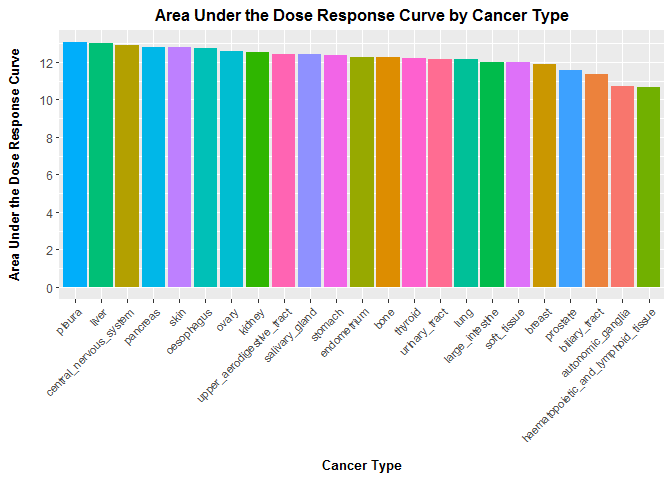
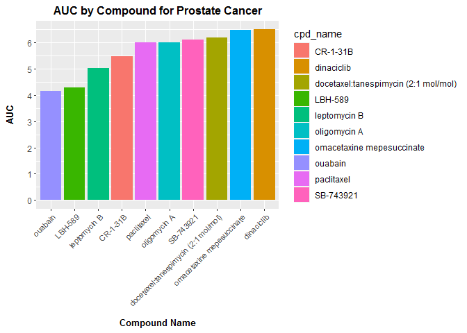
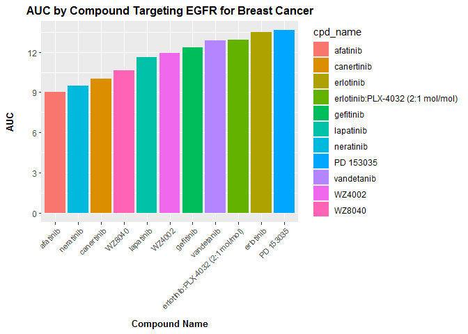

HW05
================
Mingyu Qi
8/3/2020

# 1\. Tidying the dad\_mom file

## Read in dad\_mom file

``` r
#load libraries
library(tidyverse)    
library(knitr)
library(ggrepel)

#read in "dad_mom.txt" file
dad_mom <- read.delim("dad_mom.txt")
glimpse(dad_mom)
```

    ## Rows: 3
    ## Columns: 5
    ## $ fam_id     <int> 1, 2, 3
    ## $ name_dad   <chr> "Bill", "Art", "Paul"
    ## $ income_dad <int> 30000, 22000, 25000
    ## $ name_mom   <chr> "Bess", "Amy", "Pat"
    ## $ income_mom <int> 15000, 22000, 50000

## Clean up dad\_mom data frame

``` r
dad_mom_tidy <- dad_mom %>%
  #use gather() to create a "dad or mom" indicator and a name variable 
  gather(key = "parent", value = "name", name_dad,name_mom) %>%
  #re-code variable dad_mom to parent which equals "dad" or "mom"
  mutate(parent = recode(parent, 'name_dad' = "dad", .default = "mom")) %>%
  #use ifelse() to create a new income variable 
  mutate(income = ifelse(parent == "dad", income_dad, income_mom)) %>%
  #drop old variables 
  select(-income_dad, -income_mom) %>%
  #sort data set by family ID
  arrange(fam_id)

#print data set 
print(dad_mom_tidy)
```

    ##   fam_id parent name income
    ## 1      1    dad Bill  30000
    ## 2      1    mom Bess  15000
    ## 3      2    dad  Art  22000
    ## 4      2    mom  Amy  22000
    ## 5      3    dad Paul  25000
    ## 6      3    mom  Pat  50000

# 2\. Joining together CTRP data

## Read in five CSV files

``` r
#read in AUC_1
AUC_1 <- read.csv("CTRP_files/AUC_1.csv")

#read in AUC_2
AUC_2 <- read.csv("CTRP_files/AUC_2.csv")

#read in cancer_cell_line_info
cancer_cell_line_info <- read.csv("CTRP_files/cancer_cell_line_info.csv")

#read in compound_info
compound_info <- read.csv("CTRP_files/compound_info.csv")

#read in Experiment_info
Experiment_info <- read.csv("CTRP_files/Experiment_info.csv")
```

## Join data sets together

``` r
#Vertically join AUC_1 and AUC_2
AUC <- bind_rows(AUC_1, AUC_2) %>%
  arrange(experiment_id)

#Join with Experiment_info
AUC_Exp <- AUC %>%
  full_join(Experiment_info, by = c("experiment_id" = "expt_id"))

#Join with cancer_cell_line_info
AUC_Cancer <- AUC_Exp %>%
  full_join(cancer_cell_line_info, by = "master_ccl_id")

#Join with compound_info
AUC_Compound <- AUC_Cancer %>%
  full_join(compound_info, by = "master_cpd_id")
```

## Which cancer type has the lowest AUC values to the compound “vorinostat”?

``` r
#limit data to the compound "vorinostat" and summarize average AUC of each cancer type
AUC_vor <- AUC_Compound %>%
  filter(cpd_name == "vorinostat" & is.na(cancer_type) == FALSE & is.na(area_under_curve) == FALSE ) %>%
  group_by(cancer_type) %>%
  summarize(AUC = mean(area_under_curve)) %>%
  arrange(AUC)
  
#plot average AUC by cancer type 
ggplot(AUC_vor, aes(x = reorder(cancer_type, -AUC), y = AUC, fill = cancer_type)) + 
  geom_col() + 
  scale_y_continuous(breaks = seq(0, 16, by = 2)) +
  labs(title = "Area Under the Dose Response Curve by Cancer Type", x = "\nCancer Type", y = "Area Under the Dose Response Curve\n") +
  theme(plot.title = element_text(hjust = 0.5, size = 12, face = "bold"), axis.text.x = element_text(angle = 45, hjust=1, size=8), , axis.title.x = element_text(size = 10, face = "bold"), axis.title.y = element_text(size = 10, face = "bold"), legend.position = "none")
```

<!-- -->

``` r
#According to the graph, "haematopoietic_and_lymphoid_tissue" has the lowest AUC values to the compound vorinostat.
print(paste("Cancer", AUC_vor[1,1], "has the lowest AUC values to the compound vorinostat."))
```

    ## [1] "Cancer haematopoietic_and_lymphoid_tissue has the lowest AUC values to the compound vorinostat."

## Which compound is the prostate cancer cell line 22RV1 most sensitive to? (For 22RV1, which compound has the lowest AUC value?)

### It looks there is no observation associated with cancer cell line 22RV1 in the data set. So, I used all prostate cancer records instead.

``` r
#limit data to prostate cancer
AUC_22RV1 <- AUC_Compound %>%
  filter(cancer_type == "prostate" & is.na(cpd_name) == FALSE & is.na(area_under_curve) == FALSE ) %>%
  group_by(cpd_name) %>%
  summarize(AUC = mean(area_under_curve)) %>%
  arrange(AUC) %>%
  top_n(-10, AUC)

#generate a bar plot to show the compound with the lowest AUC
ggplot(AUC_22RV1, aes(x = reorder(cpd_name, AUC), y = AUC, fill = cpd_name)) + 
  geom_col() + 
  scale_y_continuous(breaks = seq(0, 8, by = 1)) +
  labs(title = "AUC by Compound for Prostate Cancer", x = "\nCompound Name", y = "AUC\n") +
  theme(plot.title = element_text(hjust = 0.5, size = 12, face = "bold"), axis.text.x = element_text(angle = 45, hjust=1, size=8), axis.title.x = element_text(size = 10, face = "bold"), axis.title.y = element_text(size = 10, face = "bold"))
```

<!-- -->

``` r
# According to the graph, compound "ouabain" has the lowest AUC value. 
print(paste("Compund", AUC_22RV1[1,1], "has the lowest AUC value."))
```

    ## [1] "Compund ouabain has the lowest AUC value."

## For the 10 compounds that target EGFR, which of them has (on average) the lowest AUC values in the breast cancer cell lines?

``` r
#limit data to compounds that target EGFR and in the breast cancer cell lines
AUC_EGFR <- AUC_Compound %>%
  filter(str_detect(gene_symbol_of_protein_target, "EGFR") & cancer_type == "breast" & is.na(area_under_curve) == FALSE ) %>%
  group_by(cpd_name) %>%
  summarize(AUC = mean(area_under_curve)) %>%
  arrange(AUC) 

#generate a bar plot to show the compound with the lowest AUC
ggplot(AUC_EGFR, aes(x = reorder(cpd_name, AUC), y = AUC, fill = cpd_name)) + 
  geom_col() + 
  scale_y_continuous(breaks = seq(0, 15, by = 3)) +
  labs(title = "AUC by Compound Targeting EGFR for Breast Cancer", x = "\nCompound Name", y = "AUC\n") +
  theme(plot.title = element_text(hjust = 0.5, size = 12, face = "bold"), axis.text.x = element_text(angle = 45, hjust=1, size=8), axis.title.x = element_text(size = 10, face = "bold"), axis.title.y = element_text(size = 10, face = "bold"))
```

<!-- -->

``` r
# According to the graph, compound "afatinib" has the lowest AUC value. 
print(paste("Compund", AUC_EGFR[1,1], "has the lowest AUC values in the breast cancer cell lines."))
```

    ## [1] "Compund afatinib has the lowest AUC values in the breast cancer cell lines."
