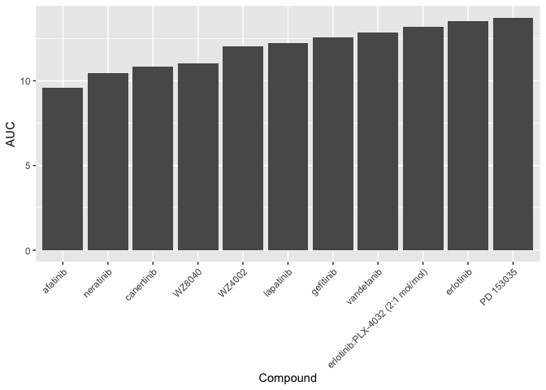

HW05
================
Xiaoshan Ke
8/1/2020

### HW Assignment

This week the goal is to practice tidying data and joining files
together. Similar to last week you can practice these skills with data
you already have or you can follow with the two (probably pretty short)
HW assignments below.

## 1\. Tidying the dad\_mom file

In this repo, you’ll find a dad\_mom.txt file that isn’t particularly
tidy. Clean this up so there are only 4 columns Tidy this data frame so
that it adheres to the tidy data principles:

    Each variable must have its own column.
    Each observation must have its own row.
    Each value must have its own cell.

``` r
dad_mom <- read.delim("dad_mom.txt")
clean_up <- dad_mom %>%
  gather(key = "key", value = "value", name_dad:income_mom) %>%
  separate(key, into = c("var","dad_or_mom"), convert = TRUE) %>%
  spread(var, value) 
```

    ## Warning: attributes are not identical across measure variables;
    ## they will be dropped

``` r
clean_up
```

    ##   fam_id dad_or_mom income name
    ## 1      1        dad  30000 Bill
    ## 2      1        mom  15000 Bess
    ## 3      2        dad  22000  Art
    ## 4      2        mom  22000  Amy
    ## 5      3        dad  25000 Paul
    ## 6      3        mom  50000  Pat

## 2\. Joining together CTRP data

CTRP is a dataset I use in my research. CTRP screens cancer cells with
various compounds and determines the Area Under the Dose Response Curve
(AUC, a metric for how sensitive a cell line is to that compound).
However, when you download the data, it comes in parts that requires a
lot of id matching to be able to use reasonably easily. For example, the
file that contains the AUC data doesn’t tell you the cell line name or
the type of cancer it is, it just gives an experiment ID number. If you
wanted to know which cell line was which, you’d have to reference the
experiment\_info.csv file which gives you a cell line ID for each
experiment, and then reference the the cancer\_cell\_line\_file.csv to
figure out what the name of that cell line actually is.

That is all to say, it would be much easier if those files were all
together instead. You’re goal is to join together the 5 csv together.

*I repeated full\_join() for three times to join the datasets, but maybe
there’s an easier solution?*

``` r
setwd("~/Desktop/DataCamp/HW05/CTRP_files")
AUC_1 <- read.csv("AUC_1.csv")
AUC_2 <- read.csv("AUC_2.csv")
cell_line <- read.csv("cancer_cell_line_info.csv")
compound <- read.csv("compound_info.csv")
experiment <- read.csv("Experiment_info.csv")

AUC <- rbind(AUC_1,AUC_2)
cpd_set <- full_join(AUC, compound, by = "master_cpd_id")
ccl_set <- full_join(experiment, cell_line, by = "master_ccl_id")
exp_set <- full_join(cpd_set, ccl_set, by = c("experiment_id" = "expt_id"))
head(exp_set)
```

    ##   experiment_id area_under_curve master_cpd_id       cpd_name
    ## 1             1           14.782          1788          CIL55
    ## 2             1           13.327          3588        BRD4132
    ## 3             1           16.082         12877        BRD6340
    ## 4             1           13.743         19153        BRD9876
    ## 5             1           13.390         23256 betulinic acid
    ## 6             1           14.385         25036       gossypol
    ##   gene_symbol_of_protein_target master_ccl_id experiment_date cells_per_well
    ## 1                          <NA>           130        20120501            500
    ## 2                          <NA>           130        20120501            500
    ## 3                          <NA>           130        20120501            500
    ## 4                          <NA>           130        20120501            500
    ## 5                          <NA>           130        20120501            500
    ## 6    BCL2;BCL2L1;LDHA;LDHB;LDHC           130        20120501            500
    ##   ccl_name            cancer_type
    ## 1     CAS1 central_nervous_system
    ## 2     CAS1 central_nervous_system
    ## 3     CAS1 central_nervous_system
    ## 4     CAS1 central_nervous_system
    ## 5     CAS1 central_nervous_system
    ## 6     CAS1 central_nervous_system

Then once those files are all together, you should have no problem
answering the following questions (with graphs):

  - Which cancer type has the lowest AUC values to the compound
    “vorinostat”?

<!-- end list -->

``` r
vorinostat <- subset(exp_set,cpd_name == "vorinostat")
vorinostat <- vorinostat[order(vorinostat$area_under_curve),]
print(paste("The cancer type that has the lowest AUC values to vorinostat is",vorinostat$cancer_type[1]))
```

    ## [1] "The cancer type that has the lowest AUC values to vorinostat is upper_aerodigestive_tract"

  - Which compound is the prostate cancer cell line 22RV1 most sensitive
    to? (For 22RV1, which compound has the lowest AUC value?)

<!-- end list -->

``` r
RV1 <- subset(exp_set,ccl_name == "22RV1")
RV1 <- RV1[order(RV1$area_under_curve),]
print(paste("For 22RV1, the compound that has the lowest AUC value is",RV1$cpd_name[1]))
```

    ## [1] "For 22RV1, the compound that has the lowest AUC value is leptomycin B"

  - For the 10 compounds that target EGFR, which of them has (on
    average) the lowest AUC values in the breast cancer cell lines?

*By looking at the below plot, I know that the compound with the lowest
AUC values in the breast cancer cell lines is afatinib. However I didn’t
figure out how to combine the two eriotinib group–although the result
won’t be affected in this particular case.*

``` r
breast <- subset(exp_set,cancer_type == "breast")
EGFR <- filter(breast,str_detect(gene_symbol_of_protein_target, "EGFR")==TRUE)
mean <- aggregate(EGFR[,2],list(EGFR$cpd_name),mean)
ggplot(mean,aes(x=reorder(Group.1,x),y=x))+
  geom_col(stat = "identity")+
  xlab("Compound")+
  ylab("AUC")+
  theme(axis.text.x = element_text(angle = 45, vjust = 1, hjust = 1))
```

    ## Warning: Ignoring unknown parameters: stat

<!-- -->
