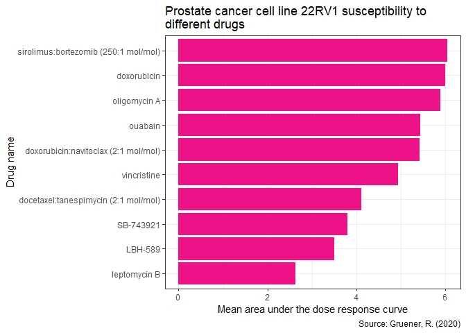

HW05
================
Ricardo Muñiz Trejo
2/8/2020

## Tidying the dad\_mom file

Untidied version of the dad\_mom data frame:

``` r
dad_mom_messy <- read_tsv("dad_mom.txt")
```

    ## Parsed with column specification:
    ## cols(
    ##   fam_id = col_double(),
    ##   name_dad = col_character(),
    ##   income_dad = col_double(),
    ##   name_mom = col_character(),
    ##   income_mom = col_double()
    ## )

``` r
kable(dad_mom_messy, format = "markdown")
```

| fam\_id | name\_dad | income\_dad | name\_mom | income\_mom |
| ------: | :-------- | ----------: | :-------- | ----------: |
|       1 | Bill      |       30000 | Bess      |       15000 |
|       2 | Art       |       22000 | Amy       |       22000 |
|       3 | Paul      |       25000 | Pat       |       50000 |

Besides **fam\_id**, **name**, and **income**, dad\_mom.txt includes a
fourth variable: whether the parent is the dad or the mom, which I’ll
simply call **parent**. Therefore, we need to reshape the table to have
the names and income in a single column and create a new variable that
specifies if the parent is mom or dad.

Here’s the tidied version of the dad\_mom data frame:

``` r
#Ok, this one can be confusing, even for me, I'll try to explain it as best as I can. 

dad_mom_tidy <- dad_mom_messy %>%
  #Since the parent variable only exist in the column names (i. e. *_mom, *_dad), I created new columns that specify if the parent is mom or dad.
  separate(col = name_dad, into = c("name_dad", "parent_dad")) %>%
  separate(col = name_mom, into = c("name_mom", "parent_mom")) %>% #parent_mom/parent_dad will be empty columns
  replace_na(list(parent_dad = "dad",
                  parent_mom = "mom")) %>% #I filled the empty columns with the proper value (dad/mom)
  
  #For now, I joined the name and parent variables into one to manipulate them later easily
  unite(name_dad, parent_dad, col = "name_dad", sep = "_") %>%
  unite(name_mom, parent_mom, col = "name_mom", sep = "_") %>%
  
  #Since I need all the names in a single column, I spread them first as variables, with the income as observations. This creates a data frame with a lot of NA values
  spread(key = name_dad, value = income_dad) %>%
  spread(key = name_mom, value = income_mom) %>%
  
  #Now that the parents names are read as variables, I only need to gather them into a single key column, with incomes as the value column. I also eliminated the NA values in the income.
  gather(key = "name", value = "income", -fam_id, na.rm = TRUE) %>%
  
  #Finally, we separate name and parent variables (remember they were united) to get the last variable, parent, into a single column
  separate(col = name, into = c("name", "parent")) %>%
  arrange(fam_id)
```

    ## Warning: Expected 2 pieces. Missing pieces filled with `NA` in 3 rows [1, 2, 3].
    
    ## Warning: Expected 2 pieces. Missing pieces filled with `NA` in 3 rows [1, 2, 3].

``` r
kable(dad_mom_tidy, format = "markdown")
```

| fam\_id | name | parent | income |
| ------: | :--- | :----- | -----: |
|       1 | Bill | dad    |  30000 |
|       1 | Bess | mom    |  15000 |
|       2 | Art  | dad    |  22000 |
|       2 | Amy  | mom    |  22000 |
|       3 | Paul | dad    |  25000 |
|       3 | Pat  | mom    |  50000 |

Ok, that code it’s horrible, long, and confusing. It gets the result,
but it’s not the easiest way of tidying the data (I guess). I wrote it
in the middle of the night, so maybe my mind wasn’t in the right place.
I’m going to try to simplify it as much as possible. Let’s see what I
can do…

``` r
#It took a some of trail and error, but this is much more simple and elegant.
dad_mom_tidy2 <- dad_mom_messy %>%
  gather(key = "variables", value = "value", -fam_id) %>% #This way you get name, income and parent all in the same column
  separate(col = variables, into = c("variables", "parent")) %>% #You can get rid of *_dad/*_mom very easily to get a new column: parent
  spread(key = variables, value = value) #You just spread the remaining "variables" into their own columns and that's it!

kable(dad_mom_tidy2, format = "markdown")
```

| fam\_id | parent | income | name |
| ------: | :----- | :----- | :--- |
|       1 | dad    | 30000  | Bill |
|       1 | mom    | 15000  | Bess |
|       2 | dad    | 22000  | Art  |
|       2 | mom    | 22000  | Amy  |
|       3 | dad    | 25000  | Paul |
|       3 | mom    | 50000  | Pat  |

Yes, it’s possible to optimize the code, fantastic\! I left the long
version as a personal reminder that a good night sleep is a must for
coding.

## Joining together CTRP data

#### Reading and importing files:

``` r
#Let's make data frames for every file in CTPR_files

AUC_1 <- read_csv("CTRP_files/AUC_1.csv") #Updated file
```

    ## Parsed with column specification:
    ## cols(
    ##   experiment_id = col_double(),
    ##   area_under_curve = col_double(),
    ##   master_cpd_id = col_double()
    ## )

``` r
AUC_2 <- read_csv("CTRP_files/AUC_2.csv")
```

    ## Parsed with column specification:
    ## cols(
    ##   experiment_id = col_double(),
    ##   area_under_curve = col_double(),
    ##   master_cpd_id = col_double()
    ## )

``` r
cancer_cell_line_info <- read_csv("CTRP_files/cancer_cell_line_info.csv")
```

    ## Parsed with column specification:
    ## cols(
    ##   master_ccl_id = col_double(),
    ##   ccl_name = col_character(),
    ##   cancer_type = col_character()
    ## )

``` r
compound_info <- read_csv("CTRP_files/compound_info.csv")
```

    ## Parsed with column specification:
    ## cols(
    ##   master_cpd_id = col_double(),
    ##   cpd_name = col_character(),
    ##   gene_symbol_of_protein_target = col_character()
    ## )

``` r
experiment_info <- read_csv("CTRP_files/experiment_info.csv")
```

    ## Parsed with column specification:
    ## cols(
    ##   expt_id = col_double(),
    ##   master_ccl_id = col_double(),
    ##   experiment_date = col_double(),
    ##   cells_per_well = col_double()
    ## )

#### Joining process:

``` r
#Bind the AUC files to get a single file
AUC_total <- AUC_1 %>%
  bind_rows(AUC_2)

#Let's join with the remaining data frames
CTRP_df <- AUC_total %>%
  inner_join(experiment_info, by = c("experiment_id" = "expt_id")) %>%
  inner_join(cancer_cell_line_info, by = "master_ccl_id") %>%
  inner_join(compound_info, by = "master_cpd_id") %>%
  separate_rows(gene_symbol_of_protein_target, sep = ";") #Tidy up that variable


glimpse(CTRP_df)
```

    ## Rows: 884,259
    ## Columns: 10
    ## $ experiment_id                 <dbl> 1, 1, 1, 1, 1, 1, 1, 1, 1, 1, 1, 1, 1...
    ## $ area_under_curve              <dbl> 14.782, 13.327, 16.082, 13.743, 13.39...
    ## $ master_cpd_id                 <dbl> 1788, 3588, 12877, 19153, 23256, 2503...
    ## $ master_ccl_id                 <dbl> 130, 130, 130, 130, 130, 130, 130, 13...
    ## $ experiment_date               <dbl> 20120501, 20120501, 20120501, 2012050...
    ## $ cells_per_well                <dbl> 500, 500, 500, 500, 500, 500, 500, 50...
    ## $ ccl_name                      <chr> "CAS1", "CAS1", "CAS1", "CAS1", "CAS1...
    ## $ cancer_type                   <chr> "central_nervous_system", "central_ne...
    ## $ cpd_name                      <chr> "CIL55", "BRD4132", "BRD6340", "BRD98...
    ## $ gene_symbol_of_protein_target <chr> NA, NA, NA, NA, NA, "BCL2", "BCL2L1",...

#### Answering the questions:

Once those files are all together, you should have no problem answering
the following questions (with graphs):

  - Which cancer type has the lowest AUC values to the compound
    “vorinostat”?

<!-- end list -->

``` r
theme_set(theme_bw())

CTRP_df_q1 <- CTRP_df %>%
  select(cpd_name, cancer_type, area_under_curve) %>%
  filter(cpd_name == "vorinostat") %>%
  group_by(cancer_type) %>%
  summarize(AUC = mean(area_under_curve)) %>%
  drop_na(cancer_type) %>% #There is a NA cancer type, it's not the lowest value, so I eliminated it.
  arrange(AUC)
```

    ## `summarise()` ungrouping output (override with `.groups` argument)

``` r
ggplot(CTRP_df_q1, aes(fct_inorder(cancer_type), AUC)) +
  geom_col(fill = "turquoise4") +
  labs(title = "Susceptibility of cancer types to vorinostat",
       y = "Mean area under the dose response curve",
       x = "Cancer type",
       caption = "Source: Gruener, R. (2020)") +
  theme(legend.position = "none")+
  coord_flip() #flipping x and y-axes helps with the very long names of cancer types
```

<!-- -->

    ## [1] "autonomic_ganglia cancer has the lowest AUC value to vorinostat."

  - Which compound is the prostate cancer cell line 22RV1 most sensitive
    to? (For 22RV1, which compound has the lowest AUC value?)

<!-- end list -->

``` r
CTRP_df_q2 <- CTRP_df %>%
  select(cancer_type, ccl_name, cpd_name, area_under_curve) %>%
  filter(cancer_type == "prostate", ccl_name == "22RV1") %>%
  group_by(cpd_name) %>%
  summarize(AUC = mean(area_under_curve)) %>%
  arrange(AUC) %>%
  top_n(-10, AUC) #I cheat a little bit in here. Because there are so many compounds that interact with 22RV1 that in the graph it becomes difficult to read the labels, I decided to narrow the number of compounds to the top (or "bottom" in this case, hence the negative number) 10 with the lowest AUC. 
```

    ## `summarise()` ungrouping output (override with `.groups` argument)

``` r
ggplot(CTRP_df_q2, aes(fct_inorder(cpd_name), y = AUC)) +
  geom_col(fill = "deeppink2") +
  labs(title = "Prostate cancer cell line 22RV1 susceptibility to \ndifferent drugs",
       x = "Drug name",
       y = "Mean area under the dose response curve",
       caption = "Source: Gruener, R. (2020)") +
  coord_flip() #same reason as before
```

<!-- -->

    ## [1] "Prostate cancer cell line 22RV1 is most sensitve to leptomycin B than any other drug."

  - For the 10 compounds that target EGFR, which of them has (on
    average) the lowest AUC values in the breast cancer cell lines?

<!-- end list -->

``` r
CTRP_df_q3 <- CTRP_df %>%
  filter(gene_symbol_of_protein_target == "EGFR", cancer_type == "breast") %>%
  group_by(cpd_name) %>%
  summarize(AUC = mean(area_under_curve)) %>%
  arrange(AUC)
```

    ## `summarise()` ungrouping output (override with `.groups` argument)

``` r
cpd_labels <- c("Afatinib", "Neratinib", "Gefatinib", "WZ8040", "Canertinib", "Erlotinib:PLX-4032", "Vandetanib", "Erlotinib", "Lapatinib", "WZ4002", "PD 153035") #Simplified compound names

ggplot(CTRP_df_q3, aes(fct_inorder(cpd_name), AUC)) +
  geom_col(fill = "forestgreen") +
  theme(axis.text.x = element_text(angle = 45, hjust = 1)) +
  labs(title = "Compounds that target the EGFR gene in breast cancer cell lines",
       x = "Drug name",
       y = "Mean area under the dose response curve",
       caption = "Source: Gruener, R. (2020)") +
  scale_x_discrete(labels = cpd_labels)
```

<!-- -->

    ## [1] "On average, of the compounds that target EGFR, afatinib has the lowest AUC value in the breast cancer cell lines."

## Session info

``` r
devtools::session_info()
```

    ## - Session info ---------------------------------------------------------------
    ##  setting  value                       
    ##  version  R version 4.0.1 (2020-06-06)
    ##  os       Windows 10 x64              
    ##  system   x86_64, mingw32             
    ##  ui       RTerm                       
    ##  language (EN)                        
    ##  collate  Spanish_Mexico.1252         
    ##  ctype    Spanish_Mexico.1252         
    ##  tz       America/Mexico_City         
    ##  date     2020-08-03                  
    ## 
    ## - Packages -------------------------------------------------------------------
    ##  package     * version date       lib source        
    ##  assertthat    0.2.1   2019-03-21 [1] CRAN (R 4.0.2)
    ##  backports     1.1.7   2020-05-13 [1] CRAN (R 4.0.0)
    ##  blob          1.2.1   2020-01-20 [1] CRAN (R 4.0.2)
    ##  broom         0.5.6   2020-04-20 [1] CRAN (R 4.0.2)
    ##  callr         3.4.3   2020-03-28 [1] CRAN (R 4.0.2)
    ##  cellranger    1.1.0   2016-07-27 [1] CRAN (R 4.0.2)
    ##  cli           2.0.2   2020-02-28 [1] CRAN (R 4.0.2)
    ##  colorspace    1.4-1   2019-03-18 [1] CRAN (R 4.0.2)
    ##  crayon        1.3.4   2017-09-16 [1] CRAN (R 4.0.2)
    ##  DBI           1.1.0   2019-12-15 [1] CRAN (R 4.0.2)
    ##  dbplyr        1.4.4   2020-05-27 [1] CRAN (R 4.0.2)
    ##  desc          1.2.0   2018-05-01 [1] CRAN (R 4.0.2)
    ##  devtools      2.3.1   2020-07-21 [1] CRAN (R 4.0.1)
    ##  digest        0.6.25  2020-02-23 [1] CRAN (R 4.0.2)
    ##  dplyr       * 1.0.0   2020-05-29 [1] CRAN (R 4.0.2)
    ##  ellipsis      0.3.1   2020-05-15 [1] CRAN (R 4.0.2)
    ##  evaluate      0.14    2019-05-28 [1] CRAN (R 4.0.2)
    ##  fansi         0.4.1   2020-01-08 [1] CRAN (R 4.0.2)
    ##  farver        2.0.3   2020-01-16 [1] CRAN (R 4.0.2)
    ##  forcats     * 0.5.0   2020-03-01 [1] CRAN (R 4.0.2)
    ##  fs            1.4.1   2020-04-04 [1] CRAN (R 4.0.2)
    ##  generics      0.0.2   2018-11-29 [1] CRAN (R 4.0.2)
    ##  ggplot2     * 3.3.2   2020-06-19 [1] CRAN (R 4.0.2)
    ##  glue          1.4.1   2020-05-13 [1] CRAN (R 4.0.2)
    ##  gtable        0.3.0   2019-03-25 [1] CRAN (R 4.0.2)
    ##  haven         2.3.1   2020-06-01 [1] CRAN (R 4.0.2)
    ##  highr         0.8     2019-03-20 [1] CRAN (R 4.0.2)
    ##  hms           0.5.3   2020-01-08 [1] CRAN (R 4.0.2)
    ##  htmltools     0.5.0   2020-06-16 [1] CRAN (R 4.0.2)
    ##  httr          1.4.1   2019-08-05 [1] CRAN (R 4.0.0)
    ##  jsonlite      1.7.0   2020-06-25 [1] CRAN (R 4.0.2)
    ##  knitr       * 1.29    2020-06-23 [1] CRAN (R 4.0.2)
    ##  labeling      0.3     2014-08-23 [1] CRAN (R 4.0.0)
    ##  lattice       0.20-41 2020-04-02 [2] CRAN (R 4.0.1)
    ##  lifecycle     0.2.0   2020-03-06 [1] CRAN (R 4.0.2)
    ##  lubridate     1.7.9   2020-06-08 [1] CRAN (R 4.0.2)
    ##  magrittr      1.5     2014-11-22 [1] CRAN (R 4.0.2)
    ##  memoise       1.1.0   2017-04-21 [1] CRAN (R 4.0.2)
    ##  modelr        0.1.8   2020-05-19 [1] CRAN (R 4.0.2)
    ##  munsell       0.5.0   2018-06-12 [1] CRAN (R 4.0.2)
    ##  nlme          3.1-148 2020-05-24 [2] CRAN (R 4.0.1)
    ##  pillar        1.4.4   2020-05-05 [1] CRAN (R 4.0.2)
    ##  pkgbuild      1.0.8   2020-05-07 [1] CRAN (R 4.0.2)
    ##  pkgconfig     2.0.3   2019-09-22 [1] CRAN (R 4.0.2)
    ##  pkgload       1.1.0   2020-05-29 [1] CRAN (R 4.0.2)
    ##  prettyunits   1.1.1   2020-01-24 [1] CRAN (R 4.0.2)
    ##  processx      3.4.2   2020-02-09 [1] CRAN (R 4.0.2)
    ##  ps            1.3.3   2020-05-08 [1] CRAN (R 4.0.2)
    ##  purrr       * 0.3.4   2020-04-17 [1] CRAN (R 4.0.2)
    ##  R6            2.4.1   2019-11-12 [1] CRAN (R 4.0.2)
    ##  Rcpp          1.0.4.6 2020-04-09 [1] CRAN (R 4.0.2)
    ##  readr       * 1.3.1   2018-12-21 [1] CRAN (R 4.0.2)
    ##  readxl        1.3.1   2019-03-13 [1] CRAN (R 4.0.2)
    ##  remotes       2.2.0   2020-07-21 [1] CRAN (R 4.0.2)
    ##  reprex        0.3.0   2019-05-16 [1] CRAN (R 4.0.2)
    ##  rlang         0.4.6   2020-05-02 [1] CRAN (R 4.0.2)
    ##  rmarkdown     2.3     2020-06-18 [1] CRAN (R 4.0.2)
    ##  rprojroot     1.3-2   2018-01-03 [1] CRAN (R 4.0.2)
    ##  rstudioapi    0.11    2020-02-07 [1] CRAN (R 4.0.2)
    ##  rvest         0.3.5   2019-11-08 [1] CRAN (R 4.0.0)
    ##  scales        1.1.1   2020-05-11 [1] CRAN (R 4.0.2)
    ##  sessioninfo   1.1.1   2018-11-05 [1] CRAN (R 4.0.2)
    ##  stringi       1.4.6   2020-02-17 [1] CRAN (R 4.0.0)
    ##  stringr     * 1.4.0   2019-02-10 [1] CRAN (R 4.0.2)
    ##  testthat      2.3.2   2020-03-02 [1] CRAN (R 4.0.2)
    ##  tibble      * 3.0.1   2020-04-20 [1] CRAN (R 4.0.2)
    ##  tidyr       * 1.1.0   2020-05-20 [1] CRAN (R 4.0.2)
    ##  tidyselect    1.1.0   2020-05-11 [1] CRAN (R 4.0.2)
    ##  tidyverse   * 1.3.0   2019-11-21 [1] CRAN (R 4.0.2)
    ##  usethis       1.6.1   2020-04-29 [1] CRAN (R 4.0.2)
    ##  utf8          1.1.4   2018-05-24 [1] CRAN (R 4.0.2)
    ##  vctrs         0.3.1   2020-06-05 [1] CRAN (R 4.0.2)
    ##  withr         2.2.0   2020-04-20 [1] CRAN (R 4.0.2)
    ##  xfun          0.15    2020-06-21 [1] CRAN (R 4.0.2)
    ##  xml2          1.3.2   2020-04-23 [1] CRAN (R 4.0.2)
    ##  yaml          2.2.1   2020-02-01 [1] CRAN (R 4.0.0)
    ## 
    ## [1] C:/Users/Ricardo/Documents/R/win-library/4.0
    ## [2] C:/Program Files/R/R-4.0.1/library
