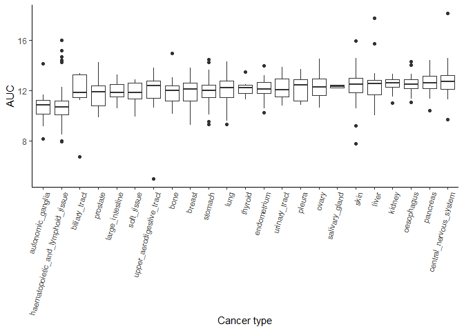

HW05
================
Daniel Krochmal
8/4/2020

## Part 1

``` r
#I will use a sequence of gather(), separate() and spread() verbs to clean-up the datafame

tidyDad_mom <- Dad_mom %>%
  
  gather(key = "var", value = "value",
         convert = FALSE, -fam_id) %>%
  
  #Since the "var" column contains two variables, I'm separating them into "var" (name,income) and "relation" (mom,dad)
  separate(col = var, into = c("var", "relation")) %>%
  
  #Since name and income should have their own column, I'm using spread() to accomplish that 
  spread(key = var, value = value, convert = TRUE) %>%
  
  #Reordering column using select. I wanted the "name" to be a second column, so for the rest I used everything()
  select(fam_id, name, everything()) %>%
  rename(family = fam_id)

kable(
  tidyDad_mom,
  format = "markdown",
  align = "c"
)
```

| family | name | relation | income |
| :----: | :--: | :------: | :----: |
|   1    | Bill |   dad    | 30000  |
|   1    | Bess |   mom    | 15000  |
|   2    | Art  |   dad    | 22000  |
|   2    | Amy  |   mom    | 22000  |
|   3    | Paul |   dad    | 25000  |
|   3    | Pat  |   mom    | 50000  |

## Part 2

### Question 1

Which cancer type has the lowest AUC values to the compound
“vorinostat”?

<!-- -->

**Autonomic ganglia displayed the lowest AUV values to vorinostat**

### Question 2

Which compound is the prostate cancer cell line 22RV1 most sensitive to?
(For 22RV1, which compound has the lowest AUC value?)

| Compound name |    AUC |
| :------------ | -----: |
| leptomycin B  | 2.6367 |

**Prostate cancer cell line 22RV1 was the most sensitive to leptomycin
B**

### Question 3

For the 10 compounds that target EGFR, which of them has (on average)
the lowest AUC values in the breast cancer cell lines?

<!-- -->

**Out of EGFR-targeting compounds, Afatinib had the lowest AUC values in
breast cancer cell lines.**

    ## - Session info ---------------------------------------------------------------
    ##  setting  value                       
    ##  version  R version 4.0.2 (2020-06-22)
    ##  os       Windows 10 x64              
    ##  system   x86_64, mingw32             
    ##  ui       RTerm                       
    ##  language (EN)                        
    ##  collate  English_United States.1252  
    ##  ctype    English_United States.1252  
    ##  tz       America/Chicago             
    ##  date     2020-08-04                  
    ## 
    ## - Packages -------------------------------------------------------------------
    ##  package     * version date       lib source        
    ##  assertthat    0.2.1   2019-03-21 [1] CRAN (R 4.0.2)
    ##  backports     1.1.7   2020-05-13 [1] CRAN (R 4.0.0)
    ##  callr         3.4.3   2020-03-28 [1] CRAN (R 4.0.2)
    ##  cli           2.0.2   2020-02-28 [1] CRAN (R 4.0.2)
    ##  colorspace    1.4-1   2019-03-18 [1] CRAN (R 4.0.2)
    ##  crayon        1.3.4   2017-09-16 [1] CRAN (R 4.0.2)
    ##  desc          1.2.0   2018-05-01 [1] CRAN (R 4.0.2)
    ##  devtools      2.3.1   2020-07-21 [1] CRAN (R 4.0.2)
    ##  digest        0.6.25  2020-02-23 [1] CRAN (R 4.0.2)
    ##  dplyr       * 1.0.0   2020-05-29 [1] CRAN (R 4.0.2)
    ##  ellipsis      0.3.1   2020-05-15 [1] CRAN (R 4.0.2)
    ##  evaluate      0.14    2019-05-28 [1] CRAN (R 4.0.2)
    ##  fansi         0.4.1   2020-01-08 [1] CRAN (R 4.0.2)
    ##  farver        2.0.3   2020-01-16 [1] CRAN (R 4.0.2)
    ##  fs            1.4.2   2020-06-30 [1] CRAN (R 4.0.2)
    ##  generics      0.0.2   2018-11-29 [1] CRAN (R 4.0.2)
    ##  ggplot2     * 3.3.2   2020-06-19 [1] CRAN (R 4.0.2)
    ##  glue          1.4.1   2020-05-13 [1] CRAN (R 4.0.2)
    ##  gtable        0.3.0   2019-03-25 [1] CRAN (R 4.0.2)
    ##  highr         0.8     2019-03-20 [1] CRAN (R 4.0.2)
    ##  hms           0.5.3   2020-01-08 [1] CRAN (R 4.0.2)
    ##  htmltools     0.5.0   2020-06-16 [1] CRAN (R 4.0.2)
    ##  knitr       * 1.29    2020-06-23 [1] CRAN (R 4.0.2)
    ##  labeling      0.3     2014-08-23 [1] CRAN (R 4.0.0)
    ##  lifecycle     0.2.0   2020-03-06 [1] CRAN (R 4.0.2)
    ##  magrittr      1.5     2014-11-22 [1] CRAN (R 4.0.2)
    ##  memoise       1.1.0   2017-04-21 [1] CRAN (R 4.0.2)
    ##  munsell       0.5.0   2018-06-12 [1] CRAN (R 4.0.2)
    ##  pillar        1.4.6   2020-07-10 [1] CRAN (R 4.0.2)
    ##  pkgbuild      1.1.0   2020-07-13 [1] CRAN (R 4.0.2)
    ##  pkgconfig     2.0.3   2019-09-22 [1] CRAN (R 4.0.2)
    ##  pkgload       1.1.0   2020-05-29 [1] CRAN (R 4.0.2)
    ##  prettyunits   1.1.1   2020-01-24 [1] CRAN (R 4.0.2)
    ##  processx      3.4.3   2020-07-05 [1] CRAN (R 4.0.2)
    ##  ps            1.3.3   2020-05-08 [1] CRAN (R 4.0.2)
    ##  purrr         0.3.4   2020-04-17 [1] CRAN (R 4.0.2)
    ##  R6            2.4.1   2019-11-12 [1] CRAN (R 4.0.2)
    ##  Rcpp          1.0.4.6 2020-04-09 [1] CRAN (R 4.0.2)
    ##  readr       * 1.3.1   2018-12-21 [1] CRAN (R 4.0.2)
    ##  remotes       2.2.0   2020-07-21 [1] CRAN (R 4.0.2)
    ##  rlang         0.4.6   2020-05-02 [1] CRAN (R 4.0.2)
    ##  rmarkdown     2.3     2020-06-18 [1] CRAN (R 4.0.2)
    ##  rprojroot     1.3-2   2018-01-03 [1] CRAN (R 4.0.2)
    ##  scales        1.1.1   2020-05-11 [1] CRAN (R 4.0.2)
    ##  sessioninfo   1.1.1   2018-11-05 [1] CRAN (R 4.0.2)
    ##  stringi       1.4.6   2020-02-17 [1] CRAN (R 4.0.0)
    ##  stringr       1.4.0   2019-02-10 [1] CRAN (R 4.0.2)
    ##  testthat      2.3.2   2020-03-02 [1] CRAN (R 4.0.2)
    ##  tibble        3.0.2   2020-07-07 [1] CRAN (R 4.0.2)
    ##  tidyr       * 1.1.0   2020-05-20 [1] CRAN (R 4.0.2)
    ##  tidyselect    1.1.0   2020-05-11 [1] CRAN (R 4.0.2)
    ##  usethis       1.6.1   2020-04-29 [1] CRAN (R 4.0.2)
    ##  vctrs         0.3.1   2020-06-05 [1] CRAN (R 4.0.2)
    ##  withr         2.2.0   2020-04-20 [1] CRAN (R 4.0.2)
    ##  xfun          0.15    2020-06-21 [1] CRAN (R 4.0.2)
    ##  yaml          2.2.1   2020-02-01 [1] CRAN (R 4.0.0)
    ## 
    ## [1] C:/Users/dankr/Documents/R/win-library/4.0
    ## [2] C:/Program Files/R/R-4.0.2/library
