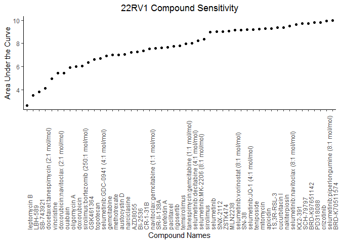
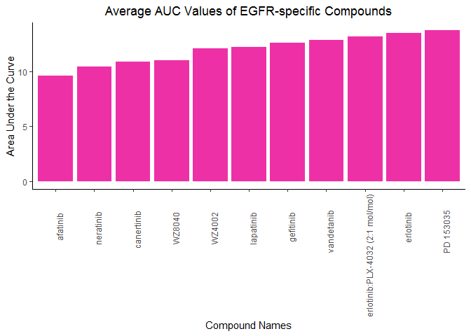

HW05
================
Nabilah Sammudin
8/4/2020

### PART 1

## 1\. Tidying the dad\_mom file

In this repo, you’ll find a dad\_mom.txt file that isn’t particularly
tidy. Clean this up so there are only 4 columns Tidy this data frame so
that it adheres to the tidy data principles:

    Each variable must have its own column.
    Each observation must have its own row.
    Each value must have its own cell.

``` r
#load library
library(knitr)
library(tidyverse)
```

    ## -- Attaching packages --------------------------------------------------------- tidyverse 1.3.0 --

    ## v ggplot2 3.3.2     v purrr   0.3.4
    ## v tibble  3.0.1     v dplyr   1.0.0
    ## v tidyr   1.1.0     v stringr 1.4.0
    ## v readr   1.3.1     v forcats 0.5.0

    ## -- Conflicts ------------------------------------------------------------ tidyverse_conflicts() --
    ## x dplyr::filter() masks stats::filter()
    ## x dplyr::lag()    masks stats::lag()

``` r
library(magrittr)
```

    ## 
    ## Attaching package: 'magrittr'

    ## The following object is masked from 'package:purrr':
    ## 
    ##     set_names

    ## The following object is masked from 'package:tidyr':
    ## 
    ##     extract

First of all, read in the .txt file and print it out

``` r
dad_mom <- read.table("dad_mom.txt", header = TRUE) #read in .txt file
dad_mom #print data frame to see values
```

    ##   fam_id name_dad income_dad name_mom income_mom
    ## 1      1     Bill      30000     Bess      15000
    ## 2      2      Art      22000      Amy      22000
    ## 3      3     Paul      25000      Pat      50000

The table needs to be cleaned such that there are only 4 columns.
Determine the 4 columns to be family, name, parent and income.

``` r
tidy_dad_mom <- dad_mom %>% #tidy data
  unite (Dad, name_dad, income_dad) %>% #unite data for dads and moms
  unite (Mom, name_mom, income_mom) %>%
  gather (key = "Parent", value = "name_income", -fam_id) %>% #gather data
  separate(name_income, into = c("Name", "Income")) %>% #separate column names
  rename(Family = fam_id) #rename fam id column so it looks neater
tidy_dad_mom #print data frame
```

    ##   Family Parent Name Income
    ## 1      1    Dad Bill  30000
    ## 2      2    Dad  Art  22000
    ## 3      3    Dad Paul  25000
    ## 4      1    Mom Bess  15000
    ## 5      2    Mom  Amy  22000
    ## 6      3    Mom  Pat  50000

``` r
kable(tidy_dad_mom, format = "markdown", align=rep('c')) #to view/print table using kable
```

| Family | Parent | Name | Income |
| :----: | :----: | :--: | :----: |
|   1    |  Dad   | Bill | 30000  |
|   2    |  Dad   | Art  | 22000  |
|   3    |  Dad   | Paul | 25000  |
|   1    |  Mom   | Bess | 15000  |
|   2    |  Mom   | Amy  | 22000  |
|   3    |  Mom   | Pat  | 50000  |

### PART 2

Goal: To join the 5 .csv files in CTRP together

First of all, read in all files

``` r
AUC_1 <- read.csv("CTRP_files/AUC_1.csv") #read in all .csv files
AUC_2 <- read.csv("CTRP_files/AUC_2.csv")
cancer_cell_line_info <- read.csv("CTRP_files/cancer_cell_line_info.csv")
compound_info <- read.csv("CTRP_files/compound_info.csv")
experiment_info <- read.csv("CTRP_files/experiment_info.csv")

#glimpse each file in console to identify variables that can be combined

overall_CTRP_data <- AUC_1 %>% 
  bind_rows(AUC_2) %>% #stack AUC_1 and AUC_2 as they have similar variables
  inner_join(experiment_info, by = c("experiment_id" = "expt_id")) %>% #add in experiment_info
  inner_join(cancer_cell_line_info, by = "master_ccl_id") %>% #add in cancer_cell_line_info
  inner_join(compound_info, by = "master_cpd_id") #add in compound_info
```

Based on the new data frames, answer the following questions with
graphs:

  - Which cancer type has the lowest AUC values to the compound
    “vorinostat”?

<!-- end list -->

``` r
cancer_auc_vorinostat <- overall_CTRP_data %>% #create new data frame for easier plotting
  select(area_under_curve,cancer_type,cpd_name) %>%
  filter(cpd_name == "vorinostat") %>%
  filter(cancer_type != "NA") %>%
  group_by(cancer_type)

ggplot(cancer_auc_vorinostat, mapping = aes(x = reorder(cancer_type, area_under_curve), y = area_under_curve)) +
  geom_boxplot() +
  theme_classic() +
  labs(x = "Cancer Type",
       y = "Area Under the Curve",
       title = "Cancer Types' Responsiveness to Vorinostat") +
  theme(axis.text.x = element_text(angle = 90, hjust = 0.8), plot.title = element_text(hjust = 0.5)) 
```

<!-- -->

ANSWER: Haematopoietic\_and\_lymphoid\_tissue cancer

  - Which compound is the prostate cancer cell line 22RV1 most sensitive
    to? (For 22RV1, which compound has the lowest AUC value?)

<!-- end list -->

``` r
prostate_auc_cpd <- overall_CTRP_data %>% #create new data frame for easier plotting
  select(area_under_curve,ccl_name,cpd_name) %>%
  filter(ccl_name == "22RV1") %>%
  filter(area_under_curve < 10) %>% #set a threshold to identify the name of the compound with lowest AUC value. Without filter, the compound names on the x axis is not readable
  arrange(area_under_curve)

ggplot(prostate_auc_cpd, mapping = aes(x = reorder(cpd_name, area_under_curve), y = area_under_curve)) +
  geom_point() +
  theme_classic() +
  labs(x = "Compound Names",
       y = "Area Under the Curve",
       title = "22RV1 Compound Sensitivity") +
  theme(axis.text.x = element_text(angle = 90, hjust = 0), plot.title = element_text(hjust = 0.5)) 
```

<!-- -->

ANSWER: Leptomycin B has the lowest AUC value, thus it is the compound
that prostate cancer cell line 22RV1 is most sensitive to.

  - For the 10 compounds that target EGFR, which of them has (on
    average) the lowest AUC values in the breast cancer cell lines?

<!-- end list -->

``` r
EGFR <- overall_CTRP_data %>% #create new data frame for easier plotting
  select(area_under_curve,cancer_type, gene_symbol_of_protein_target, cpd_name) %>%
  filter(cancer_type == "breast") %>%
  filter(str_detect(gene_symbol_of_protein_target, "EGFR")) %>%
  group_by(cpd_name) %>%
  summarise(average_AUC = mean(area_under_curve)) #find average AUC
```

    ## `summarise()` ungrouping output (override with `.groups` argument)

``` r
ggplot(EGFR, mapping = aes(x = reorder(cpd_name, average_AUC), y = average_AUC)) +
  geom_col(fill = "maroon2") +
  theme_classic() +
  labs(x = "Compound Names",
       y = "Area Under the Curve",
       title = "Average AUC Values of EGFR-specific Compounds") +
  theme(axis.text.x = element_text(angle = 90, hjust = 0.8), plot.title = element_text(hjust = 0.5))
```

<!-- -->

ANSWER: Afatinib (on average) has the lowest AUC values in the breast
cancer cell lines.
