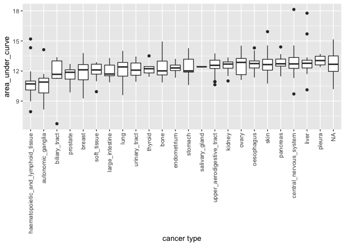
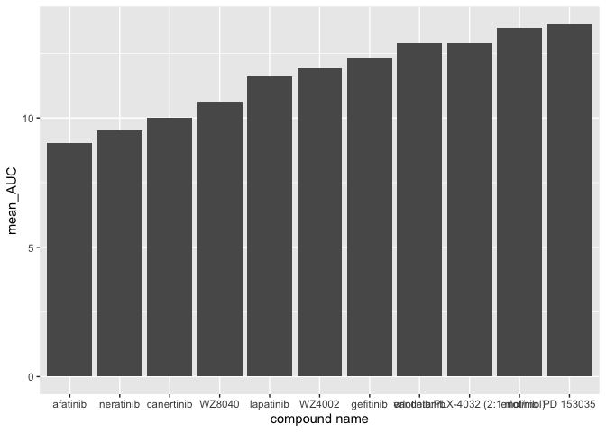

HW05\_Julia
================
Julia Shangguan
8/1/2020

``` r
knitr::opts_chunk$set(echo = TRUE, error = TRUE)
```

Loading in necessary packages:

``` r
#install.packages('tidyverse')
library(tidyverse)
```

    ## ── Attaching packages ────────────────────────────────────────────────────────── tidyverse 1.3.0 ──

    ## ✓ ggplot2 3.3.2.9000     ✓ purrr   0.3.4     
    ## ✓ tibble  3.0.3          ✓ dplyr   1.0.0     
    ## ✓ tidyr   1.1.0          ✓ stringr 1.4.0     
    ## ✓ readr   1.3.1          ✓ forcats 0.5.0

    ## ── Conflicts ───────────────────────────────────────────────────────────── tidyverse_conflicts() ──
    ## x dplyr::filter() masks stats::filter()
    ## x dplyr::lag()    masks stats::lag()

``` r
library(dplyr)
library(ggplot2)
```

## Part 1: Tidying the dad\_mom file

``` r
parent_data <- read.delim("dad_mom.txt") #read dataframe

parent_data_tidy <- parent_data %>%
  gather(key = "parent", value= "name", name_dad, name_mom) %>% #create name column
  gather(key= "key1", value = "income", income_dad, income_mom) %>% #create income column
  select(-key1)

parent_data_tidy$parent <- recode(parent_data_tidy$parent, "name_dad" = "dad", "name_mom" = "mom") #create parent's gender column

parent_data_tidy
```

    ##    fam_id parent name income
    ## 1       1    dad Bill  30000
    ## 2       2    dad  Art  22000
    ## 3       3    dad Paul  25000
    ## 4       1    mom Bess  30000
    ## 5       2    mom  Amy  22000
    ## 6       3    mom  Pat  25000
    ## 7       1    dad Bill  15000
    ## 8       2    dad  Art  22000
    ## 9       3    dad Paul  50000
    ## 10      1    mom Bess  15000
    ## 11      2    mom  Amy  22000
    ## 12      3    mom  Pat  50000

## Part 2: Joining together CTRP data

``` r
#read all dataframes
cancer_cell_line <- read_csv("CTRP_files/cancer_cell_line_info.csv")
```

    ## Parsed with column specification:
    ## cols(
    ##   master_ccl_id = col_double(),
    ##   ccl_name = col_character(),
    ##   cancer_type = col_character()
    ## )

``` r
AUC_1 <- read_csv("CTRP_files/AUC_1.csv")
```

    ## Parsed with column specification:
    ## cols(
    ##   experiment_id = col_double(),
    ##   area_under_curve = col_double(),
    ##   master_cpd_id = col_double()
    ## )

``` r
AUC_2 <- read_csv("CTRP_files/AUC_2.csv")
```

    ## Parsed with column specification:
    ## cols(
    ##   experiment_id = col_double(),
    ##   area_under_curve = col_double(),
    ##   master_cpd_id = col_double()
    ## )

``` r
compound_info <- read_csv("CTRP_files/compound_info.csv")
```

    ## Parsed with column specification:
    ## cols(
    ##   master_cpd_id = col_double(),
    ##   cpd_name = col_character(),
    ##   gene_symbol_of_protein_target = col_character()
    ## )

``` r
experiment_info <- read_csv("CTRP_files/Experiment_info.csv")
```

    ## Parsed with column specification:
    ## cols(
    ##   expt_id = col_double(),
    ##   master_ccl_id = col_double(),
    ##   experiment_date = col_double(),
    ##   cells_per_well = col_double()
    ## )

``` r
#looking at each dataframe
glimpse(cancer_cell_line)
```

    ## Rows: 1,107
    ## Columns: 3
    ## $ master_ccl_id <dbl> 1, 3, 4, 5, 6, 7, 8, 9, 10, 13, 14, 15, 16, 19, 20, 21,…
    ## $ ccl_name      <chr> "697", "5637", "2313287", "1321N1", "143B", "22RV1", "2…
    ## $ cancer_type   <chr> "haematopoietic_and_lymphoid_tissue", "urinary_tract", …

``` r
glimpse(AUC_1)
```

    ## Rows: 20,000
    ## Columns: 3
    ## $ experiment_id    <dbl> 1, 1, 1, 1, 1, 1, 1, 1, 1, 1, 1, 1, 1, 1, 1, 1, 1, 1…
    ## $ area_under_curve <dbl> 14.782, 13.327, 16.082, 13.743, 13.390, 14.385, 13.0…
    ## $ master_cpd_id    <dbl> 1788, 3588, 12877, 19153, 23256, 25036, 25334, 25344…

``` r
glimpse(AUC_2)
```

    ## Rows: 195,263
    ## Columns: 3
    ## $ experiment_id    <dbl> 461, 461, 461, 461, 461, 461, 461, 461, 461, 461, 46…
    ## $ area_under_curve <dbl> 13.4890, 14.7920, 14.7240, 13.8810, 14.7010, 14.6260…
    ## $ master_cpd_id    <dbl> 606586, 606670, 607696, 608062, 608999, 609058, 6090…

``` r
glimpse(compound_info)
```

    ## Rows: 545
    ## Columns: 3
    ## $ master_cpd_id                 <dbl> 1788, 3588, 12877, 17712, 18311, 19153,…
    ## $ cpd_name                      <chr> "CIL55", "BRD4132", "BRD6340", "ML006",…
    ## $ gene_symbol_of_protein_target <chr> NA, NA, NA, "S1PR3", "BAX", NA, "RARA;R…

``` r
glimpse(experiment_info)
```

    ## Rows: 1,061
    ## Columns: 4
    ## $ expt_id         <dbl> 1, 2, 3, 4, 5, 6, 7, 8, 9, 10, 11, 12, 13, 14, 15, 16…
    ## $ master_ccl_id   <dbl> 130, 569, 682, 9, 61, 62, 108, 111, 115, 119, 455, 85…
    ## $ experiment_date <dbl> 20120501, 20120501, 20120501, 20120504, 20120504, 201…
    ## $ cells_per_well  <dbl> 500, 500, 500, 500, 500, 500, 500, 500, 500, 500, 500…

``` r
#is it wrong to use full_join to merge all the tables? or should I be using inner_join?

AUC_all_compound<- AUC_1 %>%
  full_join(AUC_2, by = c("experiment_id", "area_under_curve", "master_cpd_id")) %>%
  full_join(compound_info, by = "master_cpd_id")

ccl_experiment_AUC_compound <- cancer_cell_line %>%
  full_join(experiment_info, by = "master_ccl_id") %>%
  full_join(AUC_all_compound, by=c("expt_id"="experiment_id"))

glimpse(ccl_experiment_AUC_compound)
```

    ## Rows: 249,074
    ## Columns: 10
    ## $ master_ccl_id                 <dbl> 1, 1, 1, 1, 1, 1, 1, 1, 1, 1, 1, 1, 1, …
    ## $ ccl_name                      <chr> "697", "697", "697", "697", "697", "697…
    ## $ cancer_type                   <chr> "haematopoietic_and_lymphoid_tissue", "…
    ## $ expt_id                       <dbl> 517, 517, 517, 517, 517, 517, 517, 517,…
    ## $ experiment_date               <dbl> 20121009, 20121009, 20121009, 20121009,…
    ## $ cells_per_well                <dbl> 500, 500, 500, 500, 500, 500, 500, 500,…
    ## $ area_under_curve              <dbl> 11.1280, 12.3280, 12.3050, 13.0850, 10.…
    ## $ master_cpd_id                 <dbl> 3588, 12877, 17712, 18311, 19153, 23151…
    ## $ cpd_name                      <chr> "BRD4132", "BRD6340", "ML006", "Bax cha…
    ## $ gene_symbol_of_protein_target <chr> NA, NA, "S1PR3", "BAX", NA, "RARA;RARB;…

Which cancer type has the lowest AUC values to the compound
“vorinostat”?

  - answer = haematopoietic and lymphoid tissue

<!-- end list -->

``` r
vorinostat_auc <- ccl_experiment_AUC_compound %>%
  filter(cpd_name == "vorinostat") %>%
  arrange(area_under_curve)

ggplot(vorinostat_auc, aes(x= reorder(cancer_type, area_under_curve), y = area_under_curve)) + 
  geom_boxplot() +
 theme(axis.text.x = element_text(angle = 90, vjust=0.5, hjust=1)) +
  scale_x_discrete(name = "cancer type")
```

<!-- -->

Which compound is the prostate cancer cell line 22RV1 most sensitive to?
(For 22RV1, which compound has the lowest AUC value?)

  - answer = ? For some reason, I have NA in the compound column

<!-- end list -->

``` r
ccl_experiment_AUC_compound %>%
  filter(ccl_name == "22RV1") %>%
  arrange(desc(area_under_curve))
```

    ## # A tibble: 1 x 10
    ##   master_ccl_id ccl_name cancer_type expt_id experiment_date cells_per_well
    ##           <dbl> <chr>    <chr>         <dbl>           <dbl>          <dbl>
    ## 1             7 22RV1    prostate        139        20120625            500
    ## # … with 4 more variables: area_under_curve <dbl>, master_cpd_id <dbl>,
    ## #   cpd_name <chr>, gene_symbol_of_protein_target <chr>

For the 10 compounds that target EGFR, which of them has (on average)
the lowest AUC values in the breast cancer cell lines?

  - answer = afatinib

<!-- end list -->

``` r
mean_auc <- ccl_experiment_AUC_compound %>%
  group_by(cpd_name, gene_symbol_of_protein_target) %>%
  filter(cancer_type == "breast") %>%
  filter(str_detect(gene_symbol_of_protein_target, "EGFR")) %>%
  summarize(mean_AUC = mean(area_under_curve)) %>%
  arrange(mean_AUC)
```

    ## `summarise()` regrouping output by 'cpd_name' (override with `.groups` argument)

``` r
ggplot(mean_auc, aes(x= reorder(cpd_name, mean_AUC), y =mean_AUC)) + 
  geom_col() +
  scale_x_discrete(name = "compound name")
```

<!-- -->
