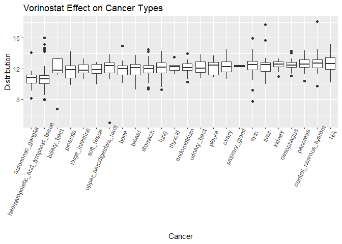
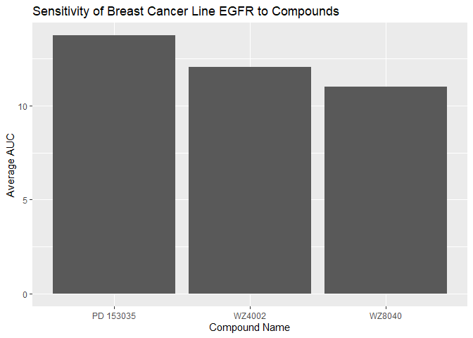

HW05 Parts 1 and 2
================
Luke Dyer
8/3/2020

\#\#Part 1 This cleans up the dad\_mom.txt file and makes it into a
manageable table.

``` r
library(tidyverse)
```

    ## -- Attaching packages ---------------------------------------------------------------------------------------------------------- tidyverse 1.3.0 --

    ## v ggplot2 3.3.2     v purrr   0.3.4
    ## v tibble  3.0.1     v dplyr   1.0.0
    ## v tidyr   1.1.0     v stringr 1.4.0
    ## v readr   1.3.1     v forcats 0.5.0

    ## -- Conflicts ------------------------------------------------------------------------------------------------------------- tidyverse_conflicts() --
    ## x dplyr::filter() masks stats::filter()
    ## x dplyr::lag()    masks stats::lag()

``` r
library(ggplot2)
library(dplyr)
library(knitr)

dad_mom_data <- read.delim("dad_mom.txt")

tidy_dad_mom <- dad_mom_data%>%
  unite(Dad, name_dad, income_dad)%>%
  unite(Mom, name_mom, income_mom)%>%
  gather(key="Parent", value="name_income", -fam_id)%>%
  separate(name_income, into=c("Name", "Income"))%>%
  arrange(fam_id)%>%
  rename(Family_Number = fam_id)

kable(tidy_dad_mom)
```

| Family\_Number | Parent | Name | Income |
| -------------: | :----- | :--- | :----- |
|              1 | Dad    | Bill | 30000  |
|              1 | Mom    | Bess | 15000  |
|              2 | Dad    | Art  | 22000  |
|              2 | Mom    | Amy  | 22000  |
|              3 | Dad    | Paul | 25000  |
|              3 | Mom    | Pat  | 50000  |

\#\#Part 2, Combining Data Sources

``` r
AUC_1 <- read.csv("CTRP_files/AUC_1.csv")
AUC_2 <- read.csv("CTRP_files/AUC_2.csv")
cancer_cell_line_invo <- read.csv("CTRP_files/cancer_cell_line_info.csv")
compound_info <- read.csv("CTRP_files/compound_info.csv")
experiment_info <- read.csv("CTRP_files/experiment_info.csv")

cancer_data <- AUC_1%>%
  full_join(AUC_2, by=c("experiment_id", "area_under_curve", "master_cpd_id"))%>%
  full_join(compound_info, by="master_cpd_id")%>%
  full_join(experiment_info, by=c("experiment_id"="expt_id"))%>%
  full_join(cancer_cell_line_invo, by="master_ccl_id")
```

\#\#Part 2, Question 1 The below graph summarizes the Effect of
Vorinostat on different cancer types. You can see haematopoietic and
lymphoid tissue has the lowest average AUC, while the lowest extreme
comes from tissue in the upper aerodigestive tract.

``` r
low_AUC <- cancer_data%>%
  select(experiment_id, cpd_name, cancer_type, area_under_curve)%>%
  filter(cpd_name=="vorinostat")%>%
  arrange(area_under_curve)%>%
  group_by(cancer_type)

ggplot(low_AUC, aes(x=reorder(cancer_type, area_under_curve,), y=area_under_curve))+
geom_boxplot()+
  theme(axis.text.x=element_text(angle=65, hjust=0.9))+
  labs(x="Cancer", y="Distribution", title="Vorinostat Effect on Cancer Types")
```

<!-- -->

\#\#Part 2, Question 2 In this case, only one row of data was required
to answer the question. Therefore, a simple kable table was used to show
that the cancer cell line 22RV1 was most sensitve to compound leptomycin
B.

``` r
prostate_sens <- cancer_data%>%
  select(experiment_id, area_under_curve, cpd_name, ccl_name, cancer_type)%>%
  filter(ccl_name == "22RV1")%>%
  arrange(area_under_curve)%>%
  top_n(n=-1, wt = area_under_curve)%>%
  rename(Experiment=experiment_id, AUC=area_under_curve, Compound=cpd_name, Cell_Line=ccl_name, Cancer_Type=cancer_type)

kable(prostate_sens)
```

| Experiment |    AUC | Compound     | Cell\_Line | Cancer\_Type |
| ---------: | -----: | :----------- | :--------- | :----------- |
|        139 | 2.6367 | leptomycin B | 22RV1      | prostate     |

\#\#Part 2, Question 3 Based on the graph, the compound WZ8040 had the
lowest AUC values in breast cancer cell lines.

``` r
EGFR_AUC <- cancer_data%>%
  select(experiment_id, gene_symbol_of_protein_target, cpd_name, area_under_curve, cancer_type)%>%
  filter(gene_symbol_of_protein_target=="EGFR", cancer_type=="breast")%>%
  group_by(cpd_name)%>%
  summarize(average_AUC=mean(area_under_curve))
```

    ## `summarise()` ungrouping output (override with `.groups` argument)

``` r
ggplot(EGFR_AUC, aes(x=cpd_name, y=average_AUC))+
  geom_col()+
  labs(x="Compound Name", y="Average AUC", title="Sensitivity of Breast Cancer Line EGFR to Compounds")
```

<!-- -->
