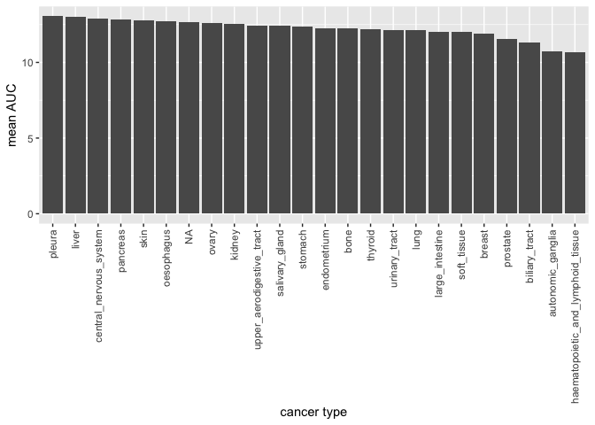
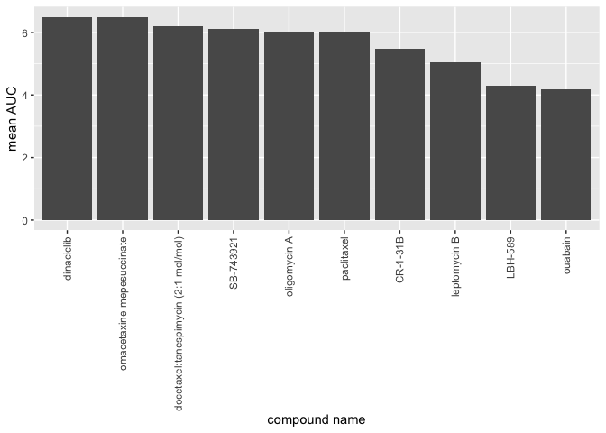
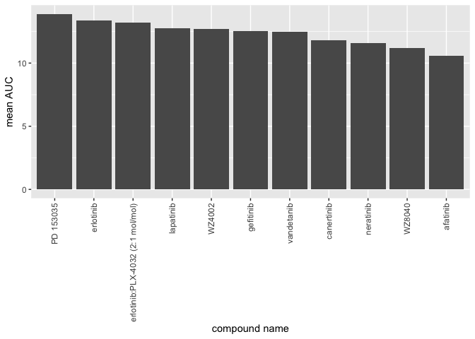

HW05\_Xingruo\_Zhang
================
Summer Zhang
8/2/2020

``` r
library(tidyverse)
```

    ## Warning: package 'tibble' was built under R version 3.6.2

``` r
library(readr)
library(knitr)
library(stringr)

dad_mom <- read_delim("dad_mom.txt", delim = "\t")

auc_1 <- read_csv("CTRP_files/AUC_1.csv")
auc_2 <- read_csv("CTRP_files/AUC_2.csv")
cancer_cell_line_info <- read_csv("CTRP_files/cancer_cell_line_info.csv")
compound_info <- read_csv("CTRP_files/compound_info.csv")
Experiment_info <- read_csv("CTRP_files/Experiment_info.csv")
```

1. Tidying the dad\_mom file
----------------------------

``` r
dad_mom2 <- dad_mom %>% 
  # Combine parents' names into one column instead of two
  gather(key = "parent", value = "name_parent", name_dad, name_mom) %>% 
  # Correct values in the parent column
  mutate(parent = ifelse(parent == "name_dad", "dad", "mom")) %>% 
  # Assign correct income to each parent
  mutate("income_parent" = ifelse(parent == "dad", income_dad, income_mom)) %>% 
  # Drop the original income columns
  select(-c(income_dad,income_mom)) %>% 
  # Arrange by family ID
  arrange(fam_id)

dad_mom2
```

    ## # A tibble: 6 x 4
    ##   fam_id parent name_parent income_parent
    ##    <dbl> <chr>  <chr>               <dbl>
    ## 1      1 dad    Bill                30000
    ## 2      1 mom    Bess                15000
    ## 3      2 dad    Art                 22000
    ## 4      2 mom    Amy                 22000
    ## 5      3 dad    Paul                25000
    ## 6      3 mom    Pat                 50000

2. Joining together CTRP data
-----------------------------

``` r
# Inspect the data
#head(auc_1)
#head(auc_2)
#head(cancer_cell_line_info)
#head(compound_info)
#head(Experiment_info)
```

``` r
auc <- rbind(auc_1, auc_2)

cancer1 <- auc %>% 
  full_join(compound_info, by = "master_cpd_id")

colnames(Experiment_info)[1] <- "experiment_id"

cancer2 <- cancer1 %>% 
  full_join(Experiment_info, by = "experiment_id")

cancer_final <- cancer2 %>% 
  full_join(cancer_cell_line_info, by = "master_ccl_id")
```

-   Which cancer type has the lowest AUC values to the compound "vorinostat"?

``` r
vorinostat_auc <- cancer_final %>% 
  filter(cpd_name == "vorinostat") %>% 
  group_by(cancer_type) %>% 
  summarise(mean_AUC = mean(area_under_curve))

vorinostat_auc$cancer_type[is.na(vorinostat_auc$cancer_type)] <- "NA"

p1 <- ggplot(vorinostat_auc, aes(x = reorder(cancer_type, -mean_AUC), y = mean_AUC)) +
  geom_col() + 
  theme(axis.text.x = element_text(angle = 90, vjust=0.5, hjust=1)) +
  labs(x = 'cancer type', y = "mean AUC" )

print(p1)
```



`Answer`: Haematopietic and lymphoid tissue cancer has the lowest AUC.

-   Which compound is the prostate cancer cell line 22RV1 most sensitive to? (For 22RV1, which compound has the lowest AUC value?)

``` r
prostate <- cancer_final %>% 
  filter(cancer_type == "prostate") %>% 
  group_by(cpd_name) %>% 
  summarise(mean_AUC = mean(area_under_curve)) %>% 
  top_n(-10)
```

    ## Selecting by mean_AUC

``` r
p2 <- ggplot(prostate, aes(x = reorder(cpd_name, -mean_AUC), y = mean_AUC)) +
  geom_col() + 
  theme(axis.text.x = element_text(angle = 90, vjust=0.5, hjust=1)) +
  labs(x = 'compound name', y = "mean AUC" )

print(p2)
```



`Answer:`Ouabain is the prostate cancer cell most sensitive to.

-   For the 10 compounds that target EGFR, which of them has (on average) the lowest AUC values in the breast cancer cell lines?

``` r
EGFR <- cancer_final %>% 
  filter(str_detect(gene_symbol_of_protein_target, "EGFR")) %>% 
  group_by(cpd_name) %>% 
  summarise(mean_AUC = mean(area_under_curve))

p3 <- ggplot(EGFR, aes(x = reorder(cpd_name, -mean_AUC), y = mean_AUC)) +
  geom_col() + 
  theme(axis.text.x = element_text(angle = 90, vjust=0.5, hjust=1)) +
  labs(x = 'compound name', y = "mean AUC" )

print(p3)
```



`Answer:`For the 10 compounds that target EGFR, afatinib has (on average) the lowest AUC values in the breast cancer cell lines.
