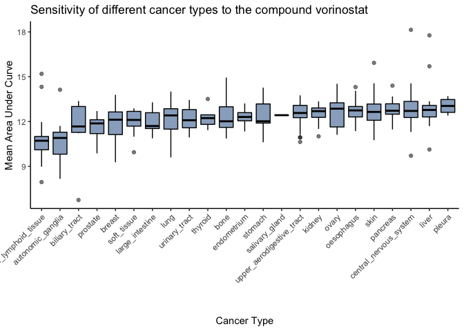
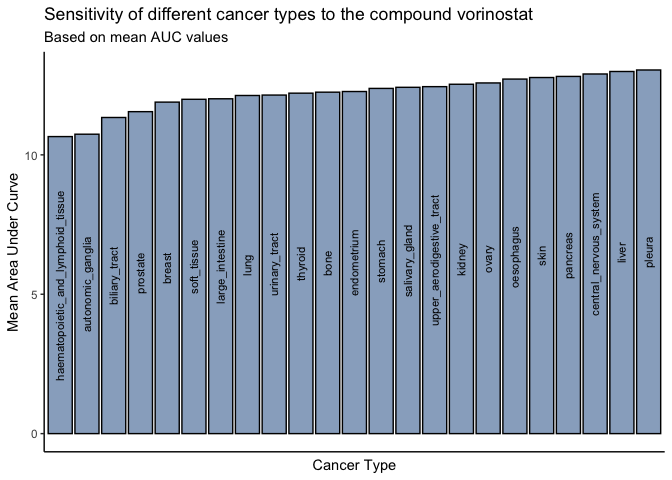
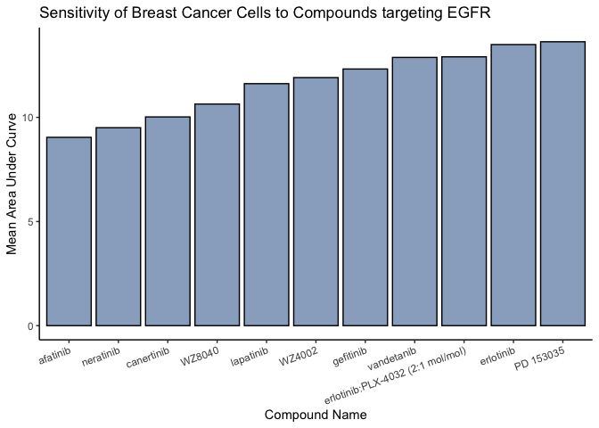

HW05 Part B
================
Patrick Haller
7/31/2020

## HW05 Part B

**First, I want to read in the data from the files in the CTRP\_files
folder and create a new data frame that combines all of the files
initially given to us.**

``` r
# read in the data files from the CTRP_files folder
AUC_1 <- read.csv("CTRP_files/AUC_1.csv")
AUC_2 <- read.csv("CTRP_files/AUC_2.csv")
cell_line_info <- read.csv("CTRP_files/cancer_cell_line_info.csv")
compound_info <- read.csv("CTRP_files/compound_info.csv")
experiment_info <- read.csv("CTRP_files/experiment_info.csv")
```

``` r
# generate new data frame that combines the 5 initial data frames
data_complete <- AUC_1 %>%
  # combine data rows from AUC_2 data frame
  bind_rows(AUC_2) %>%
  # join the columns from the experiment info data frame by experiment_id
  inner_join(experiment_info, by = c("experiment_id" = "expt_id")) %>%
  # join the columns from the cell line info data frame by master_ccl_id
  inner_join(cell_line_info, by = "master_ccl_id") %>%
  # join the columns from the compound info data frame by master_cpd_id
  inner_join(compound_info, by = "master_cpd_id")
```

**With this new data frame, we can answer the following
questions:**

### Which cancer type has the lowest AUC values to the compound “vorinostat”?

``` r
# create new data frame for this problem
auc_low_vor <- data_complete %>%
  select(area_under_curve, cancer_type, cpd_name) %>%
  filter(cpd_name == "vorinostat", cancer_type != "NA") %>%
  arrange(cancer_type, area_under_curve) 

# generate boxplot
ggplot(auc_low_vor, aes(x = reorder(cancer_type, area_under_curve), y = area_under_curve)) +
  geom_boxplot(fill = "dodgerblue4", alpha = 0.5, color = "black") +
  # adjust theme
  theme_classic() +
  # adjust x-axis tick label orientation
  theme(axis.text.x = element_text(angle = 45, hjust = 1)) +
  # adjust labels
  labs(title = "Sensitivity of different cancer types to the compound vorinostat", x = "Cancer Type", y = "Mean Area Under Curve")
```

<!-- -->

**Additionally, we can calculate the mean AUC values for each cancer
type and use the resulting values as basis for comparison:**

``` r
# create new data frame with mean AUC for each cancer_type
auc_low_vor2 <- auc_low_vor %>%
  group_by(cancer_type) %>%
  summarize(mean_auc = mean(area_under_curve)) %>% 
  arrange(mean_auc)
```

    ## `summarise()` ungrouping output (override with `.groups` argument)

``` r
# generate bar graph comparing the mean AUC between cancer types
ggplot(auc_low_vor2, aes(x = reorder(cancer_type, mean_auc), y = mean_auc)) +
  geom_col(fill = "dodgerblue4", alpha = 0.5, color = "black") +
  # add label inside the bars, it is very messy to include them below the x-axis
  geom_text(aes(label = cancer_type), position = position_stack(vjust = 0.5), angle = 90, size = 3) +
  # adjust theme
  theme_classic() +
  theme(axis.text.x = element_blank(), axis.ticks.x = element_blank()) +
  # adjust labels
  labs(title = "Sensitivity of different cancer types to the compound vorinostat", subtitle = "Based on mean AUC values", x = "Cancer Type", y = "Mean Area Under Curve")
```

<!-- -->

``` r
# print the name of the cancer type with the lowest mean AUC to vorinostat
print(paste("The cancer type with the lowest mean AUC values to the compound vorinostat is", auc_low_vor2[1,1], "."))
```

    ## [1] "The cancer type with the lowest mean AUC values to the compound vorinostat is haematopoietic_and_lymphoid_tissue ."

### Which compound is the prostate cancer cell line 22RV1 most sensitive to? (For 22RV1, which compound has the lowest AUC value?)

``` r
# generate new data frame
auc_low_prostate <- data_complete %>%
  select(area_under_curve, ccl_name, cpd_name) %>%
  filter(ccl_name == "22RV1") %>%
  arrange(area_under_curve) 
  


head(auc_low_prostate)
```

    ## [1] area_under_curve ccl_name         cpd_name        
    ## <0 rows> (or 0-length row.names)

**Note: When trying to filter for the 22RV1 cell line in my data frame,
I receive an error message, saying that there is no data in my data
frame for that cell line. I am not sure if anything’s wrong with my data
frame, but I am using the VCAP prostate cancer cell line instead for
this
question.**

``` r
# generate alternative data frame, filtering for VCAP cell line instead of 22RV1
auc_low_prostate2 <- data_complete %>%
  select(area_under_curve, ccl_name, cpd_name) %>%
  filter(ccl_name == "VCAP") %>%
  arrange(area_under_curve) 
  


print(paste("The prostate cancer cell line VCAP is most sensitive to the compound", auc_low_prostate2[1, 3], "."))
```

    ## [1] "The prostate cancer cell line VCAP is most sensitive to the compound LBH-589 ."

### For the 10 compounds that target EGFR, which of them has (on average) the lowest AUC values in the breast cancer cell lines?

``` r
# generate new data frame 
auc_egfr <- data_complete %>%
  select(area_under_curve, cancer_type, gene_symbol_of_protein_target, cpd_name) %>%
  filter(str_detect(gene_symbol_of_protein_target, "EGFR"), cancer_type == "breast") %>%
  group_by(cpd_name) %>%
  summarize(mean_auc = mean(area_under_curve)) %>%
  arrange(mean_auc)
```

    ## `summarise()` ungrouping output (override with `.groups` argument)

``` r
# generate bar graph 
ggplot(auc_egfr, aes(x = reorder(cpd_name, mean_auc), y = mean_auc)) +
  geom_col(fill = "dodgerblue4", alpha = 0.5, color = "black") +
  # adjust theme
  theme_classic() +
  theme(axis.text.x = element_text(angle = 20, hjust = 1)) +
  # adjust labels
  labs(title = "Sensitivity of Breast Cancer Cells to Compounds targeting EGFR", x = "Compound Name", y = "Mean Area Under Curve")
```

<!-- -->

``` r
# print the name of the compound that has the lowest average AUC values in the breast cancer cell lines
print(paste("Of the compounds that target EGFR,", auc_egfr[1,1], "has the lowest AUC values in the breast cancer cell lines."))
```

    ## [1] "Of the compounds that target EGFR, afatinib has the lowest AUC values in the breast cancer cell lines."
