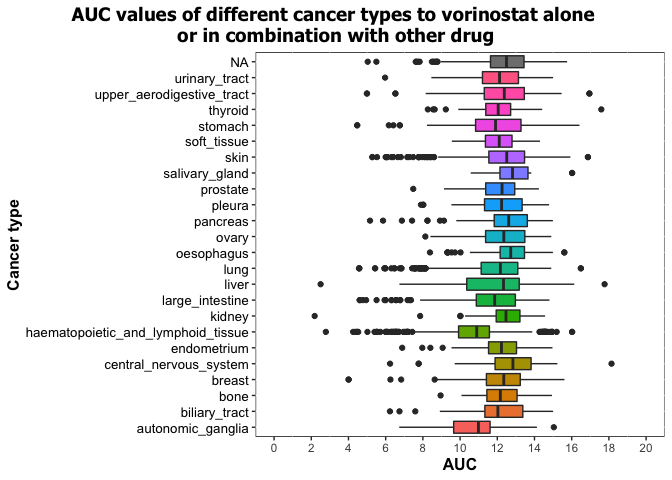
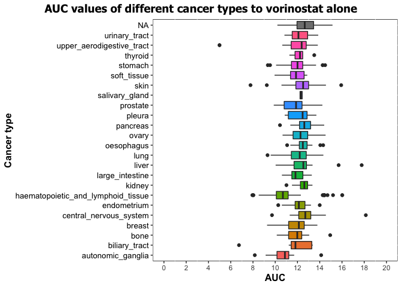
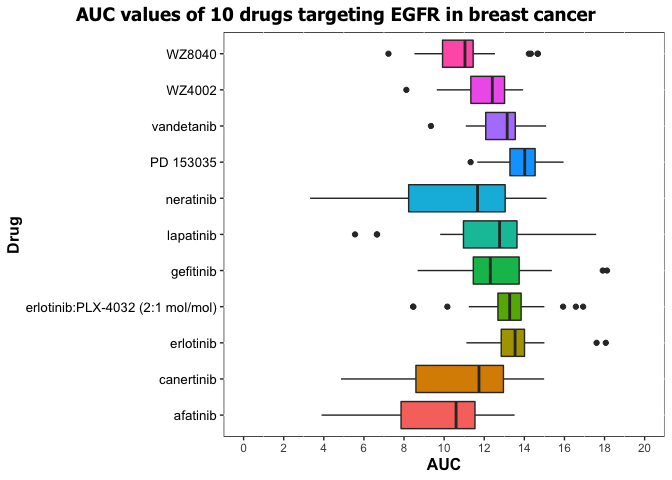

Joining together CTRP data
================

## 1\. Load packages

``` r
library(data.table)
library(readr)
library(dplyr)
```

    ## 
    ## Attaching package: 'dplyr'

    ## The following objects are masked from 'package:data.table':
    ## 
    ##     between, first, last

    ## The following objects are masked from 'package:stats':
    ## 
    ##     filter, lag

    ## The following objects are masked from 'package:base':
    ## 
    ##     intersect, setdiff, setequal, union

``` r
library(tidyverse)
```

    ## ── Attaching packages ──────────────────────────────────────────────────────────────────────────────────────── tidyverse 1.3.0 ──

    ## ✓ ggplot2 3.3.2     ✓ purrr   0.3.4
    ## ✓ tibble  3.0.3     ✓ stringr 1.4.0
    ## ✓ tidyr   1.1.0     ✓ forcats 0.5.0

    ## ── Conflicts ─────────────────────────────────────────────────────────────────────────────────────────── tidyverse_conflicts() ──
    ## x dplyr::between()   masks data.table::between()
    ## x dplyr::filter()    masks stats::filter()
    ## x dplyr::first()     masks data.table::first()
    ## x dplyr::lag()       masks stats::lag()
    ## x dplyr::last()      masks data.table::last()
    ## x purrr::transpose() masks data.table::transpose()

``` r
library(knitr)
library(lubridate)
```

    ## 
    ## Attaching package: 'lubridate'

    ## The following objects are masked from 'package:data.table':
    ## 
    ##     hour, isoweek, mday, minute, month, quarter, second, wday, week,
    ##     yday, year

    ## The following objects are masked from 'package:base':
    ## 
    ##     date, intersect, setdiff, union

## 2\. Load data

``` r
setwd("~/Desktop/GitHub/Homework_5/HW05/CTRP_files")

AUC_1 <- fread("AUC_1.csv")
AUC_2 <- fread("AUC_2.csv")
experiment_info <- fread("Experiment_info.csv")
cancer_cell_line <- fread("cancer_cell_line_info.csv")
compound <- fread("compound_info.csv")
```

## 3\. Tidy the data frames

### 3a. AUC\_1

``` r
# Rename the columns in AUC_1 file

AUC_1_rename <- AUC_1 %>%
    rename("Exp._ID" = experiment_id, "AUC" = area_under_curve, "Compound_ID" = master_cpd_id) %>%
    select("Exp._ID", "Compound_ID", "AUC")

table1 <- head(AUC_1_rename)
kable(table1, align = "ccc")
```

| Exp.\_ID | Compound\_ID |  AUC   |
| :------: | :----------: | :----: |
|    1     |     1788     | 14.782 |
|    1     |     3588     | 13.327 |
|    1     |    12877     | 16.082 |
|    1     |    19153     | 13.743 |
|    1     |    23256     | 13.390 |
|    1     |    25036     | 14.385 |

### 3b. AUC\_2

``` r
# Rename the columns in AUC_2 file

AUC_2_rename <- AUC_2 %>%
    rename("Exp._ID" = experiment_id, "AUC" = area_under_curve, "Compound_ID" = master_cpd_id) %>%
    select("Exp._ID", "Compound_ID", "AUC")

table2 <- head(AUC_2_rename)
kable(table2, align = "ccc")
```

| Exp.\_ID | Compound\_ID |  AUC   |
| :------: | :----------: | :----: |
|   461    |    606586    | 13.489 |
|   461    |    606670    | 14.792 |
|   461    |    607696    | 14.724 |
|   461    |    608062    | 13.881 |
|   461    |    608999    | 14.701 |
|   461    |    609058    | 14.626 |

### 3c. Experiment info

``` r
# Rename the columns in experiment_info file

experiment_info_rename <- experiment_info %>%
    rename("Exp._ID" = expt_id, "Date" = experiment_date, "Cells_per_well" = cells_per_well, "Cell_line_ID" = master_ccl_id) %>%
    mutate(Date = ymd(Date)) %>%
    select("Exp._ID", "Date", "Cell_line_ID", "Cells_per_well")

table3 <- head(experiment_info_rename)
kable(table3, align = "cccc")
```

| Exp.\_ID |    Date    | Cell\_line\_ID | Cells\_per\_well |
| :------: | :--------: | :------------: | :--------------: |
|    1     | 2012-05-01 |      130       |       500        |
|    2     | 2012-05-01 |      569       |       500        |
|    3     | 2012-05-01 |      682       |       500        |
|    4     | 2012-05-04 |       9        |       500        |
|    5     | 2012-05-04 |       61       |       500        |
|    6     | 2012-05-04 |       62       |       500        |

### 3d. Cancer cell line info

``` r
# Rename the columns in cancer_cell_line_info file

cancer_cell_line_rename <- cancer_cell_line %>%
    rename("Cell_line_name" = ccl_name, "Cancer_type" = cancer_type, "Cell_line_ID" = master_ccl_id)

table4 <- head(cancer_cell_line_rename)
kable(table4, align = "cll")
```

| Cell\_line\_ID | Cell\_line\_name | Cancer\_type                          |
| :------------: | :--------------- | :------------------------------------ |
|       1        | 697              | haematopoietic\_and\_lymphoid\_tissue |
|       3        | 5637             | urinary\_tract                        |
|       4        | 2313287          | stomach                               |
|       5        | 1321N1           | central\_nervous\_system              |
|       6        | 143B             | bone                                  |
|       7        | 22RV1            | prostate                              |

### 3e. Compound info

``` r
# Rename the columns in compound_info file

compound_rename <- compound %>%
    rename("Compound_ID" = master_cpd_id, "Compound_name" = cpd_name, "Target_gene" = gene_symbol_of_protein_target)

table5 <- head(compound_rename)
kable(table5, align = "clc")
```

| Compound\_ID | Compound\_name      | Target\_gene |
| :----------: | :------------------ | :----------: |
|     1788     | CIL55               |      NA      |
|     3588     | BRD4132             |      NA      |
|    12877     | BRD6340             |      NA      |
|    17712     | ML006               |    S1PR3     |
|    18311     | Bax channel blocker |     BAX      |
|    19153     | BRD9876             |      NA      |

### 3f. Combine the data frames

``` r
# Combine the AUC_1 and AUC_2 data frames into one - AUC_info

AUC_info <- rbind(AUC_1_rename, AUC_2_rename)

# Combine experiment_info with cancer_cell_line_info 

experiment_cancer_cell_line <- experiment_info_rename %>%
      full_join(cancer_cell_line_rename, by = "Cell_line_ID")

# Combine AUC_info and experiment_cancer_cell_line

AUC_exp_cancer <- AUC_info %>%
      full_join(experiment_cancer_cell_line, by = "Exp._ID")

# Add compound_info to experiment_cancer_cell_line

AUC_exp_cancer_compound <- AUC_exp_cancer  %>%
     full_join(compound_rename, by = "Compound_ID")

# Rename the column in the combined data frame

all_data <- AUC_exp_cancer_compound %>%
    rename("Cells/well" = "Cells_per_well")

# Rorder the columns in the combined data frame

all_data<- select(all_data, "Date", "Exp._ID", "Cell_line_name", "Cell_line_ID", "Cancer_type", "Cells/well", "Compound_name", "Compound_ID", "AUC", "Target_gene")

# Replace the NAs in Target gene column

target_gene <- all_data$`Target_gene` %>%
    replace_na("-")

final_data <- all_data %>%
    select(-'Target_gene') %>%
    mutate('Target_gene' = target_gene)

# I'm showing the final table in two parts for better visibility

table6 <- head(final_data[,1:6])
kable(table6, align = "lccclc")
```

| Date       | Exp.\_ID | Cell\_line\_name | Cell\_line\_ID | Cancer\_type             | Cells/well |
| :--------- | :------: | :--------------: | :------------: | :----------------------- | :--------: |
| 2012-05-01 |    1     |       CAS1       |      130       | central\_nervous\_system |    500     |
| 2012-05-01 |    1     |       CAS1       |      130       | central\_nervous\_system |    500     |
| 2012-05-01 |    1     |       CAS1       |      130       | central\_nervous\_system |    500     |
| 2012-05-01 |    1     |       CAS1       |      130       | central\_nervous\_system |    500     |
| 2012-05-01 |    1     |       CAS1       |      130       | central\_nervous\_system |    500     |
| 2012-05-01 |    1     |       CAS1       |      130       | central\_nervous\_system |    500     |

``` r
table7 <- head(final_data[,7:10])
kable(table7, align = "lccc")
```

| Compound\_name | Compound\_ID |  AUC   |        Target\_gene        |
| :------------- | :----------: | :----: | :------------------------: |
| CIL55          |     1788     | 14.782 |             \-             |
| BRD4132        |     3588     | 13.327 |             \-             |
| BRD6340        |    12877     | 16.082 |             \-             |
| BRD9876        |    19153     | 13.743 |             \-             |
| betulinic acid |    23256     | 13.390 |             \-             |
| gossypol       |    25036     | 14.385 | BCL2;BCL2L1;LDHA;LDHB;LDHC |

## 4\. Questions

### 4a. Which cancer type has the lowest AUC values to the compound “vorinostat”?

``` r
# Calculate mean AUC for vorinostat used alone or in combination with other drug

vorinostat_mean <- final_data %>%
    select("Cell_line_name", "Cell_line_ID", "Cancer_type", "Compound_name", "Compound_ID", "AUC") %>%
    separate(col = "Compound_name", into = c("Compound_1", "Compound_2")) %>%
    filter(Compound_1 == "vorinostat" | Compound_2 == "vorinostat") %>%
    group_by(Cancer_type) %>%
    summarize(AUC = round(mean(AUC), digits = 2)) %>%
    arrange(AUC)
```

    ## Warning: Expected 2 pieces. Additional pieces discarded in 63087 rows [22, 52,
    ## 69, 101, 140, 141, 143, 150, 153, 178, 194, 220, 247, 275, 319, 320, 321, 322,
    ## 323, 330, ...].

    ## Warning: Expected 2 pieces. Missing pieces filled with `NA` in 203578 rows [1,
    ## 2, 3, 4, 6, 7, 8, 9, 10, 11, 12, 13, 14, 15, 16, 17, 18, 19, 20, 21, ...].

    ## `summarise()` ungrouping output (override with `.groups` argument)

``` r
table8 <- head(vorinostat_mean)
kable(table8, align = "lc", col.names = c("Cancer type", "Mean AUC"))
```

| Cancer type                           | Mean AUC |
| :------------------------------------ | :------: |
| haematopoietic\_and\_lymphoid\_tissue |  10.66   |
| autonomic\_ganglia                    |  10.80   |
| large\_intestine                      |  11.43   |
| stomach                               |  11.83   |
| lung                                  |  11.90   |
| liver                                 |  11.91   |

``` r
# Plot mean AUC for vorinostat used alone or in combination with other drug

vorinostat1 <- final_data %>%
    select("Cell_line_name", "Cell_line_ID", "Cancer_type", "Compound_name", "Compound_ID", "AUC") %>%
    separate(col = "Compound_name", into = c("Compound_1", "Compound_2")) %>%
    filter(Compound_1 == "vorinostat" | Compound_2 == "vorinostat")
```

    ## Warning: Expected 2 pieces. Additional pieces discarded in 63087 rows [22, 52,
    ## 69, 101, 140, 141, 143, 150, 153, 178, 194, 220, 247, 275, 319, 320, 321, 322,
    ## 323, 330, ...].
    
    ## Warning: Expected 2 pieces. Missing pieces filled with `NA` in 203578 rows [1,
    ## 2, 3, 4, 6, 7, 8, 9, 10, 11, 12, 13, 14, 15, 16, 17, 18, 19, 20, 21, ...].

``` r
ggplot(vorinostat1, aes(x = Cancer_type, y = AUC, fill = Cancer_type)) +

    geom_boxplot() +

    labs(title = "AUC values of different cancer types to vorinostat alone \nor in combination with other drug", x = "Cancer type", y = "AUC") +

    theme(plot.title = element_text(size = 14, family = "Tahoma", face = "bold", hjust = 0.5),
          plot.title.position = "plot",
          legend.position = "none",
          axis.title.x = element_text(colour="black", size = 12, face = "bold"),
          axis.title.y = element_text(colour="black", size = 12, face = "bold"),
          axis.ticks.x = element_line(size = 0.5),
          axis.text.y = element_text(colour="black", size = 10),
          panel.grid.major.x = element_blank(),
          panel.background = element_rect(fill = "white", color = "black")) +
    
    scale_y_continuous(breaks = c(0, 2, 4, 6, 8, 10, 12, 14, 16, 18, 20), limits = c(0, 20)) +
    coord_flip()
```

<!-- -->

``` r
# Calculate mean AUC for vorinostat used alone

vorinostat2_mean <- final_data %>%
    select("Cell_line_name", "Cell_line_ID", "Cancer_type", "Compound_name", "Compound_ID", "AUC") %>%
    separate(col = "Compound_name", into = c("Compound_1", "Compound_2")) %>%
    filter(Compound_ID == 56554) %>%
    group_by(Cancer_type) %>%
    summarize(AUC = round(mean(AUC), digits = 2)) %>%
    arrange(AUC)
```

    ## Warning: Expected 2 pieces. Additional pieces discarded in 63087 rows [22, 52,
    ## 69, 101, 140, 141, 143, 150, 153, 178, 194, 220, 247, 275, 319, 320, 321, 322,
    ## 323, 330, ...].
    
    ## Warning: Expected 2 pieces. Missing pieces filled with `NA` in 203578 rows [1,
    ## 2, 3, 4, 6, 7, 8, 9, 10, 11, 12, 13, 14, 15, 16, 17, 18, 19, 20, 21, ...].

    ## `summarise()` ungrouping output (override with `.groups` argument)

``` r
table9 <- head(vorinostat2_mean)
kable(table9, align = "lc", col.names = c("Cancer type", "Mean AUC"))
```

| Cancer type                           | Mean AUC |
| :------------------------------------ | :------: |
| autonomic\_ganglia                    |  10.73   |
| haematopoietic\_and\_lymphoid\_tissue |  10.75   |
| biliary\_tract                        |  11.62   |
| prostate                              |  11.77   |
| large\_intestine                      |  11.91   |
| soft\_tissue                          |  11.92   |

``` r
# Plot mean AUC for vorinostat used alone

vorinostat2 <- final_data %>%
    select("Cell_line_name", "Cell_line_ID", "Cancer_type", "Compound_name", "Compound_ID", "AUC") %>%
    separate(col = "Compound_name", into = c("Compound_1", "Compound_2")) %>%
    filter(Compound_ID == 56554)
```

    ## Warning: Expected 2 pieces. Additional pieces discarded in 63087 rows [22, 52,
    ## 69, 101, 140, 141, 143, 150, 153, 178, 194, 220, 247, 275, 319, 320, 321, 322,
    ## 323, 330, ...].
    
    ## Warning: Expected 2 pieces. Missing pieces filled with `NA` in 203578 rows [1,
    ## 2, 3, 4, 6, 7, 8, 9, 10, 11, 12, 13, 14, 15, 16, 17, 18, 19, 20, 21, ...].

``` r
ggplot(vorinostat2, aes(x = Cancer_type, y = AUC, fill = Cancer_type)) +

    geom_boxplot() +

    labs(title = "AUC values of different cancer types to vorinostat alone", x = "Cancer type", y = "AUC") +

    theme(plot.title = element_text(size = 14, family = "Tahoma", face = "bold", hjust = 0.5),
          plot.title.position = "plot",
          legend.position = "none",
          axis.title.x = element_text(colour="black", size = 12, face = "bold"),
          axis.title.y = element_text(colour="black", size = 12, face = "bold"),
          axis.ticks.x = element_line(size = 0.5),
          axis.text.y = element_text(colour="black", size = 10),
          panel.grid.major.x = element_blank(),
          panel.background = element_rect(fill = "white", color = "black")) +
    
    scale_y_continuous(breaks = c(0, 2, 4, 6, 8, 10, 12, 14, 16, 18, 20), limits = c(0, 20)) +
    coord_flip()
```

<!-- -->
\#\#\# *Vorinostat alone is most effective with cancers of autonomic
ganglia. In combination with other drugs it is the most effective with
cancers of haematopoietic and lymphoid tissues.*

### 4b. Which compound is the prostate cancer cell line 22RV1 most sensitive to?

### (For 22RV1, which compound has the lowest AUC value?)

``` r
# Calculate mean AUC for drugs tested with 22RV1 prostate cancer cell line

prostate_cancer <- final_data %>%
    select("Cell_line_name", "Cancer_type", "Compound_name", "Compound_ID", "AUC") %>%
    filter(Cell_line_name == "22RV1") %>%
    group_by(Compound_name) %>%
    summarize ("Mean_AUC" = round(mean(AUC), digits = 2)) %>%
    arrange(Mean_AUC)
```

    ## `summarise()` ungrouping output (override with `.groups` argument)

``` r
table10 <- head(prostate_cancer)
kable(table10, align = "lc", col.names = c("Compound name", "Mean AUC"))
```

| Compound name                        | Mean AUC |
| :----------------------------------- | :------: |
| leptomycin B                         |   2.64   |
| LBH-589                              |   3.50   |
| SB-743921                            |   3.79   |
| docetaxel:tanespimycin (2:1 mol/mol) |   4.11   |
| vincristine                          |   4.94   |
| doxorubicin:navitoclax (2:1 mol/mol) |   5.43   |

### *The prostate cell line 22RV1 is the most sensitive to leptomycin B.*

### 4c. For the 10 compounds that target EGFR, which of them has (on average) the lowest AUC values in the breast cancer cell lines?

``` r
# Calculate mean AUC for 10 compounds targeting EGFR in breast cancer cell lines

EGFR_mean <- final_data %>%
    select("Cancer_type", "Compound_name", "Compound_ID", "AUC", "Target_gene") %>%
    mutate(EGFR = str_detect(Target_gene, "EGFR")) %>%
    filter(Cancer_type == "breast" & EGFR == TRUE) %>%
    group_by(Compound_name) %>%
    summarize("Mean_AUC" = round(mean(AUC), digits = 2)) %>%
    arrange(Mean_AUC)
```

    ## `summarise()` ungrouping output (override with `.groups` argument)

``` r
table11 <- head(EGFR_mean)
kable(table11, align = "lc", col.names = c("Compound name", "Mean AUC"))
```

| Compound name | Mean AUC |
| :------------ | :------: |
| afatinib      |   9.57   |
| neratinib     |  10.44   |
| canertinib    |  10.84   |
| WZ8040        |  11.02   |
| WZ4002        |  12.06   |
| lapatinib     |  12.21   |

``` r
# Plot mean AUC for 10 compounds targeting EGFR in breast cancer cell lines

EGFR_plot <- final_data %>%
    select("Cancer_type", "Compound_name", "Compound_ID", "AUC", "Target_gene") %>%
    mutate(EGFR = str_detect(Target_gene, "EGFR")) %>%
    filter(Cancer_type == "breast" & EGFR == TRUE)

ggplot(EGFR_plot, aes(x = Compound_name, y = AUC, fill = Compound_name)) +

    geom_boxplot() +

    labs(title = "AUC values of 10 drugs targeting EGFR in breast cancer", x = "Drug", y = "AUC") +

    theme(plot.title = element_text(size = 14, family = "Tahoma", face = "bold", hjust = 0.5),
          plot.title.position = "plot",
          legend.position = "none",
          axis.title.x = element_text(colour="black", size = 12, face = "bold"),
          axis.title.y = element_text(colour="black", size = 12, face = "bold"),
          axis.ticks.x = element_line(size = 0.5),
          axis.text.y = element_text(colour="black", size = 10),
          panel.grid.major.x = element_blank(),
          panel.background = element_rect(fill = "white", color = "black")) +
    
    scale_y_continuous(breaks = c(0, 2, 4, 6, 8, 10, 12, 14, 16, 18, 20), limits = c(0, 20)) +
    coord_flip()
```

<!-- -->

### *Among the 10 drugs targeting EGFR gene in breast cancer cell lines, afatinib has the lowest average AUC.*
