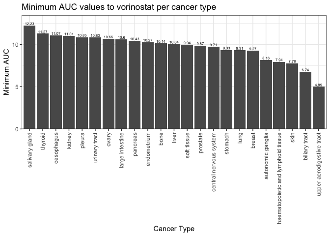
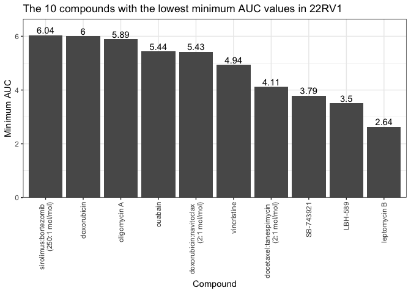
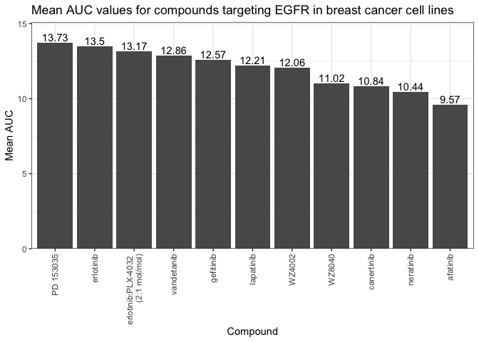

code\_submission
================
Andrea
8/3/2020

``` r
library("tidyverse")
```

``` r
my_theme <- theme_bw() + 
  theme(axis.text.x = element_text(angle = 90, hjust = 1, vjust = 0.5))
theme_set(my_theme)
```

## 1\. Tidying the dad\_mom file

``` r
dad_mom <- read_delim("dad_mom.txt", delim="\t")

head(dad_mom)
```

    ## # A tibble: 3 x 5
    ##   fam_id name_dad income_dad name_mom income_mom
    ##    <dbl> <chr>         <dbl> <chr>         <dbl>
    ## 1      1 Bill          30000 Bess          15000
    ## 2      2 Art           22000 Amy           22000
    ## 3      3 Paul          25000 Pat           50000

``` r
dad_mom_tidy <- dad_mom %>% 
  pivot_longer(-fam_id, names_to = c(".value", "parent"), names_sep = "_")

dad_mom_tidy
```

    ## # A tibble: 6 x 4
    ##   fam_id parent name  income
    ##    <dbl> <chr>  <chr>  <dbl>
    ## 1      1 dad    Bill   30000
    ## 2      1 mom    Bess   15000
    ## 3      2 dad    Art    22000
    ## 4      2 mom    Amy    22000
    ## 5      3 dad    Paul   25000
    ## 6      3 mom    Pat    50000

## 2\. Joining together CTRP data

``` r
AUC_1 <- read_csv("CTRP_files/AUC_1.csv")
AUC_2 <- read_csv("CTRP_files/AUC_2.csv")
cancer_cell_line_info <- read_csv("CTRP_files/cancer_cell_line_info.csv")
compound_info <- read_csv("CTRP_files/compound_info.csv")
experiment_info <- read_csv("CTRP_files/Experiment_info.csv")
```

``` r
AUC <- AUC_1 %>% 
  bind_rows(AUC_2)
```

``` r
all_data <- AUC %>% 
  left_join(experiment_info, by = c("experiment_id" = "expt_id")) %>%
  left_join(cancer_cell_line_info, by = "master_ccl_id") %>%
  left_join(compound_info, by = "master_cpd_id")
```

``` r
all_data <- all_data %>% 
  mutate(cancer_type = gsub("_", " ", cancer_type)) %>% 
  mutate(cpd_name = gsub(" \\(", " \n\\(", cpd_name))
```

### Which cancer type has the lowest AUC values to the compound “vorinostat”?

``` r
min_vorinostat_AUC_by_cancer <- all_data %>% 
  filter(cpd_name == "vorinostat") %>% 
  drop_na(cancer_type) %>%
  group_by(cancer_type) %>% 
  summarize(min_AUC_vorinostat = min(area_under_curve))

min_vorinostat_AUC_by_cancer
```

    ## # A tibble: 23 x 2
    ##    cancer_type                        min_AUC_vorinostat
    ##    <chr>                                           <dbl>
    ##  1 autonomic ganglia                                8.16
    ##  2 biliary tract                                    6.74
    ##  3 bone                                            10.1 
    ##  4 breast                                           9.27
    ##  5 central nervous system                           9.71
    ##  6 endometrium                                     10.3 
    ##  7 haematopoietic and lymphoid tissue               7.94
    ##  8 kidney                                          11.0 
    ##  9 large intestine                                 10.6 
    ## 10 liver                                           10.0 
    ## # … with 13 more rows

``` r
ggplot(min_vorinostat_AUC_by_cancer, aes(reorder(cancer_type, -min_AUC_vorinostat), min_AUC_vorinostat)) +
  geom_bar(stat = "identity") +
  geom_text(size = 2, aes(label = round(min_AUC_vorinostat, 2)), position=position_dodge(width = 0.9), vjust = -0.25) +
  scale_y_continuous(expand = expand_scale(mult = c(0, .1))) +
  labs(title = "Minimum AUC values to vorinostat per cancer type",
        x = "Cancer Type", y = "Minimum AUC")
```

<!-- -->

Cancer of the upper aerodigestive tract has the lowest AUC value to
vorinostat.

### Which compound is the prostate cancer cell line 22RV1 most sensitive to? (For 22RV1, which compound has the lowest AUC value?)

``` r
min_AUC_22RV1 <- all_data %>% 
  filter(ccl_name == "22RV1") %>%
  drop_na(cpd_name) %>%
  group_by(cpd_name) %>%
  summarize(min_AUC = min(area_under_curve)) %>%
  top_n(-10, min_AUC)

min_AUC_22RV1
```

    ## # A tibble: 10 x 2
    ##    cpd_name                                 min_AUC
    ##    <chr>                                      <dbl>
    ##  1 "docetaxel:tanespimycin \n(2:1 mol/mol)"    4.11
    ##  2 "doxorubicin"                               6.00
    ##  3 "doxorubicin:navitoclax \n(2:1 mol/mol)"    5.43
    ##  4 "LBH-589"                                   3.50
    ##  5 "leptomycin B"                              2.64
    ##  6 "oligomycin A"                              5.89
    ##  7 "ouabain"                                   5.44
    ##  8 "SB-743921"                                 3.79
    ##  9 "sirolimus:bortezomib \n(250:1 mol/mol)"    6.04
    ## 10 "vincristine"                               4.94

``` r
ggplot(min_AUC_22RV1, aes(reorder(cpd_name, -min_AUC), min_AUC)) +
  geom_bar(stat = "identity") +
  geom_text(aes(label = round(min_AUC, 2)), position = position_dodge(width = 0.9), vjust = -0.25) +
  scale_y_continuous(expand = expand_scale(mult = c(0, .1))) +
  labs(title = "The 10 compounds with the lowest minimum AUC values in 22RV1",
        x = "Compound", y = "Minimum AUC")
```

<!-- -->

22RV1 is the most sensitive to leptomycin B.

### For the 10 compounds that target EGFR, which of them has (on average) the lowest AUC values in the breast cancer cell lines?

``` r
EGFR_breast_mean_AUC <- all_data %>%
  filter(str_detect(gene_symbol_of_protein_target, "EGFR"), cancer_type == "breast") %>% 
  drop_na(cpd_name) %>%
  group_by(cpd_name) %>% 
  summarize(mean_AUC = mean(area_under_curve))

EGFR_breast_mean_AUC
```

    ## # A tibble: 11 x 2
    ##    cpd_name                             mean_AUC
    ##    <chr>                                   <dbl>
    ##  1 "afatinib"                               9.57
    ##  2 "canertinib"                            10.8 
    ##  3 "erlotinib"                             13.5 
    ##  4 "erlotinib:PLX-4032 \n(2:1 mol/mol)"    13.2 
    ##  5 "gefitinib"                             12.6 
    ##  6 "lapatinib"                             12.2 
    ##  7 "neratinib"                             10.4 
    ##  8 "PD 153035"                             13.7 
    ##  9 "vandetanib"                            12.9 
    ## 10 "WZ4002"                                12.1 
    ## 11 "WZ8040"                                11.0

``` r
ggplot(EGFR_breast_mean_AUC, aes(reorder(cpd_name, -mean_AUC), mean_AUC)) +
  geom_bar(stat = "identity") +
  geom_text(aes(label = round(mean_AUC, 2)), position = position_dodge(width = 0.9), vjust = -0.25) +
  scale_y_continuous(expand = expand_scale(mult = c(0, .1))) +
  labs(title = "Mean AUC values for compounds targeting EGFR in breast cancer cell lines",
        x = "Compound", y = "Mean AUC")
```

<!-- -->

Of the 10 compounds that target EGFR, on average afatinib has the lowest
AUC value in breast cancer cell lines.
