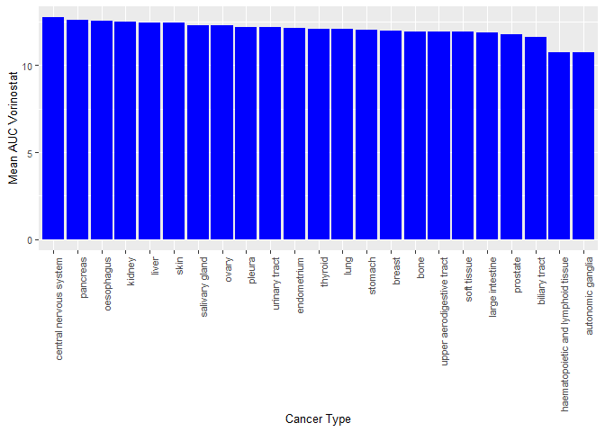
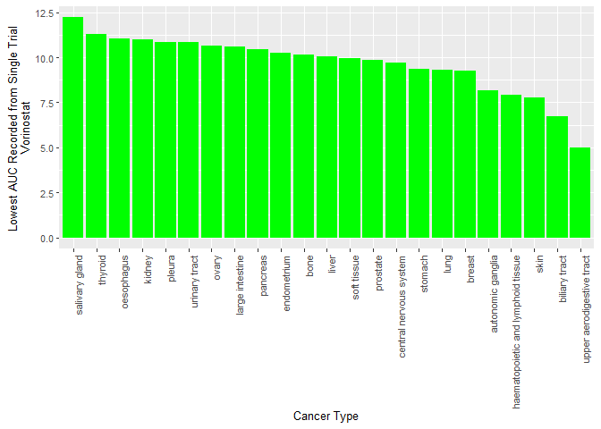

Note that the `echo = FALSE` parameter was added to the code chunk to
prevent printing of the R code that generated the plot.

\#Part 1

    library(tidyr)
    library(ggplot2)
    library(dplyr)

    ## 
    ## Attaching package: 'dplyr'

    ## The following objects are masked from 'package:stats':
    ## 
    ##     filter, lag

    ## The following objects are masked from 'package:base':
    ## 
    ##     intersect, setdiff, setequal, union

    library(stringr)
    library(readr)
    library(knitr)

    dad_mom<-read_tsv("dad_mom.txt")

    ## Parsed with column specification:
    ## cols(
    ##   fam_id = col_double(),
    ##   name_dad = col_character(),
    ##   income_dad = col_double(),
    ##   name_mom = col_character(),
    ##   income_mom = col_double()
    ## )

    dadmomcombine<-dad_mom%>%
      gather(key="key",value="value",name_dad:income_mom)%>%
      separate(key, into=c("x","mom_dad"))%>%
      spread(key=x,value=value)%>%
      select(name,mom_dad,income,fam_id)
    kable(dadmomcombine)

<table>
<thead>
<tr class="header">
<th style="text-align: left;">name</th>
<th style="text-align: left;">mom_dad</th>
<th style="text-align: left;">income</th>
<th style="text-align: right;">fam_id</th>
</tr>
</thead>
<tbody>
<tr class="odd">
<td style="text-align: left;">Bill</td>
<td style="text-align: left;">dad</td>
<td style="text-align: left;">30000</td>
<td style="text-align: right;">1</td>
</tr>
<tr class="even">
<td style="text-align: left;">Bess</td>
<td style="text-align: left;">mom</td>
<td style="text-align: left;">15000</td>
<td style="text-align: right;">1</td>
</tr>
<tr class="odd">
<td style="text-align: left;">Art</td>
<td style="text-align: left;">dad</td>
<td style="text-align: left;">22000</td>
<td style="text-align: right;">2</td>
</tr>
<tr class="even">
<td style="text-align: left;">Amy</td>
<td style="text-align: left;">mom</td>
<td style="text-align: left;">22000</td>
<td style="text-align: right;">2</td>
</tr>
<tr class="odd">
<td style="text-align: left;">Paul</td>
<td style="text-align: left;">dad</td>
<td style="text-align: left;">25000</td>
<td style="text-align: right;">3</td>
</tr>
<tr class="even">
<td style="text-align: left;">Pat</td>
<td style="text-align: left;">mom</td>
<td style="text-align: left;">50000</td>
<td style="text-align: right;">3</td>
</tr>
</tbody>
</table>

\#Part 2

    auc1<-read_csv("CTRP_files/AUC_1.csv")

    ## Parsed with column specification:
    ## cols(
    ##   experiment_id = col_double(),
    ##   area_under_curve = col_double(),
    ##   master_cpd_id = col_double()
    ## )

    auc2<-read_csv("CTRP_files/AUC_2.csv")

    ## Parsed with column specification:
    ## cols(
    ##   experiment_id = col_double(),
    ##   area_under_curve = col_double(),
    ##   master_cpd_id = col_double()
    ## )

    cancercelllinfo<-read_csv("CTRP_files/cancer_cell_line_info.csv")

    ## Parsed with column specification:
    ## cols(
    ##   master_ccl_id = col_double(),
    ##   ccl_name = col_character(),
    ##   cancer_type = col_character()
    ## )

    compoundinfo<-read_csv("CTRP_files/compound_info.csv")

    ## Parsed with column specification:
    ## cols(
    ##   master_cpd_id = col_double(),
    ##   cpd_name = col_character(),
    ##   gene_symbol_of_protein_target = col_character()
    ## )

    experimentinfo<-read_csv("CTRP_files/experiment_info.csv")

    ## Parsed with column specification:
    ## cols(
    ##   expt_id = col_double(),
    ##   master_ccl_id = col_double(),
    ##   experiment_date = col_double(),
    ##   cells_per_well = col_double()
    ## )

    auccombined_compounds<-auc1%>%
      full_join(auc2, by=c("experiment_id","area_under_curve","master_cpd_id"))%>%
      full_join(compoundinfo,by="master_cpd_id")

    Auc_compounds_cell_exp_info<-auccombined_compounds%>%
      full_join(experimentinfo,by=c("experiment_id"="expt_id"))%>%full_join(cancercelllinfo,by="master_ccl_id")
    #All files combined into one table using full joins. 
    zzmean<-Auc_compounds_cell_exp_info%>%
      filter(cpd_name=="vorinostat")%>%
      drop_na(cancer_type)%>%
      group_by(cancer_type)%>%
      summarize(mean_auc_by_compound=mean(area_under_curve))%>%
      arrange(desc(mean_auc_by_compound))%>%
      mutate(cancer_type=str_replace_all(cancer_type,"_"," "))

    ## `summarise()` ungrouping output (override with `.groups` argument)

    #Looking at mean AUC values for all cell lines tested with vorinostat
    zzlowest<-Auc_compounds_cell_exp_info%>%
      filter(cpd_name=="vorinostat")%>%
      drop_na(cancer_type)%>%
      group_by(cancer_type)%>%
      summarize(min_auc=min(area_under_curve))%>%
      arrange(desc(min_auc))%>%
      mutate(cancer_type=str_replace_all(cancer_type,"_"," "))

    ## `summarise()` ungrouping output (override with `.groups` argument)

    ##Made a table that does not calculate the mean AUC value to simply look which cell line had the lowest AUC value in a single trial

    ggplot(zzmean,aes(x=reorder(cancer_type,-mean_auc_by_compound),y=mean_auc_by_compound,))+
      geom_bar(stat="identity",fill="blue")+
      labs(x="Cancer Type",y="Mean AUC Vorinostat")+
      theme(axis.text.x = element_text(angle = 90,hjust=1),text=element_text(size=10))

    ggplot(zzlowest, aes(x=reorder(cancer_type,-min_auc),y=min_auc))+
      geom_bar(stat="identity",fill="green")+
      labs(x="Cancer Type",y="Lowest AUC Recorded from Single Trial \nVorinostat")+
      theme(axis.text.x = element_text(angle = 90,hjust=1),text=element_text(size=10))

    ##The cancer type with the lowest overall AUC value for a single trial was upper aerodigestive tract, however when looking at the mean AUC for each cancer type, autonomic ganglia has the lowest mean AUC.Graphs are simple and with more time could be made to look much better, but the information is there!!

    prostate<-Auc_compounds_cell_exp_info%>%
      filter(ccl_name=="22RV1")%>%
      group_by(cpd_name)%>%
      summarize(mean_auc=mean(area_under_curve))%>%
      arrange(desc(mean_auc))

    ## `summarise()` ungrouping output (override with `.groups` argument)

    kable(prostate)

<table>
<thead>
<tr class="header">
<th style="text-align: left;">cpd_name</th>
<th style="text-align: right;">mean_auc</th>
</tr>
</thead>
<tbody>
<tr class="odd">
<td style="text-align: left;">CI-976</td>
<td style="text-align: right;">16.6230</td>
</tr>
<tr class="even">
<td style="text-align: left;">QS-11</td>
<td style="text-align: right;">16.3640</td>
</tr>
<tr class="odd">
<td style="text-align: left;">hyperforin</td>
<td style="text-align: right;">16.2430</td>
</tr>
<tr class="even">
<td style="text-align: left;">BRD-K64610608</td>
<td style="text-align: right;">16.2410</td>
</tr>
<tr class="odd">
<td style="text-align: left;">BRD-K13185470</td>
<td style="text-align: right;">16.1310</td>
</tr>
<tr class="even">
<td style="text-align: left;">dexamethasone</td>
<td style="text-align: right;">16.1200</td>
</tr>
<tr class="odd">
<td style="text-align: left;">ML029</td>
<td style="text-align: right;">16.0410</td>
</tr>
<tr class="even">
<td style="text-align: left;">bexarotene</td>
<td style="text-align: right;">16.0380</td>
</tr>
<tr class="odd">
<td style="text-align: left;">BRD8958</td>
<td style="text-align: right;">15.9870</td>
</tr>
<tr class="even">
<td style="text-align: left;">cyclophosphamide</td>
<td style="text-align: right;">15.9800</td>
</tr>
<tr class="odd">
<td style="text-align: left;">ML258</td>
<td style="text-align: right;">15.8890</td>
</tr>
<tr class="even">
<td style="text-align: left;">tigecycline</td>
<td style="text-align: right;">15.7940</td>
</tr>
<tr class="odd">
<td style="text-align: left;">BMS-270394</td>
<td style="text-align: right;">15.7820</td>
</tr>
<tr class="even">
<td style="text-align: left;">temozolomide</td>
<td style="text-align: right;">15.7180</td>
</tr>
<tr class="odd">
<td style="text-align: left;">BRD-K20514654</td>
<td style="text-align: right;">15.6090</td>
</tr>
<tr class="even">
<td style="text-align: left;">darinaparsin</td>
<td style="text-align: right;">15.6040</td>
</tr>
<tr class="odd">
<td style="text-align: left;">BRD-K37390332</td>
<td style="text-align: right;">15.6020</td>
</tr>
<tr class="even">
<td style="text-align: left;">nelarabine</td>
<td style="text-align: right;">15.5950</td>
</tr>
<tr class="odd">
<td style="text-align: left;">BRD-K44224150</td>
<td style="text-align: right;">15.4830</td>
</tr>
<tr class="even">
<td style="text-align: left;">AT7867</td>
<td style="text-align: right;">15.4670</td>
</tr>
<tr class="odd">
<td style="text-align: left;">parthenolide</td>
<td style="text-align: right;">15.4380</td>
</tr>
<tr class="even">
<td style="text-align: left;">BRD-K16130065</td>
<td style="text-align: right;">15.3640</td>
</tr>
<tr class="odd">
<td style="text-align: left;">BRD-K03911514</td>
<td style="text-align: right;">15.3590</td>
</tr>
<tr class="even">
<td style="text-align: left;">myricetin</td>
<td style="text-align: right;">15.3100</td>
</tr>
<tr class="odd">
<td style="text-align: left;">ML203</td>
<td style="text-align: right;">15.2920</td>
</tr>
<tr class="even">
<td style="text-align: left;">GMX-1778</td>
<td style="text-align: right;">15.2730</td>
</tr>
<tr class="odd">
<td style="text-align: left;">AGK-2</td>
<td style="text-align: right;">15.2660</td>
</tr>
<tr class="even">
<td style="text-align: left;">FSC231</td>
<td style="text-align: right;">15.2320</td>
</tr>
<tr class="odd">
<td style="text-align: left;">BRD-K79669418</td>
<td style="text-align: right;">15.2210</td>
</tr>
<tr class="even">
<td style="text-align: left;">B02</td>
<td style="text-align: right;">15.2190</td>
</tr>
<tr class="odd">
<td style="text-align: left;">Platin</td>
<td style="text-align: right;">15.1600</td>
</tr>
<tr class="even">
<td style="text-align: left;">BRD-K34485477</td>
<td style="text-align: right;">15.1170</td>
</tr>
<tr class="odd">
<td style="text-align: left;">PRL-3 inhibitor I</td>
<td style="text-align: right;">15.1150</td>
</tr>
<tr class="even">
<td style="text-align: left;">BRD-K04800985</td>
<td style="text-align: right;">15.0880</td>
</tr>
<tr class="odd">
<td style="text-align: left;">BRD-K99584050</td>
<td style="text-align: right;">15.0770</td>
</tr>
<tr class="even">
<td style="text-align: left;">compound 1B</td>
<td style="text-align: right;">15.0040</td>
</tr>
<tr class="odd">
<td style="text-align: left;">BRD-K27188169:navitoclax (2:1 mol/mol)</td>
<td style="text-align: right;">15.0000</td>
</tr>
<tr class="even">
<td style="text-align: left;">Ki8751</td>
<td style="text-align: right;">15.0000</td>
</tr>
<tr class="odd">
<td style="text-align: left;">LY-2157299</td>
<td style="text-align: right;">15.0000</td>
</tr>
<tr class="even">
<td style="text-align: left;">necrostatin-7</td>
<td style="text-align: right;">15.0000</td>
</tr>
<tr class="odd">
<td style="text-align: left;">regorafenib</td>
<td style="text-align: right;">15.0000</td>
</tr>
<tr class="even">
<td style="text-align: left;">tretinoin:carboplatin (2:1 mol/mol)</td>
<td style="text-align: right;">15.0000</td>
</tr>
<tr class="odd">
<td style="text-align: left;">BRD-K27986637</td>
<td style="text-align: right;">14.9990</td>
</tr>
<tr class="even">
<td style="text-align: left;">JW-480</td>
<td style="text-align: right;">14.9840</td>
</tr>
<tr class="odd">
<td style="text-align: left;">BRD-A02303741:navitoclax (2:1 mol/mol)</td>
<td style="text-align: right;">14.9750</td>
</tr>
<tr class="even">
<td style="text-align: left;">BRD-K48334597</td>
<td style="text-align: right;">14.9360</td>
</tr>
<tr class="odd">
<td style="text-align: left;">brivanib</td>
<td style="text-align: right;">14.9320</td>
</tr>
<tr class="even">
<td style="text-align: left;">BRD-K51490254</td>
<td style="text-align: right;">14.9310</td>
</tr>
<tr class="odd">
<td style="text-align: left;">azacitidine</td>
<td style="text-align: right;">14.8940</td>
</tr>
<tr class="even">
<td style="text-align: left;">BRD-K09587429</td>
<td style="text-align: right;">14.8900</td>
</tr>
<tr class="odd">
<td style="text-align: left;">BRD8899</td>
<td style="text-align: right;">14.8780</td>
</tr>
<tr class="even">
<td style="text-align: left;">CCT036477</td>
<td style="text-align: right;">14.8760</td>
</tr>
<tr class="odd">
<td style="text-align: left;">BRD-K14844214</td>
<td style="text-align: right;">14.8630</td>
</tr>
<tr class="even">
<td style="text-align: left;">BRD4132</td>
<td style="text-align: right;">14.8190</td>
</tr>
<tr class="odd">
<td style="text-align: left;">isoliquiritigenin</td>
<td style="text-align: right;">14.8190</td>
</tr>
<tr class="even">
<td style="text-align: left;">BRD-K58730230</td>
<td style="text-align: right;">14.8130</td>
</tr>
<tr class="odd">
<td style="text-align: left;">QW-BI-011</td>
<td style="text-align: right;">14.8090</td>
</tr>
<tr class="even">
<td style="text-align: left;">GDC-0879</td>
<td style="text-align: right;">14.8010</td>
</tr>
<tr class="odd">
<td style="text-align: left;">ML031</td>
<td style="text-align: right;">14.7690</td>
</tr>
<tr class="even">
<td style="text-align: left;">OSI-930</td>
<td style="text-align: right;">14.7090</td>
</tr>
<tr class="odd">
<td style="text-align: left;">erismodegib</td>
<td style="text-align: right;">14.7020</td>
</tr>
<tr class="even">
<td style="text-align: left;">ifosfamide</td>
<td style="text-align: right;">14.6970</td>
</tr>
<tr class="odd">
<td style="text-align: left;">MK-0752</td>
<td style="text-align: right;">14.6930</td>
</tr>
<tr class="even">
<td style="text-align: left;">BRD-K29086754</td>
<td style="text-align: right;">14.6900</td>
</tr>
<tr class="odd">
<td style="text-align: left;">ruxolitinib</td>
<td style="text-align: right;">14.6880</td>
</tr>
<tr class="even">
<td style="text-align: left;">ML050</td>
<td style="text-align: right;">14.6790</td>
</tr>
<tr class="odd">
<td style="text-align: left;">sildenafil</td>
<td style="text-align: right;">14.6790</td>
</tr>
<tr class="even">
<td style="text-align: left;">GSK4112</td>
<td style="text-align: right;">14.6780</td>
</tr>
<tr class="odd">
<td style="text-align: left;">L-685458</td>
<td style="text-align: right;">14.6780</td>
</tr>
<tr class="even">
<td style="text-align: left;">tacrolimus</td>
<td style="text-align: right;">14.6740</td>
</tr>
<tr class="odd">
<td style="text-align: left;">SGX-523</td>
<td style="text-align: right;">14.6710</td>
</tr>
<tr class="even">
<td style="text-align: left;">procarbazine</td>
<td style="text-align: right;">14.6620</td>
</tr>
<tr class="odd">
<td style="text-align: left;">BRD9876</td>
<td style="text-align: right;">14.6570</td>
</tr>
<tr class="even">
<td style="text-align: left;">PYR-41</td>
<td style="text-align: right;">14.6340</td>
</tr>
<tr class="odd">
<td style="text-align: left;">IC-87114</td>
<td style="text-align: right;">14.6310</td>
</tr>
<tr class="even">
<td style="text-align: left;">ML006</td>
<td style="text-align: right;">14.6310</td>
</tr>
<tr class="odd">
<td style="text-align: left;">SU11274</td>
<td style="text-align: right;">14.6170</td>
</tr>
<tr class="even">
<td style="text-align: left;">AM-580</td>
<td style="text-align: right;">14.6140</td>
</tr>
<tr class="odd">
<td style="text-align: left;">C6-ceramide</td>
<td style="text-align: right;">14.6090</td>
</tr>
<tr class="even">
<td style="text-align: left;">BRD-K96431673</td>
<td style="text-align: right;">14.5850</td>
</tr>
<tr class="odd">
<td style="text-align: left;">fumonisin B1</td>
<td style="text-align: right;">14.5840</td>
</tr>
<tr class="even">
<td style="text-align: left;">oxaliplatin</td>
<td style="text-align: right;">14.5730</td>
</tr>
<tr class="odd">
<td style="text-align: left;">BEC</td>
<td style="text-align: right;">14.5720</td>
</tr>
<tr class="even">
<td style="text-align: left;">pifithrin-mu</td>
<td style="text-align: right;">14.5690</td>
</tr>
<tr class="odd">
<td style="text-align: left;">16-beta-bromoandrosterone</td>
<td style="text-align: right;">14.5650</td>
</tr>
<tr class="even">
<td style="text-align: left;">BRD1835</td>
<td style="text-align: right;">14.5630</td>
</tr>
<tr class="odd">
<td style="text-align: left;">BRD-K86535717</td>
<td style="text-align: right;">14.5600</td>
</tr>
<tr class="even">
<td style="text-align: left;">CIL70</td>
<td style="text-align: right;">14.5460</td>
</tr>
<tr class="odd">
<td style="text-align: left;">BRD-A02303741:carboplatin (1:1 mol/mol)</td>
<td style="text-align: right;">14.5430</td>
</tr>
<tr class="even">
<td style="text-align: left;">BRD-K24690302</td>
<td style="text-align: right;">14.5350</td>
</tr>
<tr class="odd">
<td style="text-align: left;">staurosporine</td>
<td style="text-align: right;">14.5110</td>
</tr>
<tr class="even">
<td style="text-align: left;">lenvatinib</td>
<td style="text-align: right;">14.5080</td>
</tr>
<tr class="odd">
<td style="text-align: left;">BRD-K88742110</td>
<td style="text-align: right;">14.5060</td>
</tr>
<tr class="even">
<td style="text-align: left;">CIL55</td>
<td style="text-align: right;">14.5040</td>
</tr>
<tr class="odd">
<td style="text-align: left;">BRD-A02303741</td>
<td style="text-align: right;">14.5030</td>
</tr>
<tr class="even">
<td style="text-align: left;">ML312</td>
<td style="text-align: right;">14.4980</td>
</tr>
<tr class="odd">
<td style="text-align: left;">sorafenib</td>
<td style="text-align: right;">14.4980</td>
</tr>
<tr class="even">
<td style="text-align: left;">GANT-61</td>
<td style="text-align: right;">14.4700</td>
</tr>
<tr class="odd">
<td style="text-align: left;">SR1001</td>
<td style="text-align: right;">14.4650</td>
</tr>
<tr class="even">
<td style="text-align: left;">BRD-K75293299</td>
<td style="text-align: right;">14.4470</td>
</tr>
<tr class="odd">
<td style="text-align: left;">BRD-K02492147</td>
<td style="text-align: right;">14.4420</td>
</tr>
<tr class="even">
<td style="text-align: left;">LE-135</td>
<td style="text-align: right;">14.4390</td>
</tr>
<tr class="odd">
<td style="text-align: left;">BRD-K16147474</td>
<td style="text-align: right;">14.4360</td>
</tr>
<tr class="even">
<td style="text-align: left;">BRD-K17060750</td>
<td style="text-align: right;">14.4030</td>
</tr>
<tr class="odd">
<td style="text-align: left;">968</td>
<td style="text-align: right;">14.3760</td>
</tr>
<tr class="even">
<td style="text-align: left;">decitabine:navitoclax (2:1 mol/mol)</td>
<td style="text-align: right;">14.3530</td>
</tr>
<tr class="odd">
<td style="text-align: left;">tamatinib</td>
<td style="text-align: right;">14.3480</td>
</tr>
<tr class="even">
<td style="text-align: left;">BRD9647</td>
<td style="text-align: right;">14.3430</td>
</tr>
<tr class="odd">
<td style="text-align: left;">BRD-K50799972</td>
<td style="text-align: right;">14.3400</td>
</tr>
<tr class="even">
<td style="text-align: left;">MI-1</td>
<td style="text-align: right;">14.3390</td>
</tr>
<tr class="odd">
<td style="text-align: left;">birinapant</td>
<td style="text-align: right;">14.3350</td>
</tr>
<tr class="even">
<td style="text-align: left;">spautin-1</td>
<td style="text-align: right;">14.3280</td>
</tr>
<tr class="odd">
<td style="text-align: left;">BRD-K02251932</td>
<td style="text-align: right;">14.3200</td>
</tr>
<tr class="even">
<td style="text-align: left;">AZD7545</td>
<td style="text-align: right;">14.3150</td>
</tr>
<tr class="odd">
<td style="text-align: left;">RG-108</td>
<td style="text-align: right;">14.3130</td>
</tr>
<tr class="even">
<td style="text-align: left;">BRD-K78574327</td>
<td style="text-align: right;">14.3120</td>
</tr>
<tr class="odd">
<td style="text-align: left;">PRIMA-1-Met</td>
<td style="text-align: right;">14.3070</td>
</tr>
<tr class="even">
<td style="text-align: left;">blebbistatin</td>
<td style="text-align: right;">14.3060</td>
</tr>
<tr class="odd">
<td style="text-align: left;">tandutinib</td>
<td style="text-align: right;">14.2850</td>
</tr>
<tr class="even">
<td style="text-align: left;">BRD-K30019337</td>
<td style="text-align: right;">14.2630</td>
</tr>
<tr class="odd">
<td style="text-align: left;">BRD-K07442505</td>
<td style="text-align: right;">14.2530</td>
</tr>
<tr class="even">
<td style="text-align: left;">TGX-221</td>
<td style="text-align: right;">14.2430</td>
</tr>
<tr class="odd">
<td style="text-align: left;">UNC0321</td>
<td style="text-align: right;">14.2400</td>
</tr>
<tr class="even">
<td style="text-align: left;">erlotinib</td>
<td style="text-align: right;">14.2340</td>
</tr>
<tr class="odd">
<td style="text-align: left;">EX-527</td>
<td style="text-align: right;">14.2230</td>
</tr>
<tr class="even">
<td style="text-align: left;">etomoxir</td>
<td style="text-align: right;">14.2220</td>
</tr>
<tr class="odd">
<td style="text-align: left;">pifithrin-alpha</td>
<td style="text-align: right;">14.2180</td>
</tr>
<tr class="even">
<td style="text-align: left;">nilotinib</td>
<td style="text-align: right;">14.2130</td>
</tr>
<tr class="odd">
<td style="text-align: left;">BRD-K52037352</td>
<td style="text-align: right;">14.2120</td>
</tr>
<tr class="even">
<td style="text-align: left;">SB-431542</td>
<td style="text-align: right;">14.2110</td>
</tr>
<tr class="odd">
<td style="text-align: left;">CIL41</td>
<td style="text-align: right;">14.2080</td>
</tr>
<tr class="even">
<td style="text-align: left;">tivozanib</td>
<td style="text-align: right;">14.1900</td>
</tr>
<tr class="odd">
<td style="text-align: left;">CIL56</td>
<td style="text-align: right;">14.1800</td>
</tr>
<tr class="even">
<td style="text-align: left;">chlorambucil</td>
<td style="text-align: right;">14.1730</td>
</tr>
<tr class="odd">
<td style="text-align: left;">ciclosporin</td>
<td style="text-align: right;">14.1730</td>
</tr>
<tr class="even">
<td style="text-align: left;">pandacostat</td>
<td style="text-align: right;">14.1450</td>
</tr>
<tr class="odd">
<td style="text-align: left;">BRD-K84807411</td>
<td style="text-align: right;">14.1440</td>
</tr>
<tr class="even">
<td style="text-align: left;">NSC30930</td>
<td style="text-align: right;">14.1270</td>
</tr>
<tr class="odd">
<td style="text-align: left;">BRD6340</td>
<td style="text-align: right;">14.1010</td>
</tr>
<tr class="even">
<td style="text-align: left;">PLX-4720</td>
<td style="text-align: right;">14.0980</td>
</tr>
<tr class="odd">
<td style="text-align: left;">KU-55933</td>
<td style="text-align: right;">14.0970</td>
</tr>
<tr class="even">
<td style="text-align: left;">cytochalasin B</td>
<td style="text-align: right;">14.0960</td>
</tr>
<tr class="odd">
<td style="text-align: left;">WAY-362450</td>
<td style="text-align: right;">14.0920</td>
</tr>
<tr class="even">
<td style="text-align: left;">IU1</td>
<td style="text-align: right;">14.0880</td>
</tr>
<tr class="odd">
<td style="text-align: left;">BRD-K19103580</td>
<td style="text-align: right;">14.0860</td>
</tr>
<tr class="even">
<td style="text-align: left;">fluvastatin</td>
<td style="text-align: right;">14.0790</td>
</tr>
<tr class="odd">
<td style="text-align: left;">necrostatin-1</td>
<td style="text-align: right;">14.0680</td>
</tr>
<tr class="even">
<td style="text-align: left;">CAY10576</td>
<td style="text-align: right;">14.0610</td>
</tr>
<tr class="odd">
<td style="text-align: left;">SMER-3</td>
<td style="text-align: right;">14.0490</td>
</tr>
<tr class="even">
<td style="text-align: left;">PF-573228</td>
<td style="text-align: right;">14.0430</td>
</tr>
<tr class="odd">
<td style="text-align: left;">cimetidine</td>
<td style="text-align: right;">14.0180</td>
</tr>
<tr class="even">
<td style="text-align: left;">BRD-K41334119</td>
<td style="text-align: right;">14.0110</td>
</tr>
<tr class="odd">
<td style="text-align: left;">indisulam</td>
<td style="text-align: right;">14.0090</td>
</tr>
<tr class="even">
<td style="text-align: left;">BRD-K96970199</td>
<td style="text-align: right;">13.9920</td>
</tr>
<tr class="odd">
<td style="text-align: left;">Compound 1541A</td>
<td style="text-align: right;">13.9900</td>
</tr>
<tr class="even">
<td style="text-align: left;">imatinib</td>
<td style="text-align: right;">13.9840</td>
</tr>
<tr class="odd">
<td style="text-align: left;">BRD-K33199242</td>
<td style="text-align: right;">13.9800</td>
</tr>
<tr class="even">
<td style="text-align: left;">HC-067047</td>
<td style="text-align: right;">13.9640</td>
</tr>
<tr class="odd">
<td style="text-align: left;">BRD-K27224038</td>
<td style="text-align: right;">13.9340</td>
</tr>
<tr class="even">
<td style="text-align: left;">BRD-K11533227</td>
<td style="text-align: right;">13.9320</td>
</tr>
<tr class="odd">
<td style="text-align: left;">Repligen 136</td>
<td style="text-align: right;">13.9270</td>
</tr>
<tr class="even">
<td style="text-align: left;">bendamustine</td>
<td style="text-align: right;">13.9190</td>
</tr>
<tr class="odd">
<td style="text-align: left;">NSC 74859</td>
<td style="text-align: right;">13.9190</td>
</tr>
<tr class="even">
<td style="text-align: left;">SKI-II</td>
<td style="text-align: right;">13.9190</td>
</tr>
<tr class="odd">
<td style="text-align: left;">ML239</td>
<td style="text-align: right;">13.8910</td>
</tr>
<tr class="even">
<td style="text-align: left;">BRD-K34099515</td>
<td style="text-align: right;">13.8880</td>
</tr>
<tr class="odd">
<td style="text-align: left;">erastin</td>
<td style="text-align: right;">13.8790</td>
</tr>
<tr class="even">
<td style="text-align: left;">nintedanib</td>
<td style="text-align: right;">13.8730</td>
</tr>
<tr class="odd">
<td style="text-align: left;">AC55649</td>
<td style="text-align: right;">13.8450</td>
</tr>
<tr class="even">
<td style="text-align: left;">BRD-K66532283</td>
<td style="text-align: right;">13.8410</td>
</tr>
<tr class="odd">
<td style="text-align: left;">ML083</td>
<td style="text-align: right;">13.8340</td>
</tr>
<tr class="even">
<td style="text-align: left;">manumycin A</td>
<td style="text-align: right;">13.8330</td>
</tr>
<tr class="odd">
<td style="text-align: left;">YL54</td>
<td style="text-align: right;">13.8260</td>
</tr>
<tr class="even">
<td style="text-align: left;">quizartinib</td>
<td style="text-align: right;">13.8130</td>
</tr>
<tr class="odd">
<td style="text-align: left;">BRD-K27188169</td>
<td style="text-align: right;">13.7690</td>
</tr>
<tr class="even">
<td style="text-align: left;">navitoclax</td>
<td style="text-align: right;">13.7630</td>
</tr>
<tr class="odd">
<td style="text-align: left;">BRD-K49290616</td>
<td style="text-align: right;">13.7550</td>
</tr>
<tr class="even">
<td style="text-align: left;">Mdivi-1</td>
<td style="text-align: right;">13.7510</td>
</tr>
<tr class="odd">
<td style="text-align: left;">AZ-3146</td>
<td style="text-align: right;">13.7460</td>
</tr>
<tr class="even">
<td style="text-align: left;">SJ-172550</td>
<td style="text-align: right;">13.7420</td>
</tr>
<tr class="odd">
<td style="text-align: left;">BRD-K29313308</td>
<td style="text-align: right;">13.7290</td>
</tr>
<tr class="even">
<td style="text-align: left;">PLX-4032</td>
<td style="text-align: right;">13.7170</td>
</tr>
<tr class="odd">
<td style="text-align: left;">trifluoperazine</td>
<td style="text-align: right;">13.7150</td>
</tr>
<tr class="even">
<td style="text-align: left;">carboplatin:UNC0638 (2:1 mol/mol)</td>
<td style="text-align: right;">13.6890</td>
</tr>
<tr class="odd">
<td style="text-align: left;">SID 26681509</td>
<td style="text-align: right;">13.6810</td>
</tr>
<tr class="even">
<td style="text-align: left;">BRD-K41597374</td>
<td style="text-align: right;">13.6690</td>
</tr>
<tr class="odd">
<td style="text-align: left;">TG-100-115</td>
<td style="text-align: right;">13.6640</td>
</tr>
<tr class="even">
<td style="text-align: left;">PF-543</td>
<td style="text-align: right;">13.6610</td>
</tr>
<tr class="odd">
<td style="text-align: left;">elocalcitol</td>
<td style="text-align: right;">13.6530</td>
</tr>
<tr class="even">
<td style="text-align: left;">tretinoin</td>
<td style="text-align: right;">13.6520</td>
</tr>
<tr class="odd">
<td style="text-align: left;">NSC95397</td>
<td style="text-align: right;">13.6430</td>
</tr>
<tr class="even">
<td style="text-align: left;">navitoclax:piperlongumine (1:1 mol/mol)</td>
<td style="text-align: right;">13.6400</td>
</tr>
<tr class="odd">
<td style="text-align: left;">FGIN-1-27</td>
<td style="text-align: right;">13.6340</td>
</tr>
<tr class="even">
<td style="text-align: left;">BRD-K80183349</td>
<td style="text-align: right;">13.6260</td>
</tr>
<tr class="odd">
<td style="text-align: left;">tubastatin A</td>
<td style="text-align: right;">13.6230</td>
</tr>
<tr class="even">
<td style="text-align: left;">lomeguatrib</td>
<td style="text-align: right;">13.6210</td>
</tr>
<tr class="odd">
<td style="text-align: left;">ML320</td>
<td style="text-align: right;">13.6160</td>
</tr>
<tr class="even">
<td style="text-align: left;">VU0155056</td>
<td style="text-align: right;">13.6100</td>
</tr>
<tr class="odd">
<td style="text-align: left;">BIRB-796</td>
<td style="text-align: right;">13.5920</td>
</tr>
<tr class="even">
<td style="text-align: left;">prochlorperazine</td>
<td style="text-align: right;">13.5910</td>
</tr>
<tr class="odd">
<td style="text-align: left;">pyrazolanthrone</td>
<td style="text-align: right;">13.5870</td>
</tr>
<tr class="even">
<td style="text-align: left;">simvastatin</td>
<td style="text-align: right;">13.5870</td>
</tr>
<tr class="odd">
<td style="text-align: left;">BMS-195614</td>
<td style="text-align: right;">13.5770</td>
</tr>
<tr class="even">
<td style="text-align: left;">BRD-K45681478</td>
<td style="text-align: right;">13.5770</td>
</tr>
<tr class="odd">
<td style="text-align: left;">tamoxifen</td>
<td style="text-align: right;">13.5760</td>
</tr>
<tr class="even">
<td style="text-align: left;">navitoclax:birinapant (1:1 mol/mol)</td>
<td style="text-align: right;">13.5330</td>
</tr>
<tr class="odd">
<td style="text-align: left;">BRD-A71883111</td>
<td style="text-align: right;">13.5260</td>
</tr>
<tr class="even">
<td style="text-align: left;">neuronal differentiation inducer III</td>
<td style="text-align: right;">13.5220</td>
</tr>
<tr class="odd">
<td style="text-align: left;">PX-12</td>
<td style="text-align: right;">13.5210</td>
</tr>
<tr class="even">
<td style="text-align: left;">veliparib</td>
<td style="text-align: right;">13.5090</td>
</tr>
<tr class="odd">
<td style="text-align: left;">Bax channel blocker</td>
<td style="text-align: right;">13.5060</td>
</tr>
<tr class="even">
<td style="text-align: left;">CHIR-99021</td>
<td style="text-align: right;">13.5020</td>
</tr>
<tr class="odd">
<td style="text-align: left;">momelotinib</td>
<td style="text-align: right;">13.4970</td>
</tr>
<tr class="even">
<td style="text-align: left;">fulvestrant</td>
<td style="text-align: right;">13.4830</td>
</tr>
<tr class="odd">
<td style="text-align: left;">lapatinib</td>
<td style="text-align: right;">13.4760</td>
</tr>
<tr class="even">
<td style="text-align: left;">Ch-55</td>
<td style="text-align: right;">13.4670</td>
</tr>
<tr class="odd">
<td style="text-align: left;">BRD-K85133207</td>
<td style="text-align: right;">13.4610</td>
</tr>
<tr class="even">
<td style="text-align: left;">NSC48300</td>
<td style="text-align: right;">13.4550</td>
</tr>
<tr class="odd">
<td style="text-align: left;">N9-isopropylolomoucine</td>
<td style="text-align: right;">13.4520</td>
</tr>
<tr class="even">
<td style="text-align: left;">AZD4547</td>
<td style="text-align: right;">13.4420</td>
</tr>
<tr class="odd">
<td style="text-align: left;">itraconazole</td>
<td style="text-align: right;">13.4280</td>
</tr>
<tr class="even">
<td style="text-align: left;">phloretin</td>
<td style="text-align: right;">13.4210</td>
</tr>
<tr class="odd">
<td style="text-align: left;">gossypol</td>
<td style="text-align: right;">13.4190</td>
</tr>
<tr class="even">
<td style="text-align: left;">KU-60019</td>
<td style="text-align: right;">13.3790</td>
</tr>
<tr class="odd">
<td style="text-align: left;">CAL-101</td>
<td style="text-align: right;">13.3760</td>
</tr>
<tr class="even">
<td style="text-align: left;">KW-2449</td>
<td style="text-align: right;">13.3710</td>
</tr>
<tr class="odd">
<td style="text-align: left;">dacarbazine</td>
<td style="text-align: right;">13.3650</td>
</tr>
<tr class="even">
<td style="text-align: left;">tretinoin:navitoclax (4:1 mol/mol)</td>
<td style="text-align: right;">13.3630</td>
</tr>
<tr class="odd">
<td style="text-align: left;">tipifarnib-P1</td>
<td style="text-align: right;">13.3540</td>
</tr>
<tr class="even">
<td style="text-align: left;">cyanoquinoline 11</td>
<td style="text-align: right;">13.3490</td>
</tr>
<tr class="odd">
<td style="text-align: left;">CAY10594</td>
<td style="text-align: right;">13.3480</td>
</tr>
<tr class="even">
<td style="text-align: left;">MGCD-265</td>
<td style="text-align: right;">13.3240</td>
</tr>
<tr class="odd">
<td style="text-align: left;">vorapaxar</td>
<td style="text-align: right;">13.3200</td>
</tr>
<tr class="even">
<td style="text-align: left;">semagacestat</td>
<td style="text-align: right;">13.2950</td>
</tr>
<tr class="odd">
<td style="text-align: left;">purmorphamine</td>
<td style="text-align: right;">13.2880</td>
</tr>
<tr class="even">
<td style="text-align: left;">IPR-456</td>
<td style="text-align: right;">13.2550</td>
</tr>
<tr class="odd">
<td style="text-align: left;">BRD-K92856060</td>
<td style="text-align: right;">13.2410</td>
</tr>
<tr class="even">
<td style="text-align: left;">NVP-231</td>
<td style="text-align: right;">13.2160</td>
</tr>
<tr class="odd">
<td style="text-align: left;">BRD-K03536150</td>
<td style="text-align: right;">13.2100</td>
</tr>
<tr class="even">
<td style="text-align: left;">salermide:PLX-4032 (12:1 mol/mol)</td>
<td style="text-align: right;">13.1970</td>
</tr>
<tr class="odd">
<td style="text-align: left;">GW-405833</td>
<td style="text-align: right;">13.1950</td>
</tr>
<tr class="even">
<td style="text-align: left;">linsitinib</td>
<td style="text-align: right;">13.1930</td>
</tr>
<tr class="odd">
<td style="text-align: left;">erlotinib:PLX-4032 (2:1 mol/mol)</td>
<td style="text-align: right;">13.1760</td>
</tr>
<tr class="even">
<td style="text-align: left;">dasatinib</td>
<td style="text-align: right;">13.1540</td>
</tr>
<tr class="odd">
<td style="text-align: left;">SRT-1720</td>
<td style="text-align: right;">13.1490</td>
</tr>
<tr class="even">
<td style="text-align: left;">alisertib</td>
<td style="text-align: right;">13.1380</td>
</tr>
<tr class="odd">
<td style="text-align: left;">BRD-K35604418</td>
<td style="text-align: right;">13.1110</td>
</tr>
<tr class="even">
<td style="text-align: left;">zebularine</td>
<td style="text-align: right;">13.1100</td>
</tr>
<tr class="odd">
<td style="text-align: left;">navitoclax:sorafenib (1:1 mol/mol)</td>
<td style="text-align: right;">13.1090</td>
</tr>
<tr class="even">
<td style="text-align: left;">SB-525334</td>
<td style="text-align: right;">13.0970</td>
</tr>
<tr class="odd">
<td style="text-align: left;">masitinib</td>
<td style="text-align: right;">13.0960</td>
</tr>
<tr class="even">
<td style="text-align: left;">pazopanib</td>
<td style="text-align: right;">13.0910</td>
</tr>
<tr class="odd">
<td style="text-align: left;">barasertib</td>
<td style="text-align: right;">13.0900</td>
</tr>
<tr class="even">
<td style="text-align: left;">gefitinib</td>
<td style="text-align: right;">13.0830</td>
</tr>
<tr class="odd">
<td style="text-align: left;">CD-1530</td>
<td style="text-align: right;">13.0710</td>
</tr>
<tr class="even">
<td style="text-align: left;">PF-750</td>
<td style="text-align: right;">13.0690</td>
</tr>
<tr class="odd">
<td style="text-align: left;">BRD-K28456706</td>
<td style="text-align: right;">13.0680</td>
</tr>
<tr class="even">
<td style="text-align: left;">UNC0638</td>
<td style="text-align: right;">13.0660</td>
</tr>
<tr class="odd">
<td style="text-align: left;">Ko-143</td>
<td style="text-align: right;">13.0460</td>
</tr>
<tr class="even">
<td style="text-align: left;">carboplatin</td>
<td style="text-align: right;">13.0430</td>
</tr>
<tr class="odd">
<td style="text-align: left;">XL765</td>
<td style="text-align: right;">13.0240</td>
</tr>
<tr class="even">
<td style="text-align: left;">BRD-K13999467</td>
<td style="text-align: right;">12.9730</td>
</tr>
<tr class="odd">
<td style="text-align: left;">ABT-737</td>
<td style="text-align: right;">12.9650</td>
</tr>
<tr class="even">
<td style="text-align: left;">piperlongumine</td>
<td style="text-align: right;">12.9650</td>
</tr>
<tr class="odd">
<td style="text-align: left;">UNC0638:navitoclax (1:1 mol/mol)</td>
<td style="text-align: right;">12.9380</td>
</tr>
<tr class="even">
<td style="text-align: left;">JQ-1:navitoclax (2:1 mol/mol)</td>
<td style="text-align: right;">12.9360</td>
</tr>
<tr class="odd">
<td style="text-align: left;">BRD-K71781559</td>
<td style="text-align: right;">12.8920</td>
</tr>
<tr class="even">
<td style="text-align: left;">RITA</td>
<td style="text-align: right;">12.8710</td>
</tr>
<tr class="odd">
<td style="text-align: left;">KHS101</td>
<td style="text-align: right;">12.8480</td>
</tr>
<tr class="even">
<td style="text-align: left;">vandetanib</td>
<td style="text-align: right;">12.8470</td>
</tr>
<tr class="odd">
<td style="text-align: left;">isoevodiamine</td>
<td style="text-align: right;">12.8370</td>
</tr>
<tr class="even">
<td style="text-align: left;">foretinib</td>
<td style="text-align: right;">12.8280</td>
</tr>
<tr class="odd">
<td style="text-align: left;">piperlongumine:MST-312 (1:1 mol/mol)</td>
<td style="text-align: right;">12.8190</td>
</tr>
<tr class="even">
<td style="text-align: left;">SB-225002</td>
<td style="text-align: right;">12.8150</td>
</tr>
<tr class="odd">
<td style="text-align: left;">AZD6482</td>
<td style="text-align: right;">12.8070</td>
</tr>
<tr class="even">
<td style="text-align: left;">PAC-1</td>
<td style="text-align: right;">12.7690</td>
</tr>
<tr class="odd">
<td style="text-align: left;">BRD-K61166597</td>
<td style="text-align: right;">12.7460</td>
</tr>
<tr class="even">
<td style="text-align: left;">decitabine:carboplatin (1:1 mol/mol)</td>
<td style="text-align: right;">12.7410</td>
</tr>
<tr class="odd">
<td style="text-align: left;">alisertib:navitoclax (2:1 mol/mol)</td>
<td style="text-align: right;">12.7390</td>
</tr>
<tr class="even">
<td style="text-align: left;">VER-155008</td>
<td style="text-align: right;">12.7370</td>
</tr>
<tr class="odd">
<td style="text-align: left;">lovastatin</td>
<td style="text-align: right;">12.7340</td>
</tr>
<tr class="even">
<td style="text-align: left;">niclosamide</td>
<td style="text-align: right;">12.7310</td>
</tr>
<tr class="odd">
<td style="text-align: left;">olaparib</td>
<td style="text-align: right;">12.7310</td>
</tr>
<tr class="even">
<td style="text-align: left;">Compound 23 citrate</td>
<td style="text-align: right;">12.7190</td>
</tr>
<tr class="odd">
<td style="text-align: left;">BIX-01294</td>
<td style="text-align: right;">12.6880</td>
</tr>
<tr class="even">
<td style="text-align: left;">STF-31</td>
<td style="text-align: right;">12.6610</td>
</tr>
<tr class="odd">
<td style="text-align: left;">HLI 373</td>
<td style="text-align: right;">12.6590</td>
</tr>
<tr class="even">
<td style="text-align: left;">StemRegenin 1</td>
<td style="text-align: right;">12.6240</td>
</tr>
<tr class="odd">
<td style="text-align: left;">cabozantinib</td>
<td style="text-align: right;">12.6210</td>
</tr>
<tr class="even">
<td style="text-align: left;">navitoclax:MST-312 (1:1 mol/mol)</td>
<td style="text-align: right;">12.6190</td>
</tr>
<tr class="odd">
<td style="text-align: left;">silmitasertib</td>
<td style="text-align: right;">12.6150</td>
</tr>
<tr class="even">
<td style="text-align: left;">BIBR-1532</td>
<td style="text-align: right;">12.6120</td>
</tr>
<tr class="odd">
<td style="text-align: left;">vorinostat:carboplatin (1:1 mol/mol)</td>
<td style="text-align: right;">12.6060</td>
</tr>
<tr class="even">
<td style="text-align: left;">navitoclax:PLX-4032 (1:1 mol/mol)</td>
<td style="text-align: right;">12.5900</td>
</tr>
<tr class="odd">
<td style="text-align: left;">GSK-3 inhibitor IX</td>
<td style="text-align: right;">12.5750</td>
</tr>
<tr class="even">
<td style="text-align: left;">GSK525762A</td>
<td style="text-align: right;">12.5490</td>
</tr>
<tr class="odd">
<td style="text-align: left;">JQ-1:MK-0752 (1:1 mol/mol)</td>
<td style="text-align: right;">12.5330</td>
</tr>
<tr class="even">
<td style="text-align: left;">fingolimod</td>
<td style="text-align: right;">12.5070</td>
</tr>
<tr class="odd">
<td style="text-align: left;">vorinostat:navitoclax (4:1 mol/mol)</td>
<td style="text-align: right;">12.5010</td>
</tr>
<tr class="even">
<td style="text-align: left;">serdemetan:SCH-529074 (1:1 mol/mol)</td>
<td style="text-align: right;">12.4740</td>
</tr>
<tr class="odd">
<td style="text-align: left;">I-BET151</td>
<td style="text-align: right;">12.4690</td>
</tr>
<tr class="even">
<td style="text-align: left;">BRD1812</td>
<td style="text-align: right;">12.4680</td>
</tr>
<tr class="odd">
<td style="text-align: left;">NVP-BSK805</td>
<td style="text-align: right;">12.4610</td>
</tr>
<tr class="even">
<td style="text-align: left;">importazole</td>
<td style="text-align: right;">12.4590</td>
</tr>
<tr class="odd">
<td style="text-align: left;">valdecoxib</td>
<td style="text-align: right;">12.4510</td>
</tr>
<tr class="even">
<td style="text-align: left;">decitabine</td>
<td style="text-align: right;">12.4420</td>
</tr>
<tr class="odd">
<td style="text-align: left;">CIL55A</td>
<td style="text-align: right;">12.4390</td>
</tr>
<tr class="even">
<td style="text-align: left;">JQ-1:carboplatin (1:1 mol/mol)</td>
<td style="text-align: right;">12.4100</td>
</tr>
<tr class="odd">
<td style="text-align: left;">SCH-529074</td>
<td style="text-align: right;">12.3660</td>
</tr>
<tr class="even">
<td style="text-align: left;">triptolide</td>
<td style="text-align: right;">12.3470</td>
</tr>
<tr class="odd">
<td style="text-align: left;">TPCA-1</td>
<td style="text-align: right;">12.3340</td>
</tr>
<tr class="even">
<td style="text-align: left;">ELCPK</td>
<td style="text-align: right;">12.3020</td>
</tr>
<tr class="odd">
<td style="text-align: left;">canertinib</td>
<td style="text-align: right;">12.2870</td>
</tr>
<tr class="even">
<td style="text-align: left;">BRD-A94377914</td>
<td style="text-align: right;">12.2820</td>
</tr>
<tr class="odd">
<td style="text-align: left;">FQI-2</td>
<td style="text-align: right;">12.2740</td>
</tr>
<tr class="even">
<td style="text-align: left;">tanespimycin:bortezomib (250:1 mol/mol)</td>
<td style="text-align: right;">12.2570</td>
</tr>
<tr class="odd">
<td style="text-align: left;">BRD-K71935468</td>
<td style="text-align: right;">12.2380</td>
</tr>
<tr class="even">
<td style="text-align: left;">serdemetan</td>
<td style="text-align: right;">12.2370</td>
</tr>
<tr class="odd">
<td style="text-align: left;">NSC632839</td>
<td style="text-align: right;">12.2300</td>
</tr>
<tr class="even">
<td style="text-align: left;">Merck60</td>
<td style="text-align: right;">12.2100</td>
</tr>
<tr class="odd">
<td style="text-align: left;">LY-2183240</td>
<td style="text-align: right;">12.1990</td>
</tr>
<tr class="even">
<td style="text-align: left;">RAF265</td>
<td style="text-align: right;">12.1750</td>
</tr>
<tr class="odd">
<td style="text-align: left;">YK 4-279</td>
<td style="text-align: right;">12.1240</td>
</tr>
<tr class="even">
<td style="text-align: left;">carboplatin:etoposide (40:17 mol/mol)</td>
<td style="text-align: right;">12.1070</td>
</tr>
<tr class="odd">
<td style="text-align: left;">BRD-K66453893</td>
<td style="text-align: right;">12.0940</td>
</tr>
<tr class="even">
<td style="text-align: left;">selumetinib:tretinoin (2:1 mol/mol)</td>
<td style="text-align: right;">12.0670</td>
</tr>
<tr class="odd">
<td style="text-align: left;">AA-COCF3</td>
<td style="text-align: right;">12.0430</td>
</tr>
<tr class="even">
<td style="text-align: left;">FQI-1</td>
<td style="text-align: right;">12.0360</td>
</tr>
<tr class="odd">
<td style="text-align: left;">bleomycin A2</td>
<td style="text-align: right;">12.0310</td>
</tr>
<tr class="even">
<td style="text-align: left;">PRIMA-1</td>
<td style="text-align: right;">12.0300</td>
</tr>
<tr class="odd">
<td style="text-align: left;">daporinad</td>
<td style="text-align: right;">11.9900</td>
</tr>
<tr class="even">
<td style="text-align: left;">bosutinib</td>
<td style="text-align: right;">11.9580</td>
</tr>
<tr class="odd">
<td style="text-align: left;">GW-843682X</td>
<td style="text-align: right;">11.8970</td>
</tr>
<tr class="even">
<td style="text-align: left;">saracatinib</td>
<td style="text-align: right;">11.8630</td>
</tr>
<tr class="odd">
<td style="text-align: left;">Compound 7d-cis</td>
<td style="text-align: right;">11.8310</td>
</tr>
<tr class="even">
<td style="text-align: left;">PF-184</td>
<td style="text-align: right;">11.8270</td>
</tr>
<tr class="odd">
<td style="text-align: left;">selumetinib:BRD-A02303741 (4:1 mol/mol)</td>
<td style="text-align: right;">11.7910</td>
</tr>
<tr class="even">
<td style="text-align: left;">JQ-1:UNC0638 (2:1 mol/mol)</td>
<td style="text-align: right;">11.7520</td>
</tr>
<tr class="odd">
<td style="text-align: left;">DBeQ</td>
<td style="text-align: right;">11.6980</td>
</tr>
<tr class="even">
<td style="text-align: left;">epigallocatechin-3-monogallate</td>
<td style="text-align: right;">11.6840</td>
</tr>
<tr class="odd">
<td style="text-align: left;">parbendazole</td>
<td style="text-align: right;">11.6690</td>
</tr>
<tr class="even">
<td style="text-align: left;">cerulenin</td>
<td style="text-align: right;">11.6360</td>
</tr>
<tr class="odd">
<td style="text-align: left;">NSC23766</td>
<td style="text-align: right;">11.6200</td>
</tr>
<tr class="even">
<td style="text-align: left;">ciclopirox</td>
<td style="text-align: right;">11.6120</td>
</tr>
<tr class="odd">
<td style="text-align: left;">linifanib</td>
<td style="text-align: right;">11.6000</td>
</tr>
<tr class="even">
<td style="text-align: left;">myriocin</td>
<td style="text-align: right;">11.5930</td>
</tr>
<tr class="odd">
<td style="text-align: left;">ISOX</td>
<td style="text-align: right;">11.5810</td>
</tr>
<tr class="even">
<td style="text-align: left;">MK-1775</td>
<td style="text-align: right;">11.5510</td>
</tr>
<tr class="odd">
<td style="text-align: left;">BRD-K55116708</td>
<td style="text-align: right;">11.5020</td>
</tr>
<tr class="even">
<td style="text-align: left;">crizotinib:PLX-4032 (2:1 mol/mol)</td>
<td style="text-align: right;">11.4700</td>
</tr>
<tr class="odd">
<td style="text-align: left;">BRD-K26531177</td>
<td style="text-align: right;">11.4050</td>
</tr>
<tr class="even">
<td style="text-align: left;">BRD-K63431240</td>
<td style="text-align: right;">11.4010</td>
</tr>
<tr class="odd">
<td style="text-align: left;">etoposide</td>
<td style="text-align: right;">11.3860</td>
</tr>
<tr class="even">
<td style="text-align: left;">pluripotin</td>
<td style="text-align: right;">11.3730</td>
</tr>
<tr class="odd">
<td style="text-align: left;">bortezomib</td>
<td style="text-align: right;">11.2860</td>
</tr>
<tr class="even">
<td style="text-align: left;">curcumin</td>
<td style="text-align: right;">11.2810</td>
</tr>
<tr class="odd">
<td style="text-align: left;">WZ8040</td>
<td style="text-align: right;">11.2760</td>
</tr>
<tr class="even">
<td style="text-align: left;">YM-155</td>
<td style="text-align: right;">11.2690</td>
</tr>
<tr class="odd">
<td style="text-align: left;">fluorouracil</td>
<td style="text-align: right;">11.2540</td>
</tr>
<tr class="even">
<td style="text-align: left;">navitoclax:pluripotin (1:1 mol/mol)</td>
<td style="text-align: right;">11.2300</td>
</tr>
<tr class="odd">
<td style="text-align: left;">MK-2206</td>
<td style="text-align: right;">11.1980</td>
</tr>
<tr class="even">
<td style="text-align: left;">CD-437</td>
<td style="text-align: right;">11.1870</td>
</tr>
<tr class="odd">
<td style="text-align: left;">ML210</td>
<td style="text-align: right;">11.1130</td>
</tr>
<tr class="even">
<td style="text-align: left;">neratinib</td>
<td style="text-align: right;">11.1100</td>
</tr>
<tr class="odd">
<td style="text-align: left;">ML311</td>
<td style="text-align: right;">11.0440</td>
</tr>
<tr class="even">
<td style="text-align: left;">AZD7762</td>
<td style="text-align: right;">11.0200</td>
</tr>
<tr class="odd">
<td style="text-align: left;">NVP-ADW742</td>
<td style="text-align: right;">10.9810</td>
</tr>
<tr class="even">
<td style="text-align: left;">BRD-K94991378</td>
<td style="text-align: right;">10.9350</td>
</tr>
<tr class="odd">
<td style="text-align: left;">PHA-793887</td>
<td style="text-align: right;">10.9230</td>
</tr>
<tr class="even">
<td style="text-align: left;">nutlin-3</td>
<td style="text-align: right;">10.9160</td>
</tr>
<tr class="odd">
<td style="text-align: left;">WP1130</td>
<td style="text-align: right;">10.9130</td>
</tr>
<tr class="even">
<td style="text-align: left;">ISOX:bortezomib (250:1 mol/mol)</td>
<td style="text-align: right;">10.9120</td>
</tr>
<tr class="odd">
<td style="text-align: left;">TG-101348</td>
<td style="text-align: right;">10.9020</td>
</tr>
<tr class="even">
<td style="text-align: left;">tanespimycin</td>
<td style="text-align: right;">10.8980</td>
</tr>
<tr class="odd">
<td style="text-align: left;">JQ-1</td>
<td style="text-align: right;">10.8830</td>
</tr>
<tr class="even">
<td style="text-align: left;">BMS-754807</td>
<td style="text-align: right;">10.8480</td>
</tr>
<tr class="odd">
<td style="text-align: left;">CAY10618</td>
<td style="text-align: right;">10.8100</td>
</tr>
<tr class="even">
<td style="text-align: left;">BRD-K34222889</td>
<td style="text-align: right;">10.7870</td>
</tr>
<tr class="odd">
<td style="text-align: left;">tosedostat</td>
<td style="text-align: right;">10.7680</td>
</tr>
<tr class="even">
<td style="text-align: left;">OSI-027</td>
<td style="text-align: right;">10.6750</td>
</tr>
<tr class="odd">
<td style="text-align: left;">cytarabine hydrochloride</td>
<td style="text-align: right;">10.6620</td>
</tr>
<tr class="even">
<td style="text-align: left;">ML162</td>
<td style="text-align: right;">10.6180</td>
</tr>
<tr class="odd">
<td style="text-align: left;">afatinib</td>
<td style="text-align: right;">10.6070</td>
</tr>
<tr class="even">
<td style="text-align: left;">PL-DI</td>
<td style="text-align: right;">10.5860</td>
</tr>
<tr class="odd">
<td style="text-align: left;">entinostat</td>
<td style="text-align: right;">10.5820</td>
</tr>
<tr class="even">
<td style="text-align: left;">ceranib-2</td>
<td style="text-align: right;">10.5390</td>
</tr>
<tr class="odd">
<td style="text-align: left;">KU-0063794</td>
<td style="text-align: right;">10.5320</td>
</tr>
<tr class="even">
<td style="text-align: left;">JQ-1:vorinostat (2:1 mol/mol)</td>
<td style="text-align: right;">10.4840</td>
</tr>
<tr class="odd">
<td style="text-align: left;">KU 0060648</td>
<td style="text-align: right;">10.4250</td>
</tr>
<tr class="even">
<td style="text-align: left;">vorinostat</td>
<td style="text-align: right;">10.4180</td>
</tr>
<tr class="odd">
<td style="text-align: left;">PI-103</td>
<td style="text-align: right;">10.3830</td>
</tr>
<tr class="even">
<td style="text-align: left;">pevonedistat</td>
<td style="text-align: right;">10.3160</td>
</tr>
<tr class="odd">
<td style="text-align: left;">triazolothiadiazine</td>
<td style="text-align: right;">10.3100</td>
</tr>
<tr class="even">
<td style="text-align: left;">obatoclax</td>
<td style="text-align: right;">10.2790</td>
</tr>
<tr class="odd">
<td style="text-align: left;">3-Cl-AHPC</td>
<td style="text-align: right;">10.2590</td>
</tr>
<tr class="even">
<td style="text-align: left;">neopeltolide</td>
<td style="text-align: right;">10.2360</td>
</tr>
<tr class="odd">
<td style="text-align: left;">NVP-TAE684</td>
<td style="text-align: right;">10.2160</td>
</tr>
<tr class="even">
<td style="text-align: left;">clofarabine</td>
<td style="text-align: right;">10.2110</td>
</tr>
<tr class="odd">
<td style="text-align: left;">selumetinib:UNC0638 (4:1 mol/mol)</td>
<td style="text-align: right;">10.1970</td>
</tr>
<tr class="even">
<td style="text-align: left;">selumetinib:PLX-4032 (8:1 mol/mol)</td>
<td style="text-align: right;">10.1830</td>
</tr>
<tr class="odd">
<td style="text-align: left;">bardoxolone methyl</td>
<td style="text-align: right;">10.1520</td>
</tr>
<tr class="even">
<td style="text-align: left;">tipifarnib-P2</td>
<td style="text-align: right;">10.1320</td>
</tr>
<tr class="odd">
<td style="text-align: left;">GDC-0941</td>
<td style="text-align: right;">10.1280</td>
</tr>
<tr class="even">
<td style="text-align: left;">SNX-2112:bortezomib (250:1 mol/mol)</td>
<td style="text-align: right;">10.0320</td>
</tr>
<tr class="odd">
<td style="text-align: left;">BRD-K70511574</td>
<td style="text-align: right;">9.9702</td>
</tr>
<tr class="even">
<td style="text-align: left;">selumetinib:piperlongumine (8:1 mol/mol)</td>
<td style="text-align: right;">9.9653</td>
</tr>
<tr class="odd">
<td style="text-align: left;">crizotinib</td>
<td style="text-align: right;">9.8240</td>
</tr>
<tr class="even">
<td style="text-align: left;">PD318088</td>
<td style="text-align: right;">9.8051</td>
</tr>
<tr class="odd">
<td style="text-align: left;">BRD-K97651142</td>
<td style="text-align: right;">9.7393</td>
</tr>
<tr class="even">
<td style="text-align: left;">SCH-79797</td>
<td style="text-align: right;">9.7298</td>
</tr>
<tr class="odd">
<td style="text-align: left;">KX2-391</td>
<td style="text-align: right;">9.6448</td>
</tr>
<tr class="even">
<td style="text-align: left;">selumetinib:navitoclax (8:1 mol/mol)</td>
<td style="text-align: right;">9.5054</td>
</tr>
<tr class="odd">
<td style="text-align: left;">nakiterpiosin</td>
<td style="text-align: right;">9.3753</td>
</tr>
<tr class="even">
<td style="text-align: left;">cucurbitacin I</td>
<td style="text-align: right;">9.3738</td>
</tr>
<tr class="odd">
<td style="text-align: left;">1S,3R-RSL-3</td>
<td style="text-align: right;">9.2997</td>
</tr>
<tr class="even">
<td style="text-align: left;">apicidin</td>
<td style="text-align: right;">9.2878</td>
</tr>
<tr class="odd">
<td style="text-align: left;">mitomycin</td>
<td style="text-align: right;">9.2566</td>
</tr>
<tr class="even">
<td style="text-align: left;">teniposide</td>
<td style="text-align: right;">9.2175</td>
</tr>
<tr class="odd">
<td style="text-align: left;">selumetinib:JQ-1 (4:1 mol/mol)</td>
<td style="text-align: right;">9.2102</td>
</tr>
<tr class="even">
<td style="text-align: left;">SN-38</td>
<td style="text-align: right;">9.1752</td>
</tr>
<tr class="odd">
<td style="text-align: left;">selumetinib:vorinostat (8:1 mol/mol)</td>
<td style="text-align: right;">9.1373</td>
</tr>
<tr class="even">
<td style="text-align: left;">MLN2238</td>
<td style="text-align: right;">9.0713</td>
</tr>
<tr class="odd">
<td style="text-align: left;">ZSTK474</td>
<td style="text-align: right;">9.0240</td>
</tr>
<tr class="even">
<td style="text-align: left;">SNX-2112</td>
<td style="text-align: right;">9.0109</td>
</tr>
<tr class="odd">
<td style="text-align: left;">selumetinib</td>
<td style="text-align: right;">8.9905</td>
</tr>
<tr class="even">
<td style="text-align: left;">sirolimus</td>
<td style="text-align: right;">8.3566</td>
</tr>
<tr class="odd">
<td style="text-align: left;">selumetinib:MK-2206 (8:1 mol/mol)</td>
<td style="text-align: right;">8.2176</td>
</tr>
<tr class="even">
<td style="text-align: left;">selumetinib:decitabine (4:1 mol/mol)</td>
<td style="text-align: right;">8.0353</td>
</tr>
<tr class="odd">
<td style="text-align: left;">tanespimycin:gemcitabine (1:1 mol/mol)</td>
<td style="text-align: right;">7.9721</td>
</tr>
<tr class="even">
<td style="text-align: left;">temsirolimus</td>
<td style="text-align: right;">7.7972</td>
</tr>
<tr class="odd">
<td style="text-align: left;">rigosertib</td>
<td style="text-align: right;">7.7638</td>
</tr>
<tr class="even">
<td style="text-align: left;">paclitaxel</td>
<td style="text-align: right;">7.6600</td>
</tr>
<tr class="odd">
<td style="text-align: left;">brefeldin A</td>
<td style="text-align: right;">7.6392</td>
</tr>
<tr class="even">
<td style="text-align: left;">SR-II-138A</td>
<td style="text-align: right;">7.5620</td>
</tr>
<tr class="odd">
<td style="text-align: left;">navitoclax:gemcitabine (1:1 mol/mol)</td>
<td style="text-align: right;">7.5263</td>
</tr>
<tr class="even">
<td style="text-align: left;">CR-1-31B</td>
<td style="text-align: right;">7.3611</td>
</tr>
<tr class="odd">
<td style="text-align: left;">BI-2536</td>
<td style="text-align: right;">7.2495</td>
</tr>
<tr class="even">
<td style="text-align: left;">AZD8055</td>
<td style="text-align: right;">7.2405</td>
</tr>
<tr class="odd">
<td style="text-align: left;">narciclasine</td>
<td style="text-align: right;">7.0582</td>
</tr>
<tr class="even">
<td style="text-align: left;">austocystin D</td>
<td style="text-align: right;">6.9955</td>
</tr>
<tr class="odd">
<td style="text-align: left;">methotrexate</td>
<td style="text-align: right;">6.9909</td>
</tr>
<tr class="even">
<td style="text-align: left;">gemcitabine</td>
<td style="text-align: right;">6.9161</td>
</tr>
<tr class="odd">
<td style="text-align: left;">selumetinib:GDC-0941 (4:1 mol/mol)</td>
<td style="text-align: right;">6.7097</td>
</tr>
<tr class="even">
<td style="text-align: left;">topotecan</td>
<td style="text-align: right;">6.6009</td>
</tr>
<tr class="odd">
<td style="text-align: left;">GSK461364</td>
<td style="text-align: right;">6.3351</td>
</tr>
<tr class="even">
<td style="text-align: left;">sirolimus:bortezomib (250:1 mol/mol)</td>
<td style="text-align: right;">6.0424</td>
</tr>
<tr class="odd">
<td style="text-align: left;">doxorubicin</td>
<td style="text-align: right;">6.0010</td>
</tr>
<tr class="even">
<td style="text-align: left;">oligomycin A</td>
<td style="text-align: right;">5.8888</td>
</tr>
<tr class="odd">
<td style="text-align: left;">ouabain</td>
<td style="text-align: right;">5.4446</td>
</tr>
<tr class="even">
<td style="text-align: left;">doxorubicin:navitoclax (2:1 mol/mol)</td>
<td style="text-align: right;">5.4287</td>
</tr>
<tr class="odd">
<td style="text-align: left;">vincristine</td>
<td style="text-align: right;">4.9409</td>
</tr>
<tr class="even">
<td style="text-align: left;">docetaxel:tanespimycin (2:1 mol/mol)</td>
<td style="text-align: right;">4.1148</td>
</tr>
<tr class="odd">
<td style="text-align: left;">SB-743921</td>
<td style="text-align: right;">3.7939</td>
</tr>
<tr class="even">
<td style="text-align: left;">LBH-589</td>
<td style="text-align: right;">3.5010</td>
</tr>
<tr class="odd">
<td style="text-align: left;">leptomycin B</td>
<td style="text-align: right;">2.6367</td>
</tr>
</tbody>
</table>

    #I just did something simple to calculate the meean AU for each compound tested on cell line 22RV1. CI-976 had the highest mean AUC value.

    egfr<-Auc_compounds_cell_exp_info%>%
      drop_na(gene_symbol_of_protein_target)%>%
      mutate(gene=str_detect(gene_symbol_of_protein_target,"EGFR"))%>%
      filter(gene)%>%
      group_by(cpd_name)%>%
      summarize(mean_auc=mean(area_under_curve))%>%
      arrange(mean_auc)

    ## `summarise()` ungrouping output (override with `.groups` argument)

    kable(egfr)

<table>
<thead>
<tr class="header">
<th style="text-align: left;">cpd_name</th>
<th style="text-align: right;">mean_auc</th>
</tr>
</thead>
<tbody>
<tr class="odd">
<td style="text-align: left;">afatinib</td>
<td style="text-align: right;">10.42383</td>
</tr>
<tr class="even">
<td style="text-align: left;">WZ8040</td>
<td style="text-align: right;">11.27586</td>
</tr>
<tr class="odd">
<td style="text-align: left;">neratinib</td>
<td style="text-align: right;">11.47025</td>
</tr>
<tr class="even">
<td style="text-align: left;">canertinib</td>
<td style="text-align: right;">11.83344</td>
</tr>
<tr class="odd">
<td style="text-align: left;">gefitinib</td>
<td style="text-align: right;">12.36220</td>
</tr>
<tr class="even">
<td style="text-align: left;">vandetanib</td>
<td style="text-align: right;">12.55116</td>
</tr>
<tr class="odd">
<td style="text-align: left;">WZ4002</td>
<td style="text-align: right;">12.73333</td>
</tr>
<tr class="even">
<td style="text-align: left;">lapatinib</td>
<td style="text-align: right;">12.85067</td>
</tr>
<tr class="odd">
<td style="text-align: left;">erlotinib:PLX-4032 (2:1 mol/mol)</td>
<td style="text-align: right;">13.13989</td>
</tr>
<tr class="even">
<td style="text-align: left;">erlotinib</td>
<td style="text-align: right;">13.25960</td>
</tr>
<tr class="odd">
<td style="text-align: left;">PD 153035</td>
<td style="text-align: right;">13.87915</td>
</tr>
</tbody>
</table>

    #afatinib has the lowest mean AUC value
